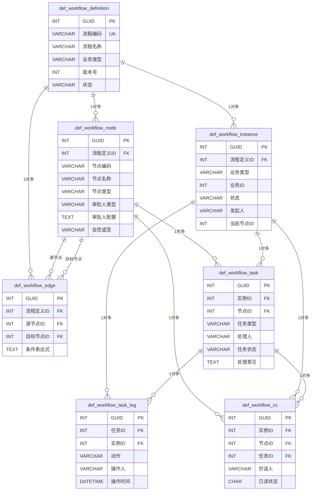
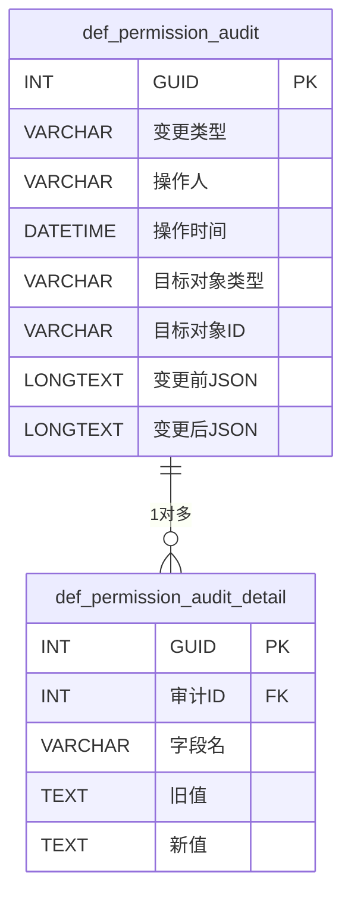
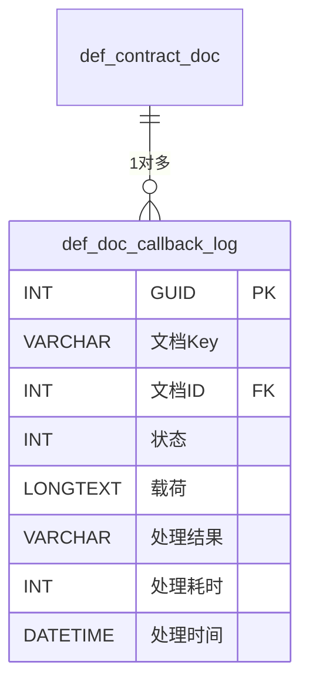
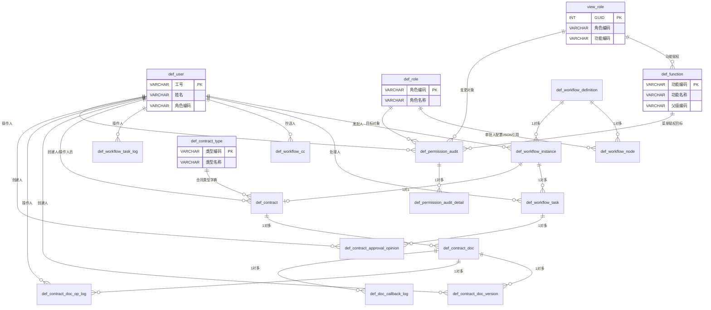

# 合同管理数据库设计

> 文档版本：v1.0
> 编制日期：2026-07-23
> 适用项目：`e:\code\php\mis`（backend: CodeIgniter 4.7.2 / PHP 8.5.4；frontend: Vue 3 + Vite + Soybean Admin）
> 数据库：MySQL 8.0+
> 关联文档：[合同管理模块系统性升级实施计划.md](file:///e:/code/php/mis/.trae/documents/合同管理模块系统性升级实施计划.md)

---

## 目录

- [一、引言](#一引言)
- [二、设计规范](#二设计规范)
- [三、ER 图](#三er-图)
- [四、表结构详细设计](#四表结构详细设计)
- [五、索引设计](#五索引设计)
- [六、与现有表关系](#六与现有表关系)
- [七、数据迁移设计](#七数据迁移设计)
- [八、菜单与权限初始化](#八菜单与权限初始化)
- [九、CI4 Migration 文件规划](#九ci4-migration-文件规划)
- [十、容量与性能预估](#十容量与性能预估)

---

## 一、引言

### 1.1 目的

本文档为合同管理模块系统性升级的数据库设计说明书，定义如下内容：

1. 15 张新表的完整结构（字段、类型、约束、注释、DDL）。
2. 表间逻辑关系与索引设计。
3. 新表与现有 `def_user`/`def_role`/`view_role`/`def_function`/`def_contract_type` 等表的复用关系。
4. 旧表（`def_contract_master`/`def_contract_flow` 等）到新表的字段级映射与状态映射。
5. CI4 Migration 文件命名、执行顺序、依赖关系与回滚方案。
6. 容量预估、分区与归档策略。

本文档作为阶段 2（数据库重构与新表创建）以及阶段 3-6（后端编码）的统一依据。

### 1.2 范围

**纳入范围**：

- 工作流引擎 7 张表：`def_workflow_definition`/`def_workflow_node`/`def_workflow_edge`/`def_workflow_instance`/`def_workflow_task`/`def_workflow_task_log`/`def_workflow_cc`。
- 合同模块重构 5 张表：`def_contract`/`def_contract_doc`/`def_contract_doc_version`/`def_contract_doc_op_log`/`def_contract_approval_opinion`。
- 权限审计 2 张表：`def_permission_audit`/`def_permission_audit_detail`。
- OnlyOffice 回调日志 1 张表：`def_doc_callback_log`。
- 数据迁移脚本、菜单与权限初始化脚本。

**不纳入范围**：

- OnlyOffice Document Server 部署（由运维负责）。
- 通用工作流引擎接入其他业务模块（本次仅合同接入）。
- 现有 Workbench/Employee 模块表结构改造。
- 旧合同表 `def_contract_master`/`def_contract_flow` 等的物理删除（保留归档）。

### 1.3 设计原则

| 原则 | 说明 |
|---|---|
| 命名规范 | 表名统一 `def_` 前缀 + 中文名；字段名使用中文；主键 `GUID`；与现有 `def_user`/`def_function` 等表风格一致 |
| 索引策略 | 主键聚簇索引 + 业务唯一索引（`uk_`）+ 高频查询字段普通索引（`idx_`）+ 多字段联合索引；避免冗余索引；大字段单独表存储 |
| 范式遵守 | 整体满足第三范式（3NF）；审批人配置、权限配置等半结构化数据以 JSON 字段存储（适当反范式以减少 JOIN） |
| 审计字段 | 每张业务表必备：操作来源/操作人员/操作时间/创建人/创建时间/更新人/更新时间/删除标识/有效标识；日志类表精简审计字段 |
| 软删除 | 通过 `删除标识` 字段实现软删除（`'0'` 未删除 / `'1'` 已删除），不物理删除；日志类表不软删除，按时间归档 |
| 外键约束 | 不使用物理外键（性能与迁移考虑），通过应用层校验 + 索引保证引用完整性 |
| 字符集 | 统一 `utf8mb4` + `utf8mb4_unicode_ci`，支持中文与 emoji |
| 存储引擎 | 统一 `InnoDB`，支持事务、行锁 |
| 主键策略 | `GUID INT AUTO_INCREMENT`，与现有表一致 |
| 时间字段 | `DATETIME` 类型，应用层统一时区（`Asia/Shanghai`）；不使用 `TIMESTAMP`（避开 2038 与时区歧义） |

### 1.4 版本与环境

| 项 | 值 |
|---|---|
| 数据库 | MySQL 8.0+（推荐 8.0.30+） |
| 存储引擎 | InnoDB |
| 字符集 | utf8mb4 |
| 排序规则 | utf8mb4_unicode_ci |
| 时区 | Asia/Shanghai |
| SQL 模式 | `STRICT_TRANS_TABLES,NO_ENGINE_SUBSTITUTION` |
| CI4 Migration | CodeIgniter 4.7.2 内置 Migration（`php spark migrate`） |
| PHP | 8.5.4 |

---

## 二、设计规范

### 2.1 表命名规范

| 规则 | 示例 |
|---|---|
| 业务数据表统一 `def_` 前缀 | `def_contract`/`def_workflow_definition` |
| 视图统一 `view_` 前缀 | `view_role`（现有，复用） |
| 临时表统一 `tmp_` 前缀 | `tmp_contract_migrate`（迁移过程用） |
| 归档表统一 `_archive` 后缀 | `def_contract_master_archive` |
| 日志类表名以 `_log` 结尾 | `def_workflow_task_log`/`def_doc_callback_log` |
| 字典类表名以 `_type` 结尾 | `def_contract_type`（现有，复用） |

> 说明：本次新增表名采用"`def_` + 子域英文 + 实体英文"或"`def_` + 中文名"两种形式。工作流引擎作为通用子域，使用英文实体名（`definition`/`node`/`edge`/`instance`/`task`/`cc`）以提升可读性；合同模块、权限审计、回调日志延续中文风格。

### 2.2 字段命名规范

| 规则 | 示例 |
|---|---|
| 主键统一 `GUID`（INT AUTO_INCREMENT） | `GUID INT NOT NULL AUTO_INCREMENT` |
| 业务字段使用中文名 | `合同编号`/`合同名称`/`合同金额`/`签订日期` |
| 通用引擎字段使用英文 | `流程定义ID`/`节点编码`/`节点类型` |
| 布尔字段使用 `CHAR(1)`，`'0'`/`'1'` | `删除标识`/`有效标识`/`是否标记`/`已读状态` |
| 状态字段使用 `VARCHAR(20)`，存储英文枚举 | `合同状态`='DRAFT' / `状态`='RUNNING' |
| JSON 字段使用 `TEXT` 或 `LONGTEXT` | `审批人配置`/`权限配置`/`变更前JSON` |
| 时间字段使用 `DATETIME` | `创建时间`/`操作时间`/`签署时间` |
| 金额字段使用 `DECIMAL(18,2)` | `合同金额` |

### 2.3 审计字段规范

**业务表必备审计字段**（9 个）：

| 字段名 | 类型 | 默认值 | 注释 |
|---|---|---|---|
| 操作来源 | VARCHAR(50) | NULL | 操作来源（web/api/job/import 等） |
| 操作人员 | VARCHAR(50) | NULL | 最近操作人（用户工号） |
| 操作时间 | DATETIME | NULL | 最近操作时间 |
| 创建人 | VARCHAR(50) | NULL | 创建人（用户工号） |
| 创建时间 | DATETIME | NULL | 创建时间 |
| 更新人 | VARCHAR(50) | NULL | 更新人（用户工号） |
| 更新时间 | DATETIME | NULL | 更新时间 |
| 删除标识 | CHAR(1) | '0' | 删除标识（0=未删除，1=已删除） |
| 有效标识 | CHAR(1) | '1' | 有效标识（0=无效，1=有效） |

**日志类表精简审计字段**：

- `def_workflow_task_log`：操作人/操作人姓名/操作时间/备注
- `def_contract_doc_op_log`：操作人/操作人姓名/操作时间/IP地址/设备信息
- `def_doc_callback_log`：处理时间/处理耗时/处理结果
- `def_permission_audit`：操作人/操作人姓名/操作时间/IP地址
- `def_permission_audit_detail`：无审计字段（被审计主表覆盖）

### 2.4 索引命名规范

| 索引类型 | 前缀 | 示例 |
|---|---|---|
| 主键 | `PRIMARY` | `PRIMARY KEY (GUID)` |
| 唯一索引 | `uk_` | `uk_合同编号`/`uk_文档Key` |
| 普通索引 | `idx_` | `idx_合同状态`/`idx_创建时间` |
| 联合索引 | `idx_字段1_字段2` | `idx_实例ID_任务状态` |

**联合索引字段顺序原则**：

1. 等值查询字段在前，范围查询字段在后。
2. 高选择性字段在前，低选择性字段在后。
3. 排序字段在最后（利用索引有序性避免 filesort）。

### 2.5 字符集与存储引擎

所有新表统一：

```sql
ENGINE=InnoDB DEFAULT CHARSET=utf8mb4 COLLATE=utf8mb4_unicode_ci
```

---

## 三、ER 图

### 3.1 工作流引擎 ER 图



### 3.2 合同模块 ER 图

```mermaid
erDiagram
    def_contract ||--o{ def_contract_doc : "1对多"
    def_contract ||--o{ def_contract_approval_opinion : "1对多"
    def_contract_doc ||--o{ def_contract_doc_version : "1对多"
    def_contract_doc ||--o{ def_contract_doc_op_log : "1对多"
    def_contract_type ||--o{ def_contract : "类型字典"
    def_workflow_instance ||--o|| def_contract : "工作流实例"
    def_workflow_task ||--o{ def_contract_approval_opinion : "任务意见"

    def_contract {
        INT GUID PK
        VARCHAR 合同编号 UK
        VARCHAR 合同名称
        VARCHAR 合同类型 FK
        DECIMAL 合同金额
        VARCHAR 合同状态
        INT 工作流实例ID FK
        INT 主文档ID FK
    }
    def_contract_doc {
        INT GUID PK
        INT 合同ID FK
        VARCHAR 文档Key UK
        VARCHAR OnlyOffice文件Key
        INT 当前版本
        VARCHAR 编辑模式
        TEXT 权限配置
    }
    def_contract_doc_version {
        INT GUID PK
        INT 文档ID FK
        INT 版本号
        VARCHAR 文件Key
        VARCHAR 创建人
        DATETIME 创建时间
        CHAR 是否标记
    }
    def_contract_doc_op_log {
        INT GUID PK
        INT 文档ID FK
        INT 合同ID FK
        VARCHAR 操作类型
        VARCHAR 操作人
        DATETIME 操作时间
        VARCHAR IP地址
    }
    def_contract_approval_opinion {
        INT GUID PK
        INT 任务ID FK
        INT 合同ID FK
        INT 实例ID FK
        TEXT 意见内容
        VARCHAR 意见类型
        CHAR 是否最终
    }
    def_contract_type {
        INT GUID PK
        VARCHAR 类型编码 UK
        VARCHAR 类型名称
        VARCHAR 公司ID
    }
```

### 3.3 权限审计 ER 图



### 3.4 OnlyOffice 回调日志 ER 图



### 3.5 整体 ER 图

下图展示 15 张新表与现有 `def_user`/`def_role`/`view_role`/`def_function`/`def_contract_type` 之间的逻辑关联（通过字段引用，非物理外键）：



---

## 四、表结构详细设计

### 4.1 工作流引擎表（7 张）

#### 4.1.1 def_workflow_definition（流程定义）

**用途**：存储通用工作流流程定义，每个流程定义可启用多个版本，业务类型区分合同/员工等不同业务接入方。

| 字段名 | 类型 | 是否空 | 默认值 | 注释 |
|---|---|---|---|---|
| GUID | INT | NOT NULL | AUTO_INCREMENT | 主键 |
| 流程编码 | VARCHAR(50) | NOT NULL |  | 流程编码（业务唯一，如 `contract_approval_standard`） |
| 流程名称 | VARCHAR(200) | NOT NULL |  | 流程名称（如"合同标准审批流"） |
| 流程分类 | VARCHAR(50) | NULL | NULL | 流程分类 |
| 业务类型 | VARCHAR(50) | NOT NULL |  | 业务类型（contract/employee/...） |
| 版本号 | INT | NOT NULL | 1 | 版本号（同流程编码递增） |
| 状态 | VARCHAR(20) | NOT NULL | 'DRAFT' | 状态（DRAFT/ENABLED/DISABLED） |
| 流程说明 | TEXT | NULL | NULL | 流程说明 |
| 表单配置 | TEXT | NULL | NULL | 表单配置 JSON |
| 操作来源 | VARCHAR(50) | NULL | NULL | 操作来源 |
| 操作人员 | VARCHAR(50) | NULL | NULL | 操作人员 |
| 操作时间 | DATETIME | NULL | NULL | 操作时间 |
| 创建人 | VARCHAR(50) | NULL | NULL | 创建人 |
| 创建时间 | DATETIME | NULL | NULL | 创建时间 |
| 更新人 | VARCHAR(50) | NULL | NULL | 更新人 |
| 更新时间 | DATETIME | NULL | NULL | 更新时间 |
| 删除标识 | CHAR(1) | NOT NULL | '0' | 删除标识 |
| 有效标识 | CHAR(1) | NOT NULL | '1' | 有效标识 |

**主键**：`GUID`

**索引**：
- `uk_流程编码_版本号`（流程编码, 版本号）— UNIQUE
- `idx_业务类型`（业务类型）
- `idx_状态`（状态）
- `idx_创建时间`（创建时间）

**外键逻辑关系**：被 `def_workflow_node.流程定义ID` / `def_workflow_edge.流程定义ID` / `def_workflow_instance.流程定义ID` 引用。

**DDL**：

```sql
CREATE TABLE IF NOT EXISTS `def_workflow_definition` (
  `GUID` INT NOT NULL AUTO_INCREMENT COMMENT '主键',
  `流程编码` VARCHAR(50) NOT NULL COMMENT '流程编码',
  `流程名称` VARCHAR(200) NOT NULL COMMENT '流程名称',
  `流程分类` VARCHAR(50) DEFAULT NULL COMMENT '流程分类',
  `业务类型` VARCHAR(50) NOT NULL COMMENT '业务类型(contract/employee/...)',
  `版本号` INT NOT NULL DEFAULT 1 COMMENT '版本号',
  `状态` VARCHAR(20) NOT NULL DEFAULT 'DRAFT' COMMENT '状态(DRAFT/ENABLED/DISABLED)',
  `流程说明` TEXT DEFAULT NULL COMMENT '流程说明',
  `表单配置` TEXT DEFAULT NULL COMMENT '表单配置JSON',
  `操作来源` VARCHAR(50) DEFAULT NULL COMMENT '操作来源',
  `操作人员` VARCHAR(50) DEFAULT NULL COMMENT '操作人员',
  `操作时间` DATETIME DEFAULT NULL COMMENT '操作时间',
  `创建人` VARCHAR(50) DEFAULT NULL COMMENT '创建人',
  `创建时间` DATETIME DEFAULT NULL COMMENT '创建时间',
  `更新人` VARCHAR(50) DEFAULT NULL COMMENT '更新人',
  `更新时间` DATETIME DEFAULT NULL COMMENT '更新时间',
  `删除标识` CHAR(1) NOT NULL DEFAULT '0' COMMENT '删除标识(0=未删除,1=已删除)',
  `有效标识` CHAR(1) NOT NULL DEFAULT '1' COMMENT '有效标识(0=无效,1=有效)',
  PRIMARY KEY (`GUID`),
  UNIQUE KEY `uk_流程编码_版本号` (`流程编码`, `版本号`),
  KEY `idx_业务类型` (`业务类型`),
  KEY `idx_状态` (`状态`),
  KEY `idx_创建时间` (`创建时间`)
) ENGINE=InnoDB DEFAULT CHARSET=utf8mb4 COLLATE=utf8mb4_unicode_ci COMMENT='工作流流程定义表';
```

---

#### 4.1.2 def_workflow_node（节点定义）

**用途**：存储流程定义下的节点配置，节点类型包含开始/审批/抄送/结束，审批人类型支持角色/部门/上级/指定人。

| 字段名 | 类型 | 是否空 | 默认值 | 注释 |
|---|---|---|---|---|
| GUID | INT | NOT NULL | AUTO_INCREMENT | 主键 |
| 流程定义ID | INT | NOT NULL |  | 流程定义ID |
| 节点编码 | VARCHAR(50) | NOT NULL |  | 节点编码（流程内唯一） |
| 节点名称 | VARCHAR(200) | NOT NULL |  | 节点名称 |
| 节点类型 | VARCHAR(20) | NOT NULL |  | 节点类型（start/approval/cc/end） |
| 审批人类型 | VARCHAR(20) | NULL | NULL | 审批人类型（role/dept/leader/user） |
| 审批人配置 | TEXT | NULL | NULL | 审批人配置 JSON |
| 会签或签 | VARCHAR(20) | NULL | 'countersign' | 会签或签（countersign=会签/or-sign=或签） |
| 超时规则 | TEXT | NULL | NULL | 超时规则 JSON |
| 节点顺序 | INT | NOT NULL | 0 | 节点顺序 |
| 节点说明 | VARCHAR(500) | NULL | NULL | 节点说明 |
| 操作来源 | VARCHAR(50) | NULL | NULL | 操作来源 |
| 操作人员 | VARCHAR(50) | NULL | NULL | 操作人员 |
| 操作时间 | DATETIME | NULL | NULL | 操作时间 |
| 创建人 | VARCHAR(50) | NULL | NULL | 创建人 |
| 创建时间 | DATETIME | NULL | NULL | 创建时间 |
| 更新人 | VARCHAR(50) | NULL | NULL | 更新人 |
| 更新时间 | DATETIME | NULL | NULL | 更新时间 |
| 删除标识 | CHAR(1) | NOT NULL | '0' | 删除标识 |
| 有效标识 | CHAR(1) | NOT NULL | '1' | 有效标识 |

**主键**：`GUID`

**索引**：
- `uk_流程定义ID_节点编码`（流程定义ID, 节点编码）— UNIQUE
- `idx_流程定义ID`（流程定义ID）
- `idx_节点类型`（节点类型）

**外键逻辑关系**：
- `流程定义ID` → `def_workflow_definition.GUID`
- 被 `def_workflow_edge.源节点ID`/`目标节点ID`、`def_workflow_task.节点ID`、`def_workflow_cc.节点ID` 引用

**DDL**：

```sql
CREATE TABLE IF NOT EXISTS `def_workflow_node` (
  `GUID` INT NOT NULL AUTO_INCREMENT COMMENT '主键',
  `流程定义ID` INT NOT NULL COMMENT '流程定义ID',
  `节点编码` VARCHAR(50) NOT NULL COMMENT '节点编码',
  `节点名称` VARCHAR(200) NOT NULL COMMENT '节点名称',
  `节点类型` VARCHAR(20) NOT NULL COMMENT '节点类型(start/approval/cc/end)',
  `审批人类型` VARCHAR(20) DEFAULT NULL COMMENT '审批人类型(role/dept/leader/user)',
  `审批人配置` TEXT DEFAULT NULL COMMENT '审批人配置JSON',
  `会签或签` VARCHAR(20) DEFAULT 'countersign' COMMENT '会签或签(countersign=会签/or-sign=或签)',
  `超时规则` TEXT DEFAULT NULL COMMENT '超时规则JSON',
  `节点顺序` INT NOT NULL DEFAULT 0 COMMENT '节点顺序',
  `节点说明` VARCHAR(500) DEFAULT NULL COMMENT '节点说明',
  `操作来源` VARCHAR(50) DEFAULT NULL COMMENT '操作来源',
  `操作人员` VARCHAR(50) DEFAULT NULL COMMENT '操作人员',
  `操作时间` DATETIME DEFAULT NULL COMMENT '操作时间',
  `创建人` VARCHAR(50) DEFAULT NULL COMMENT '创建人',
  `创建时间` DATETIME DEFAULT NULL COMMENT '创建时间',
  `更新人` VARCHAR(50) DEFAULT NULL COMMENT '更新人',
  `更新时间` DATETIME DEFAULT NULL COMMENT '更新时间',
  `删除标识` CHAR(1) NOT NULL DEFAULT '0' COMMENT '删除标识(0=未删除,1=已删除)',
  `有效标识` CHAR(1) NOT NULL DEFAULT '1' COMMENT '有效标识(0=无效,1=有效)',
  PRIMARY KEY (`GUID`),
  UNIQUE KEY `uk_流程定义ID_节点编码` (`流程定义ID`, `节点编码`),
  KEY `idx_流程定义ID` (`流程定义ID`),
  KEY `idx_节点类型` (`节点类型`)
) ENGINE=InnoDB DEFAULT CHARSET=utf8mb4 COLLATE=utf8mb4_unicode_ci COMMENT='工作流节点定义表';
```

---

#### 4.1.3 def_workflow_edge（连线定义）

**用途**：存储节点之间的连线及条件表达式，支持条件分支（如合同金额 > 100 万走二级审批）。

| 字段名 | 类型 | 是否空 | 默认值 | 注释 |
|---|---|---|---|---|
| GUID | INT | NOT NULL | AUTO_INCREMENT | 主键 |
| 流程定义ID | INT | NOT NULL |  | 流程定义ID |
| 源节点ID | INT | NOT NULL |  | 源节点ID |
| 目标节点ID | INT | NOT NULL |  | 目标节点ID |
| 条件表达式 | TEXT | NULL | NULL | 条件表达式（如 `合同金额 > 1000000`） |
| 连线顺序 | INT | NOT NULL | 0 | 连线顺序 |
| 创建人 | VARCHAR(50) | NULL | NULL | 创建人 |
| 创建时间 | DATETIME | NULL | NULL | 创建时间 |
| 更新人 | VARCHAR(50) | NULL | NULL | 更新人 |
| 更新时间 | DATETIME | NULL | NULL | 更新时间 |
| 删除标识 | CHAR(1) | NOT NULL | '0' | 删除标识 |
| 有效标识 | CHAR(1) | NOT NULL | '1' | 有效标识 |

**主键**：`GUID`

**索引**：
- `uk_流程定义ID_源节点ID_目标节点ID`（流程定义ID, 源节点ID, 目标节点ID）— UNIQUE
- `idx_源节点ID`（源节点ID）
- `idx_目标节点ID`（目标节点ID）

**外键逻辑关系**：
- `流程定义ID` → `def_workflow_definition.GUID`
- `源节点ID`/`目标节点ID` → `def_workflow_node.GUID`

**DDL**：

```sql
CREATE TABLE IF NOT EXISTS `def_workflow_edge` (
  `GUID` INT NOT NULL AUTO_INCREMENT COMMENT '主键',
  `流程定义ID` INT NOT NULL COMMENT '流程定义ID',
  `源节点ID` INT NOT NULL COMMENT '源节点ID',
  `目标节点ID` INT NOT NULL COMMENT '目标节点ID',
  `条件表达式` TEXT DEFAULT NULL COMMENT '条件表达式',
  `连线顺序` INT NOT NULL DEFAULT 0 COMMENT '连线顺序',
  `创建人` VARCHAR(50) DEFAULT NULL COMMENT '创建人',
  `创建时间` DATETIME DEFAULT NULL COMMENT '创建时间',
  `更新人` VARCHAR(50) DEFAULT NULL COMMENT '更新人',
  `更新时间` DATETIME DEFAULT NULL COMMENT '更新时间',
  `删除标识` CHAR(1) NOT NULL DEFAULT '0' COMMENT '删除标识',
  `有效标识` CHAR(1) NOT NULL DEFAULT '1' COMMENT '有效标识',
  PRIMARY KEY (`GUID`),
  UNIQUE KEY `uk_流程定义ID_源节点ID_目标节点ID` (`流程定义ID`, `源节点ID`, `目标节点ID`),
  KEY `idx_源节点ID` (`源节点ID`),
  KEY `idx_目标节点ID` (`目标节点ID`)
) ENGINE=InnoDB DEFAULT CHARSET=utf8mb4 COLLATE=utf8mb4_unicode_ci COMMENT='工作流连线定义表';
```

---

#### 4.1.4 def_workflow_instance（流程实例）

**用途**：每次业务发起审批时创建一个流程实例，记录运行状态、发起人、当前节点。

| 字段名 | 类型 | 是否空 | 默认值 | 注释 |
|---|---|---|---|---|
| GUID | INT | NOT NULL | AUTO_INCREMENT | 主键 |
| 流程定义ID | INT | NOT NULL |  | 流程定义ID |
| 版本号 | INT | NOT NULL |  | 启动时流程定义版本号 |
| 业务类型 | VARCHAR(50) | NOT NULL |  | 业务类型 |
| 业务ID | INT | NOT NULL |  | 业务ID（如 def_contract.GUID） |
| 实例标题 | VARCHAR(200) | NULL | NULL | 实例标题 |
| 状态 | VARCHAR(20) | NOT NULL | 'RUNNING' | 状态（RUNNING/COMPLETED/TERMINATED/SUSPENDED/EXCEPTION） |
| 发起人 | VARCHAR(50) | NOT NULL |  | 发起人（用户工号） |
| 发起人姓名 | VARCHAR(100) | NULL | NULL | 发起人姓名 |
| 当前节点ID | INT | NULL | NULL | 当前节点ID |
| 发起时间 | DATETIME | NOT NULL |  | 发起时间 |
| 完成时间 | DATETIME | NULL | NULL | 完成时间 |
| 终止原因 | VARCHAR(500) | NULL | NULL | 终止原因 |
| 操作来源 | VARCHAR(50) | NULL | NULL | 操作来源 |
| 操作人员 | VARCHAR(50) | NULL | NULL | 操作人员 |
| 操作时间 | DATETIME | NULL | NULL | 操作时间 |
| 创建人 | VARCHAR(50) | NULL | NULL | 创建人 |
| 创建时间 | DATETIME | NULL | NULL | 创建时间 |
| 更新人 | VARCHAR(50) | NULL | NULL | 更新人 |
| 更新时间 | DATETIME | NULL | NULL | 更新时间 |
| 删除标识 | CHAR(1) | NOT NULL | '0' | 删除标识 |
| 有效标识 | CHAR(1) | NOT NULL | '1' | 有效标识 |

**主键**：`GUID`

**索引**：
- `idx_业务类型_业务ID`（业务类型, 业务ID）— 普通联合索引（同业务可有多个历史实例，应用层对 RUNNING 状态做唯一校验）
- `idx_发起人_状态`（发起人, 状态）
- `idx_状态_发起时间`（状态, 发起时间）
- `idx_业务类型`（业务类型）

**外键逻辑关系**：
- `流程定义ID` → `def_workflow_definition.GUID`
- `当前节点ID` → `def_workflow_node.GUID`
- `发起人` → `def_user.工号`
- 被 `def_workflow_task.实例ID`、`def_workflow_cc.实例ID`、`def_workflow_task_log.实例ID`、`def_contract.工作流实例ID` 引用

**DDL**：

```sql
CREATE TABLE IF NOT EXISTS `def_workflow_instance` (
  `GUID` INT NOT NULL AUTO_INCREMENT COMMENT '主键',
  `流程定义ID` INT NOT NULL COMMENT '流程定义ID',
  `版本号` INT NOT NULL COMMENT '版本号',
  `业务类型` VARCHAR(50) NOT NULL COMMENT '业务类型',
  `业务ID` INT NOT NULL COMMENT '业务ID',
  `实例标题` VARCHAR(200) DEFAULT NULL COMMENT '实例标题',
  `状态` VARCHAR(20) NOT NULL DEFAULT 'RUNNING' COMMENT '状态(RUNNING/COMPLETED/TERMINATED/SUSPENDED/EXCEPTION)',
  `发起人` VARCHAR(50) NOT NULL COMMENT '发起人',
  `发起人姓名` VARCHAR(100) DEFAULT NULL COMMENT '发起人姓名',
  `当前节点ID` INT DEFAULT NULL COMMENT '当前节点ID',
  `发起时间` DATETIME NOT NULL COMMENT '发起时间',
  `完成时间` DATETIME DEFAULT NULL COMMENT '完成时间',
  `终止原因` VARCHAR(500) DEFAULT NULL COMMENT '终止原因',
  `操作来源` VARCHAR(50) DEFAULT NULL COMMENT '操作来源',
  `操作人员` VARCHAR(50) DEFAULT NULL COMMENT '操作人员',
  `操作时间` DATETIME DEFAULT NULL COMMENT '操作时间',
  `创建人` VARCHAR(50) DEFAULT NULL COMMENT '创建人',
  `创建时间` DATETIME DEFAULT NULL COMMENT '创建时间',
  `更新人` VARCHAR(50) DEFAULT NULL COMMENT '更新人',
  `更新时间` DATETIME DEFAULT NULL COMMENT '更新时间',
  `删除标识` CHAR(1) NOT NULL DEFAULT '0' COMMENT '删除标识',
  `有效标识` CHAR(1) NOT NULL DEFAULT '1' COMMENT '有效标识',
  PRIMARY KEY (`GUID`),
  KEY `idx_业务类型_业务ID` (`业务类型`, `业务ID`),
  KEY `idx_发起人_状态` (`发起人`, `状态`),
  KEY `idx_状态_发起时间` (`状态`, `发起时间`),
  KEY `idx_业务类型` (`业务类型`)
) ENGINE=InnoDB DEFAULT CHARSET=utf8mb4 COLLATE=utf8mb4_unicode_ci COMMENT='工作流流程实例表';
```

---

#### 4.1.5 def_workflow_task（审批任务）

**用途**：流程实例在每个审批节点为每个处理人生成一条任务，是"我的待办"的核心数据源。

| 字段名 | 类型 | 是否空 | 默认值 | 注释 |
|---|---|---|---|---|
| GUID | INT | NOT NULL | AUTO_INCREMENT | 主键 |
| 实例ID | INT | NOT NULL |  | 实例ID |
| 节点ID | INT | NOT NULL |  | 节点ID |
| 任务类型 | VARCHAR(20) | NOT NULL |  | 任务类型（approval/cc/countersign/transfer） |
| 处理人 | VARCHAR(50) | NOT NULL |  | 处理人（用户工号） |
| 处理人姓名 | VARCHAR(100) | NULL | NULL | 处理人姓名 |
| 任务状态 | VARCHAR(20) | NOT NULL | 'PENDING' | 任务状态（PENDING/DONE/SKIPPED/CANCELED） |
| 处理意见 | TEXT | NULL | NULL | 处理意见（冗余，正式意见存 def_contract_approval_opinion） |
| 处理结果 | VARCHAR(20) | NULL | NULL | 处理结果（approve/reject/transfer/countersign） |
| 处理时间 | DATETIME | NULL | NULL | 处理时间 |
| 加签父任务ID | INT | NULL | NULL | 加签父任务ID |
| 转签源任务ID | INT | NULL | NULL | 转签源任务ID |
| 任务标题 | VARCHAR(200) | NULL | NULL | 任务标题 |
| 任务来源 | VARCHAR(50) | NULL | NULL | 任务来源 |
| 截止时间 | DATETIME | NULL | NULL | 截止时间 |
| 操作来源 | VARCHAR(50) | NULL | NULL | 操作来源 |
| 操作人员 | VARCHAR(50) | NULL | NULL | 操作人员 |
| 操作时间 | DATETIME | NULL | NULL | 操作时间 |
| 创建人 | VARCHAR(50) | NULL | NULL | 创建人 |
| 创建时间 | DATETIME | NULL | NULL | 创建时间 |
| 更新人 | VARCHAR(50) | NULL | NULL | 更新人 |
| 更新时间 | DATETIME | NULL | NULL | 更新时间 |
| 删除标识 | CHAR(1) | NOT NULL | '0' | 删除标识 |
| 有效标识 | CHAR(1) | NOT NULL | '1' | 有效标识 |

**主键**：`GUID`

**索引**：
- `idx_处理人_任务状态`（处理人, 任务状态）— 待办列表核心索引
- `idx_实例ID_任务状态`（实例ID, 任务状态）
- `idx_节点ID`（节点ID）
- `idx_任务状态_创建时间`（任务状态, 创建时间）
- `idx_加签父任务ID`（加签父任务ID）
- `idx_转签源任务ID`（转签源任务ID）

**外键逻辑关系**：
- `实例ID` → `def_workflow_instance.GUID`
- `节点ID` → `def_workflow_node.GUID`
- `处理人` → `def_user.工号`
- `加签父任务ID`/`转签源任务ID` → `def_workflow_task.GUID`（自引用）
- 被 `def_workflow_task_log.任务ID`、`def_contract_approval_opinion.任务ID`、`def_workflow_cc.任务ID` 引用

**DDL**：

```sql
CREATE TABLE IF NOT EXISTS `def_workflow_task` (
  `GUID` INT NOT NULL AUTO_INCREMENT COMMENT '主键',
  `实例ID` INT NOT NULL COMMENT '实例ID',
  `节点ID` INT NOT NULL COMMENT '节点ID',
  `任务类型` VARCHAR(20) NOT NULL COMMENT '任务类型(approval/cc/countersign/transfer)',
  `处理人` VARCHAR(50) NOT NULL COMMENT '处理人',
  `处理人姓名` VARCHAR(100) DEFAULT NULL COMMENT '处理人姓名',
  `任务状态` VARCHAR(20) NOT NULL DEFAULT 'PENDING' COMMENT '任务状态(PENDING/DONE/SKIPPED/CANCELED)',
  `处理意见` TEXT DEFAULT NULL COMMENT '处理意见',
  `处理结果` VARCHAR(20) DEFAULT NULL COMMENT '处理结果(approve/reject/transfer/countersign)',
  `处理时间` DATETIME DEFAULT NULL COMMENT '处理时间',
  `加签父任务ID` INT DEFAULT NULL COMMENT '加签父任务ID',
  `转签源任务ID` INT DEFAULT NULL COMMENT '转签源任务ID',
  `任务标题` VARCHAR(200) DEFAULT NULL COMMENT '任务标题',
  `任务来源` VARCHAR(50) DEFAULT NULL COMMENT '任务来源',
  `截止时间` DATETIME DEFAULT NULL COMMENT '截止时间',
  `操作来源` VARCHAR(50) DEFAULT NULL COMMENT '操作来源',
  `操作人员` VARCHAR(50) DEFAULT NULL COMMENT '操作人员',
  `操作时间` DATETIME DEFAULT NULL COMMENT '操作时间',
  `创建人` VARCHAR(50) DEFAULT NULL COMMENT '创建人',
  `创建时间` DATETIME DEFAULT NULL COMMENT '创建时间',
  `更新人` VARCHAR(50) DEFAULT NULL COMMENT '更新人',
  `更新时间` DATETIME DEFAULT NULL COMMENT '更新时间',
  `删除标识` CHAR(1) NOT NULL DEFAULT '0' COMMENT '删除标识',
  `有效标识` CHAR(1) NOT NULL DEFAULT '1' COMMENT '有效标识',
  PRIMARY KEY (`GUID`),
  KEY `idx_处理人_任务状态` (`处理人`, `任务状态`),
  KEY `idx_实例ID_任务状态` (`实例ID`, `任务状态`),
  KEY `idx_节点ID` (`节点ID`),
  KEY `idx_任务状态_创建时间` (`任务状态`, `创建时间`),
  KEY `idx_加签父任务ID` (`加签父任务ID`),
  KEY `idx_转签源任务ID` (`转签源任务ID`)
) ENGINE=InnoDB DEFAULT CHARSET=utf8mb4 COLLATE=utf8mb4_unicode_ci COMMENT='工作流审批任务表';
```

---

#### 4.1.6 def_workflow_task_log（任务流转日志）

**用途**：记录任务的每次流转动作（提交/同意/拒绝/转签/加签/撤回），用于审计追溯。

| 字段名 | 类型 | 是否空 | 默认值 | 注释 |
|---|---|---|---|---|
| GUID | INT | NOT NULL | AUTO_INCREMENT | 主键 |
| 任务ID | INT | NOT NULL |  | 任务ID |
| 实例ID | INT | NOT NULL |  | 实例ID（冗余） |
| 节点ID | INT | NULL | NULL | 节点ID |
| 动作 | VARCHAR(20) | NOT NULL |  | 动作（submit/approve/reject/transfer/countersign/withdraw/skip/timeout） |
| 操作人 | VARCHAR(50) | NOT NULL |  | 操作人 |
| 操作人姓名 | VARCHAR(100) | NULL | NULL | 操作人姓名 |
| 操作时间 | DATETIME | NOT NULL |  | 操作时间 |
| 备注 | TEXT | NULL | NULL | 备注 |
| 操作详情 | TEXT | NULL | NULL | 操作详情 JSON |
| IP地址 | VARCHAR(50) | NULL | NULL | IP地址 |
| 设备信息 | VARCHAR(200) | NULL | NULL | 设备信息 |

**主键**：`GUID`

**索引**：
- `idx_任务ID_操作时间`（任务ID, 操作时间）
- `idx_实例ID_操作时间`（实例ID, 操作时间）
- `idx_操作人_操作时间`（操作人, 操作时间）
- `idx_动作`（动作）
- `idx_操作时间`（操作时间）

**外键逻辑关系**：
- `任务ID` → `def_workflow_task.GUID`
- `实例ID` → `def_workflow_instance.GUID`
- `节点ID` → `def_workflow_node.GUID`
- `操作人` → `def_user.工号`

**DDL**：

```sql
CREATE TABLE IF NOT EXISTS `def_workflow_task_log` (
  `GUID` INT NOT NULL AUTO_INCREMENT COMMENT '主键',
  `任务ID` INT NOT NULL COMMENT '任务ID',
  `实例ID` INT NOT NULL COMMENT '实例ID',
  `节点ID` INT DEFAULT NULL COMMENT '节点ID',
  `动作` VARCHAR(20) NOT NULL COMMENT '动作(submit/approve/reject/transfer/countersign/withdraw/skip/timeout)',
  `操作人` VARCHAR(50) NOT NULL COMMENT '操作人',
  `操作人姓名` VARCHAR(100) DEFAULT NULL COMMENT '操作人姓名',
  `操作时间` DATETIME NOT NULL COMMENT '操作时间',
  `备注` TEXT DEFAULT NULL COMMENT '备注',
  `操作详情` TEXT DEFAULT NULL COMMENT '操作详情JSON',
  `IP地址` VARCHAR(50) DEFAULT NULL COMMENT 'IP地址',
  `设备信息` VARCHAR(200) DEFAULT NULL COMMENT '设备信息',
  PRIMARY KEY (`GUID`),
  KEY `idx_任务ID_操作时间` (`任务ID`, `操作时间`),
  KEY `idx_实例ID_操作时间` (`实例ID`, `操作时间`),
  KEY `idx_操作人_操作时间` (`操作人`, `操作时间`),
  KEY `idx_动作` (`动作`),
  KEY `idx_操作时间` (`操作时间`)
) ENGINE=InnoDB DEFAULT CHARSET=utf8mb4 COLLATE=utf8mb4_unicode_ci COMMENT='工作流任务流转日志表';
```

---

#### 4.1.7 def_workflow_cc（抄送记录）

**用途**：记录抄送任务及已读状态，支撑"我的抄送"列表。

| 字段名 | 类型 | 是否空 | 默认值 | 注释 |
|---|---|---|---|---|
| GUID | INT | NOT NULL | AUTO_INCREMENT | 主键 |
| 实例ID | INT | NOT NULL |  | 实例ID |
| 节点ID | INT | NOT NULL |  | 节点ID（抄送节点） |
| 任务ID | INT | NULL | NULL | 关联任务ID |
| 抄送人 | VARCHAR(50) | NOT NULL |  | 抄送人（用户工号） |
| 抄送人姓名 | VARCHAR(100) | NULL | NULL | 抄送人姓名 |
| 抄送时间 | DATETIME | NOT NULL |  | 抄送时间 |
| 已读状态 | CHAR(1) | NOT NULL | '0' | 已读状态（0=未读，1=已读） |
| 阅读时间 | DATETIME | NULL | NULL | 阅读时间 |
| 抄送说明 | VARCHAR(500) | NULL | NULL | 抄送说明 |

**主键**：`GUID`

**索引**：
- `idx_抄送人_已读状态`（抄送人, 已读状态）
- `idx_实例ID`（实例ID）
- `idx_节点ID`（节点ID）
- `idx_任务ID`（任务ID）

**外键逻辑关系**：
- `实例ID` → `def_workflow_instance.GUID`
- `节点ID` → `def_workflow_node.GUID`
- `任务ID` → `def_workflow_task.GUID`
- `抄送人` → `def_user.工号`

**DDL**：

```sql
CREATE TABLE IF NOT EXISTS `def_workflow_cc` (
  `GUID` INT NOT NULL AUTO_INCREMENT COMMENT '主键',
  `实例ID` INT NOT NULL COMMENT '实例ID',
  `节点ID` INT NOT NULL COMMENT '节点ID',
  `任务ID` INT DEFAULT NULL COMMENT '任务ID',
  `抄送人` VARCHAR(50) NOT NULL COMMENT '抄送人',
  `抄送人姓名` VARCHAR(100) DEFAULT NULL COMMENT '抄送人姓名',
  `抄送时间` DATETIME NOT NULL COMMENT '抄送时间',
  `已读状态` CHAR(1) NOT NULL DEFAULT '0' COMMENT '已读状态(0=未读,1=已读)',
  `阅读时间` DATETIME DEFAULT NULL COMMENT '阅读时间',
  `抄送说明` VARCHAR(500) DEFAULT NULL COMMENT '抄送说明',
  PRIMARY KEY (`GUID`),
  KEY `idx_抄送人_已读状态` (`抄送人`, `已读状态`),
  KEY `idx_实例ID` (`实例ID`),
  KEY `idx_节点ID` (`节点ID`),
  KEY `idx_任务ID` (`任务ID`)
) ENGINE=InnoDB DEFAULT CHARSET=utf8mb4 COLLATE=utf8mb4_unicode_ci COMMENT='工作流抄送记录表';
```

---

### 4.2 合同模块表（5 张）

#### 4.2.1 def_contract（合同主表）

**用途**：重构后的合同主表，替换旧表 `def_contract_master`。新增工作流实例ID与主文档ID字段，移除原"当前流程节点"硬编码字段（改由工作流实例当前节点驱动）。

| 字段名 | 类型 | 是否空 | 默认值 | 注释 |
|---|---|---|---|---|
| GUID | INT | NOT NULL | AUTO_INCREMENT | 主键 |
| 合同编号 | VARCHAR(50) | NOT NULL |  | 合同编号（业务唯一） |
| 合同名称 | VARCHAR(200) | NOT NULL |  | 合同名称 |
| 合同类型 | VARCHAR(50) | NULL | NULL | 合同类型（关联 def_contract_type.类型编码） |
| 合同金额 | DECIMAL(18,2) | NULL | 0.00 | 合同金额 |
| 甲方名称 | VARCHAR(200) | NULL | NULL | 甲方名称 |
| 甲方联系人 | VARCHAR(100) | NULL | NULL | 甲方联系人 |
| 甲方电话 | VARCHAR(20) | NULL | NULL | 甲方电话 |
| 乙方名称 | VARCHAR(200) | NULL | NULL | 乙方名称 |
| 乙方联系人 | VARCHAR(100) | NULL | NULL | 乙方联系人 |
| 乙方电话 | VARCHAR(20) | NULL | NULL | 乙方电话 |
| 签订日期 | DATE | NULL | NULL | 签订日期 |
| 开始日期 | DATE | NULL | NULL | 合同开始日期 |
| 结束日期 | DATE | NULL | NULL | 合同结束日期 |
| 付款方式 | VARCHAR(50) | NULL | NULL | 付款方式 |
| 备注 | TEXT | NULL | NULL | 备注 |
| 合同状态 | VARCHAR(20) | NOT NULL | 'DRAFT' | 合同状态（DRAFT/PENDING/APPROVED/REJECTED/SIGNED/ARCHIVED/TERMINATED/EXPIRED） |
| 工作流实例ID | INT | NULL | NULL | 工作流实例ID |
| 主文档ID | INT | NULL | NULL | 主文档ID |
| 版本号 | INT | NOT NULL | 1 | 合同业务版本号 |
| 操作记录 | VARCHAR(500) | NULL | NULL | 操作记录摘要 |
| 操作来源 | VARCHAR(50) | NULL | NULL | 操作来源 |
| 操作人员 | VARCHAR(50) | NULL | NULL | 操作人员 |
| 操作时间 | DATETIME | NULL | NULL | 操作时间 |
| 创建人 | VARCHAR(50) | NULL | NULL | 创建人 |
| 创建时间 | DATETIME | NULL | NULL | 创建时间 |
| 更新人 | VARCHAR(50) | NULL | NULL | 更新人 |
| 更新时间 | DATETIME | NULL | NULL | 更新时间 |
| 删除标识 | CHAR(1) | NOT NULL | '0' | 删除标识 |
| 有效标识 | CHAR(1) | NOT NULL | '1' | 有效标识 |

**主键**：`GUID`

**索引**：
- `uk_合同编号`（合同编号）— UNIQUE
- `idx_合同状态`（合同状态）
- `idx_合同类型`（合同类型）
- `idx_创建时间`（创建时间）
- `idx_签订日期`（签订日期）
- `idx_工作流实例ID`（工作流实例ID）
- `idx_创建人`（创建人）

**外键逻辑关系**：
- `合同类型` → `def_contract_type.类型编码`
- `工作流实例ID` → `def_workflow_instance.GUID`
- `主文档ID` → `def_contract_doc.GUID`
- `创建人`/`操作人员`/`更新人` → `def_user.工号`
- 被 `def_contract_doc.合同ID`、`def_contract_approval_opinion.合同ID`、`def_workflow_instance.业务ID`（业务类型为 contract 时）引用

**DDL**：

```sql
CREATE TABLE IF NOT EXISTS `def_contract` (
  `GUID` INT NOT NULL AUTO_INCREMENT COMMENT '主键',
  `合同编号` VARCHAR(50) NOT NULL COMMENT '合同编号',
  `合同名称` VARCHAR(200) NOT NULL COMMENT '合同名称',
  `合同类型` VARCHAR(50) DEFAULT NULL COMMENT '合同类型',
  `合同金额` DECIMAL(18,2) DEFAULT 0.00 COMMENT '合同金额',
  `甲方名称` VARCHAR(200) DEFAULT NULL COMMENT '甲方名称',
  `甲方联系人` VARCHAR(100) DEFAULT NULL COMMENT '甲方联系人',
  `甲方电话` VARCHAR(20) DEFAULT NULL COMMENT '甲方电话',
  `乙方名称` VARCHAR(200) DEFAULT NULL COMMENT '乙方名称',
  `乙方联系人` VARCHAR(100) DEFAULT NULL COMMENT '乙方联系人',
  `乙方电话` VARCHAR(20) DEFAULT NULL COMMENT '乙方电话',
  `签订日期` DATE DEFAULT NULL COMMENT '签订日期',
  `开始日期` DATE DEFAULT NULL COMMENT '开始日期',
  `结束日期` DATE DEFAULT NULL COMMENT '结束日期',
  `付款方式` VARCHAR(50) DEFAULT NULL COMMENT '付款方式',
  `备注` TEXT DEFAULT NULL COMMENT '备注',
  `合同状态` VARCHAR(20) NOT NULL DEFAULT 'DRAFT' COMMENT '合同状态(DRAFT/PENDING/APPROVED/REJECTED/SIGNED/ARCHIVED/TERMINATED/EXPIRED)',
  `工作流实例ID` INT DEFAULT NULL COMMENT '工作流实例ID',
  `主文档ID` INT DEFAULT NULL COMMENT '主文档ID',
  `版本号` INT NOT NULL DEFAULT 1 COMMENT '版本号',
  `操作记录` VARCHAR(500) DEFAULT NULL COMMENT '操作记录',
  `操作来源` VARCHAR(50) DEFAULT NULL COMMENT '操作来源',
  `操作人员` VARCHAR(50) DEFAULT NULL COMMENT '操作人员',
  `操作时间` DATETIME DEFAULT NULL COMMENT '操作时间',
  `创建人` VARCHAR(50) DEFAULT NULL COMMENT '创建人',
  `创建时间` DATETIME DEFAULT NULL COMMENT '创建时间',
  `更新人` VARCHAR(50) DEFAULT NULL COMMENT '更新人',
  `更新时间` DATETIME DEFAULT NULL COMMENT '更新时间',
  `删除标识` CHAR(1) NOT NULL DEFAULT '0' COMMENT '删除标识',
  `有效标识` CHAR(1) NOT NULL DEFAULT '1' COMMENT '有效标识',
  PRIMARY KEY (`GUID`),
  UNIQUE KEY `uk_合同编号` (`合同编号`),
  KEY `idx_合同状态` (`合同状态`),
  KEY `idx_合同类型` (`合同类型`),
  KEY `idx_创建时间` (`创建时间`),
  KEY `idx_签订日期` (`签订日期`),
  KEY `idx_工作流实例ID` (`工作流实例ID`),
  KEY `idx_创建人` (`创建人`)
) ENGINE=InnoDB DEFAULT CHARSET=utf8mb4 COLLATE=utf8mb4_unicode_ci COMMENT='合同主表';
```

---

#### 4.2.2 def_contract_doc（合同文档）

**用途**：合同的 OnlyOffice 在线文档，一个合同可有多个文档（正文、附件、补充协议等）。

| 字段名 | 类型 | 是否空 | 默认值 | 注释 |
|---|---|---|---|---|
| GUID | INT | NOT NULL | AUTO_INCREMENT | 主键 |
| 合同ID | INT | NOT NULL |  | 合同ID |
| 文档Key | VARCHAR(100) | NOT NULL |  | 文档Key（OnlyOffice docKey，全局唯一） |
| 文档标题 | VARCHAR(200) | NULL | NULL | 文档标题 |
| 文档类型 | VARCHAR(20) | NULL | 'main' | 文档类型（main/attachment/supplement） |
| OnlyOffice文件Key | VARCHAR(100) | NULL | NULL | OnlyOffice 文件 Key（每次保存更新） |
| 当前版本 | INT | NOT NULL | 1 | 当前版本号 |
| 编辑模式 | VARCHAR(20) | NOT NULL | 'view' | 默认编辑模式（view/edit/review） |
| 权限配置 | TEXT | NULL | NULL | 权限配置 JSON |
| 文件大小 | BIGINT | NULL | NULL | 文件大小（字节） |
| 文件类型 | VARCHAR(50) | NULL | NULL | 文件 MIME 类型 |
| 存储路径 | VARCHAR(500) | NULL | NULL | 物理存储路径 |
| 文档说明 | VARCHAR(500) | NULL | NULL | 文档说明 |
| 操作来源 | VARCHAR(50) | NULL | NULL | 操作来源 |
| 操作人员 | VARCHAR(50) | NULL | NULL | 操作人员 |
| 操作时间 | DATETIME | NULL | NULL | 操作时间 |
| 创建人 | VARCHAR(50) | NULL | NULL | 创建人 |
| 创建时间 | DATETIME | NULL | NULL | 创建时间 |
| 更新人 | VARCHAR(50) | NULL | NULL | 更新人 |
| 更新时间 | DATETIME | NULL | NULL | 更新时间 |
| 删除标识 | CHAR(1) | NOT NULL | '0' | 删除标识 |
| 有效标识 | CHAR(1) | NOT NULL | '1' | 有效标识 |

**主键**：`GUID`

**索引**：
- `uk_文档Key`（文档Key）— UNIQUE
- `idx_合同ID`（合同ID）
- `idx_OnlyOffice文件Key`（OnlyOffice文件Key）
- `idx_文档类型`（文档类型）

**外键逻辑关系**：
- `合同ID` → `def_contract.GUID`
- `创建人`/`操作人员`/`更新人` → `def_user.工号`
- 被 `def_contract_doc_version.文档ID`、`def_contract_doc_op_log.文档ID`、`def_doc_callback_log.文档ID`、`def_contract.主文档ID` 引用

**DDL**：

```sql
CREATE TABLE IF NOT EXISTS `def_contract_doc` (
  `GUID` INT NOT NULL AUTO_INCREMENT COMMENT '主键',
  `合同ID` INT NOT NULL COMMENT '合同ID',
  `文档Key` VARCHAR(100) NOT NULL COMMENT '文档Key(OnlyOffice docKey)',
  `文档标题` VARCHAR(200) DEFAULT NULL COMMENT '文档标题',
  `文档类型` VARCHAR(20) DEFAULT 'main' COMMENT '文档类型(main/attachment/supplement)',
  `OnlyOffice文件Key` VARCHAR(100) DEFAULT NULL COMMENT 'OnlyOffice文件Key',
  `当前版本` INT NOT NULL DEFAULT 1 COMMENT '当前版本号',
  `编辑模式` VARCHAR(20) NOT NULL DEFAULT 'view' COMMENT '编辑模式(view/edit/review)',
  `权限配置` TEXT DEFAULT NULL COMMENT '权限配置JSON',
  `文件大小` BIGINT DEFAULT NULL COMMENT '文件大小(字节)',
  `文件类型` VARCHAR(50) DEFAULT NULL COMMENT '文件MIME类型',
  `存储路径` VARCHAR(500) DEFAULT NULL COMMENT '物理存储路径',
  `文档说明` VARCHAR(500) DEFAULT NULL COMMENT '文档说明',
  `操作来源` VARCHAR(50) DEFAULT NULL COMMENT '操作来源',
  `操作人员` VARCHAR(50) DEFAULT NULL COMMENT '操作人员',
  `操作时间` DATETIME DEFAULT NULL COMMENT '操作时间',
  `创建人` VARCHAR(50) DEFAULT NULL COMMENT '创建人',
  `创建时间` DATETIME DEFAULT NULL COMMENT '创建时间',
  `更新人` VARCHAR(50) DEFAULT NULL COMMENT '更新人',
  `更新时间` DATETIME DEFAULT NULL COMMENT '更新时间',
  `删除标识` CHAR(1) NOT NULL DEFAULT '0' COMMENT '删除标识',
  `有效标识` CHAR(1) NOT NULL DEFAULT '1' COMMENT '有效标识',
  PRIMARY KEY (`GUID`),
  UNIQUE KEY `uk_文档Key` (`文档Key`),
  KEY `idx_合同ID` (`合同ID`),
  KEY `idx_OnlyOffice文件Key` (`OnlyOffice文件Key`),
  KEY `idx_文档类型` (`文档类型`)
) ENGINE=InnoDB DEFAULT CHARSET=utf8mb4 COLLATE=utf8mb4_unicode_ci COMMENT='合同文档表';
```

---

#### 4.2.3 def_contract_doc_version（文档版本）

**用途**：记录文档每次保存的版本快照，支持版本查看/对比/回溯/标记。

| 字段名 | 类型 | 是否空 | 默认值 | 注释 |
|---|---|---|---|---|
| GUID | INT | NOT NULL | AUTO_INCREMENT | 主键 |
| 文档ID | INT | NOT NULL |  | 文档ID |
| 版本号 | INT | NOT NULL |  | 版本号（同文档递增） |
| 文件Key | VARCHAR(100) | NOT NULL |  | 文件Key（OnlyOffice fileKey） |
| 文件大小 | BIGINT | NULL | NULL | 文件大小（字节） |
| 存储路径 | VARCHAR(500) | NULL | NULL | 物理存储路径 |
| 版本说明 | VARCHAR(500) | NULL | NULL | 版本说明 |
| 是否标记 | CHAR(1) | NOT NULL | '0' | 是否标记（0=否，1=是，里程碑版本） |
| 标记说明 | VARCHAR(200) | NULL | NULL | 标记说明 |
| 创建人 | VARCHAR(50) | NULL | NULL | 创建人 |
| 创建时间 | DATETIME | NULL | NULL | 创建时间 |
| 操作来源 | VARCHAR(50) | NULL | NULL | 操作来源 |
| 操作人员 | VARCHAR(50) | NULL | NULL | 操作人员 |
| 操作时间 | DATETIME | NULL | NULL | 操作时间 |

**主键**：`GUID`

**索引**：
- `uk_文档ID_版本号`（文档ID, 版本号）— UNIQUE
- `idx_文档ID_创建时间`（文档ID, 创建时间）
- `idx_创建人`（创建人）
- `idx_是否标记`（是否标记）

**外键逻辑关系**：
- `文档ID` → `def_contract_doc.GUID`
- `创建人` → `def_user.工号`

**DDL**：

```sql
CREATE TABLE IF NOT EXISTS `def_contract_doc_version` (
  `GUID` INT NOT NULL AUTO_INCREMENT COMMENT '主键',
  `文档ID` INT NOT NULL COMMENT '文档ID',
  `版本号` INT NOT NULL COMMENT '版本号',
  `文件Key` VARCHAR(100) NOT NULL COMMENT '文件Key',
  `文件大小` BIGINT DEFAULT NULL COMMENT '文件大小(字节)',
  `存储路径` VARCHAR(500) DEFAULT NULL COMMENT '物理存储路径',
  `版本说明` VARCHAR(500) DEFAULT NULL COMMENT '版本说明',
  `是否标记` CHAR(1) NOT NULL DEFAULT '0' COMMENT '是否标记(0=否,1=是)',
  `标记说明` VARCHAR(200) DEFAULT NULL COMMENT '标记说明',
  `创建人` VARCHAR(50) DEFAULT NULL COMMENT '创建人',
  `创建时间` DATETIME DEFAULT NULL COMMENT '创建时间',
  `操作来源` VARCHAR(50) DEFAULT NULL COMMENT '操作来源',
  `操作人员` VARCHAR(50) DEFAULT NULL COMMENT '操作人员',
  `操作时间` DATETIME DEFAULT NULL COMMENT '操作时间',
  PRIMARY KEY (`GUID`),
  UNIQUE KEY `uk_文档ID_版本号` (`文档ID`, `版本号`),
  KEY `idx_文档ID_创建时间` (`文档ID`, `创建时间`),
  KEY `idx_创建人` (`创建人`),
  KEY `idx_是否标记` (`是否标记`)
) ENGINE=InnoDB DEFAULT CHARSET=utf8mb4 COLLATE=utf8mb4_unicode_ci COMMENT='合同文档版本表';
```

---

#### 4.2.4 def_contract_doc_op_log（文档操作留痕）

**用途**：记录文档所有操作（打开/编辑/保存/下载/版本创建/版本回溯），满足审计要求。

| 字段名 | 类型 | 是否空 | 默认值 | 注释 |
|---|---|---|---|---|
| GUID | INT | NOT NULL | AUTO_INCREMENT | 主键 |
| 文档ID | INT | NOT NULL |  | 文档ID |
| 合同ID | INT | NULL | NULL | 合同ID（冗余） |
| 版本号 | INT | NULL | NULL | 关联版本号 |
| 操作类型 | VARCHAR(20) | NOT NULL |  | 操作类型（open/edit/save/download/version_create/version_rollback） |
| 操作人 | VARCHAR(50) | NOT NULL |  | 操作人 |
| 操作人姓名 | VARCHAR(100) | NULL | NULL | 操作人姓名 |
| 操作时间 | DATETIME | NOT NULL |  | 操作时间 |
| 操作详情 | TEXT | NULL | NULL | 操作详情 JSON |
| IP地址 | VARCHAR(50) | NULL | NULL | IP地址 |
| 设备信息 | VARCHAR(200) | NULL | NULL | 设备信息 |
| 操作结果 | VARCHAR(20) | NULL | 'success' | 操作结果（success/fail） |
| 错误信息 | TEXT | NULL | NULL | 错误信息 |

**主键**：`GUID`

**索引**：
- `idx_文档ID_操作时间`（文档ID, 操作时间）
- `idx_合同ID_操作时间`（合同ID, 操作时间）
- `idx_操作人_操作时间`（操作人, 操作时间）
- `idx_操作类型`（操作类型）
- `idx_操作时间`（操作时间）

**外键逻辑关系**：
- `文档ID` → `def_contract_doc.GUID`
- `合同ID` → `def_contract.GUID`
- `操作人` → `def_user.工号`

**DDL**：

```sql
CREATE TABLE IF NOT EXISTS `def_contract_doc_op_log` (
  `GUID` INT NOT NULL AUTO_INCREMENT COMMENT '主键',
  `文档ID` INT NOT NULL COMMENT '文档ID',
  `合同ID` INT DEFAULT NULL COMMENT '合同ID',
  `版本号` INT DEFAULT NULL COMMENT '版本号',
  `操作类型` VARCHAR(20) NOT NULL COMMENT '操作类型(open/edit/save/download/version_create/version_rollback)',
  `操作人` VARCHAR(50) NOT NULL COMMENT '操作人',
  `操作人姓名` VARCHAR(100) DEFAULT NULL COMMENT '操作人姓名',
  `操作时间` DATETIME NOT NULL COMMENT '操作时间',
  `操作详情` TEXT DEFAULT NULL COMMENT '操作详情JSON',
  `IP地址` VARCHAR(50) DEFAULT NULL COMMENT 'IP地址',
  `设备信息` VARCHAR(200) DEFAULT NULL COMMENT '设备信息',
  `操作结果` VARCHAR(20) DEFAULT 'success' COMMENT '操作结果(success/fail)',
  `错误信息` TEXT DEFAULT NULL COMMENT '错误信息',
  PRIMARY KEY (`GUID`),
  KEY `idx_文档ID_操作时间` (`文档ID`, `操作时间`),
  KEY `idx_合同ID_操作时间` (`合同ID`, `操作时间`),
  KEY `idx_操作人_操作时间` (`操作人`, `操作时间`),
  KEY `idx_操作类型` (`操作类型`),
  KEY `idx_操作时间` (`操作时间`)
) ENGINE=InnoDB DEFAULT CHARSET=utf8mb4 COLLATE=utf8mb4_unicode_ci COMMENT='合同文档操作留痕表';
```

---

#### 4.2.5 def_contract_approval_opinion（审批意见表）

**用途**：独立存储审批意见，与任务解耦，支持意见编辑/查看/追溯/导出。

| 字段名 | 类型 | 是否空 | 默认值 | 注释 |
|---|---|---|---|---|
| GUID | INT | NOT NULL | AUTO_INCREMENT | 主键 |
| 任务ID | INT | NOT NULL |  | 任务ID |
| 合同ID | INT | NOT NULL |  | 合同ID |
| 实例ID | INT | NULL | NULL | 实例ID（冗余） |
| 节点ID | INT | NULL | NULL | 节点ID |
| 意见内容 | TEXT | NOT NULL |  | 意见内容 |
| 意见类型 | VARCHAR(20) | NOT NULL |  | 意见类型（approve/reject/transfer/countersign） |
| 是否最终 | CHAR(1) | NOT NULL | '0' | 是否最终（0=否，1=是，最终意见不可编辑） |
| 附件 | VARCHAR(500) | NULL | NULL | 附件路径（多个分号分隔） |
| 创建人 | VARCHAR(50) | NULL | NULL | 创建人（即审批人） |
| 创建人姓名 | VARCHAR(100) | NULL | NULL | 创建人姓名 |
| 创建时间 | DATETIME | NULL | NULL | 创建时间 |
| 更新人 | VARCHAR(50) | NULL | NULL | 更新人 |
| 更新时间 | DATETIME | NULL | NULL | 更新时间 |
| 删除标识 | CHAR(1) | NOT NULL | '0' | 删除标识 |
| 有效标识 | CHAR(1) | NOT NULL | '1' | 有效标识 |

**主键**：`GUID`

**索引**：
- `idx_任务ID`（任务ID）
- `idx_合同ID_创建时间`（合同ID, 创建时间）
- `idx_实例ID_创建时间`（实例ID, 创建时间）
- `idx_意见类型`（意见类型）
- `idx_创建人_创建时间`（创建人, 创建时间）

**外键逻辑关系**：
- `任务ID` → `def_workflow_task.GUID`
- `合同ID` → `def_contract.GUID`
- `实例ID` → `def_workflow_instance.GUID`
- `节点ID` → `def_workflow_node.GUID`
- `创建人` → `def_user.工号`

**DDL**：

```sql
CREATE TABLE IF NOT EXISTS `def_contract_approval_opinion` (
  `GUID` INT NOT NULL AUTO_INCREMENT COMMENT '主键',
  `任务ID` INT NOT NULL COMMENT '任务ID',
  `合同ID` INT NOT NULL COMMENT '合同ID',
  `实例ID` INT DEFAULT NULL COMMENT '实例ID',
  `节点ID` INT DEFAULT NULL COMMENT '节点ID',
  `意见内容` TEXT NOT NULL COMMENT '意见内容',
  `意见类型` VARCHAR(20) NOT NULL COMMENT '意见类型(approve/reject/transfer/countersign)',
  `是否最终` CHAR(1) NOT NULL DEFAULT '0' COMMENT '是否最终(0=否,1=是)',
  `附件` VARCHAR(500) DEFAULT NULL COMMENT '附件路径',
  `创建人` VARCHAR(50) DEFAULT NULL COMMENT '创建人',
  `创建人姓名` VARCHAR(100) DEFAULT NULL COMMENT '创建人姓名',
  `创建时间` DATETIME DEFAULT NULL COMMENT '创建时间',
  `更新人` VARCHAR(50) DEFAULT NULL COMMENT '更新人',
  `更新时间` DATETIME DEFAULT NULL COMMENT '更新时间',
  `删除标识` CHAR(1) NOT NULL DEFAULT '0' COMMENT '删除标识',
  `有效标识` CHAR(1) NOT NULL DEFAULT '1' COMMENT '有效标识',
  PRIMARY KEY (`GUID`),
  KEY `idx_任务ID` (`任务ID`),
  KEY `idx_合同ID_创建时间` (`合同ID`, `创建时间`),
  KEY `idx_实例ID_创建时间` (`实例ID`, `创建时间`),
  KEY `idx_意见类型` (`意见类型`),
  KEY `idx_创建人_创建时间` (`创建人`, `创建时间`)
) ENGINE=InnoDB DEFAULT CHARSET=utf8mb4 COLLATE=utf8mb4_unicode_ci COMMENT='合同审批意见表';
```

---

### 4.3 权限审计表（2 张）

#### 4.3.1 def_permission_audit（权限变更审计）

**用途**：记录角色赋权/用户赋权/菜单赋权/工作流节点赋权等权限变更操作，存储变更前后 JSON 快照。

| 字段名 | 类型 | 是否空 | 默认值 | 注释 |
|---|---|---|---|---|
| GUID | INT | NOT NULL | AUTO_INCREMENT | 主键 |
| 变更类型 | VARCHAR(30) | NOT NULL |  | 变更类型（role_grant/user_grant/menu_grant/workflow_node_grant） |
| 操作人 | VARCHAR(50) | NOT NULL |  | 操作人 |
| 操作人姓名 | VARCHAR(100) | NULL | NULL | 操作人姓名 |
| 操作时间 | DATETIME | NOT NULL |  | 操作时间 |
| 目标对象类型 | VARCHAR(30) | NULL | NULL | 目标对象类型（role/user/menu/workflow_node） |
| 目标对象ID | VARCHAR(50) | NULL | NULL | 目标对象ID |
| 目标对象名称 | VARCHAR(200) | NULL | NULL | 目标对象名称 |
| 变更前JSON | LONGTEXT | NULL | NULL | 变更前 JSON 快照 |
| 变更后JSON | LONGTEXT | NULL | NULL | 变更后 JSON 快照 |
| 变更说明 | VARCHAR(500) | NULL | NULL | 变更说明 |
| IP地址 | VARCHAR(50) | NULL | NULL | IP地址 |
| 设备信息 | VARCHAR(200) | NULL | NULL | 设备信息 |

**主键**：`GUID`

**索引**：
- `idx_操作人_操作时间`（操作人, 操作时间）
- `idx_变更类型_操作时间`（变更类型, 操作时间）
- `idx_目标对象类型_目标对象ID`（目标对象类型, 目标对象ID）
- `idx_操作时间`（操作时间）

**外键逻辑关系**：
- `操作人` → `def_user.工号`
- `目标对象ID` 依据 `目标对象类型` 关联到 `def_role`/`def_user`/`def_function`/`def_workflow_node`
- 被 `def_permission_audit_detail.审计ID` 引用

**DDL**：

```sql
CREATE TABLE IF NOT EXISTS `def_permission_audit` (
  `GUID` INT NOT NULL AUTO_INCREMENT COMMENT '主键',
  `变更类型` VARCHAR(30) NOT NULL COMMENT '变更类型(role_grant/user_grant/menu_grant/workflow_node_grant)',
  `操作人` VARCHAR(50) NOT NULL COMMENT '操作人',
  `操作人姓名` VARCHAR(100) DEFAULT NULL COMMENT '操作人姓名',
  `操作时间` DATETIME NOT NULL COMMENT '操作时间',
  `目标对象类型` VARCHAR(30) DEFAULT NULL COMMENT '目标对象类型(role/user/menu/workflow_node)',
  `目标对象ID` VARCHAR(50) DEFAULT NULL COMMENT '目标对象ID',
  `目标对象名称` VARCHAR(200) DEFAULT NULL COMMENT '目标对象名称',
  `变更前JSON` LONGTEXT DEFAULT NULL COMMENT '变更前JSON',
  `变更后JSON` LONGTEXT DEFAULT NULL COMMENT '变更后JSON',
  `变更说明` VARCHAR(500) DEFAULT NULL COMMENT '变更说明',
  `IP地址` VARCHAR(50) DEFAULT NULL COMMENT 'IP地址',
  `设备信息` VARCHAR(200) DEFAULT NULL COMMENT '设备信息',
  PRIMARY KEY (`GUID`),
  KEY `idx_操作人_操作时间` (`操作人`, `操作时间`),
  KEY `idx_变更类型_操作时间` (`变更类型`, `操作时间`),
  KEY `idx_目标对象类型_目标对象ID` (`目标对象类型`, `目标对象ID`),
  KEY `idx_操作时间` (`操作时间`)
) ENGINE=InnoDB DEFAULT CHARSET=utf8mb4 COLLATE=utf8mb4_unicode_ci COMMENT='权限变更审计表';
```

---

#### 4.3.2 def_permission_audit_detail（变更明细）

**用途**：审计主表的字段级变更明细，便于按字段维度查询与对比。

| 字段名 | 类型 | 是否空 | 默认值 | 注释 |
|---|---|---|---|---|
| GUID | INT | NOT NULL | AUTO_INCREMENT | 主键 |
| 审计ID | INT | NOT NULL |  | 审计ID |
| 字段名 | VARCHAR(100) | NOT NULL |  | 字段名 |
| 字段说明 | VARCHAR(200) | NULL | NULL | 字段说明 |
| 旧值 | TEXT | NULL | NULL | 旧值 |
| 新值 | TEXT | NULL | NULL | 新值 |

**主键**：`GUID`

**索引**：
- `idx_审计ID`（审计ID）
- `idx_字段名`（字段名）

**外键逻辑关系**：`审计ID` → `def_permission_audit.GUID`

**DDL**：

```sql
CREATE TABLE IF NOT EXISTS `def_permission_audit_detail` (
  `GUID` INT NOT NULL AUTO_INCREMENT COMMENT '主键',
  `审计ID` INT NOT NULL COMMENT '审计ID',
  `字段名` VARCHAR(100) NOT NULL COMMENT '字段名',
  `字段说明` VARCHAR(200) DEFAULT NULL COMMENT '字段说明',
  `旧值` TEXT DEFAULT NULL COMMENT '旧值',
  `新值` TEXT DEFAULT NULL COMMENT '新值',
  PRIMARY KEY (`GUID`),
  KEY `idx_审计ID` (`审计ID`),
  KEY `idx_字段名` (`字段名`)
) ENGINE=InnoDB DEFAULT CHARSET=utf8mb4 COLLATE=utf8mb4_unicode_ci COMMENT='权限变更明细表';
```

---

### 4.4 OnlyOffice 回调日志表（1 张）

#### 4.4.1 def_doc_callback_log（OnlyOffice 回调日志）

**用途**：记录 OnlyOffice Document Server 的每次回调请求与处理结果，便于排查回调失败、版本未保存等问题。

| 字段名 | 类型 | 是否空 | 默认值 | 注释 |
|---|---|---|---|---|
| GUID | INT | NOT NULL | AUTO_INCREMENT | 主键 |
| 文档Key | VARCHAR(100) | NOT NULL |  | 文档Key（OnlyOffice docKey） |
| 文档ID | INT | NULL | NULL | 文档ID |
| 状态 | INT | NOT NULL |  | OnlyOffice 回调状态（0=未保存/1=编辑中/2=准备保存/3=保存出错/4=无变化关闭/6=强制保存/7=强制保存出错） |
| 载荷 | LONGTEXT | NULL | NULL | 回调载荷 JSON |
| 处理结果 | VARCHAR(20) | NULL | NULL | 处理结果（success/fail/ignored） |
| 处理耗时 | INT | NULL | NULL | 处理耗时（毫秒） |
| 错误信息 | TEXT | NULL | NULL | 错误信息 |
| 处理时间 | DATETIME | NOT NULL |  | 处理时间 |
| 回调URL | VARCHAR(500) | NULL | NULL | 回调来源 URL |

**主键**：`GUID`

**索引**：
- `idx_文档Key_处理时间`（文档Key, 处理时间）
- `idx_文档ID_处理时间`（文档ID, 处理时间）
- `idx_状态_处理时间`（状态, 处理时间）
- `idx_处理结果`（处理结果）
- `idx_处理时间`（处理时间）

**外键逻辑关系**：
- `文档Key` → `def_contract_doc.文档Key`
- `文档ID` → `def_contract_doc.GUID`

**DDL**：

```sql
CREATE TABLE IF NOT EXISTS `def_doc_callback_log` (
  `GUID` INT NOT NULL AUTO_INCREMENT COMMENT '主键',
  `文档Key` VARCHAR(100) NOT NULL COMMENT '文档Key',
  `文档ID` INT DEFAULT NULL COMMENT '文档ID',
  `状态` INT NOT NULL COMMENT 'OnlyOffice回调状态(0/1/2/3/4/6/7)',
  `载荷` LONGTEXT DEFAULT NULL COMMENT '回调载荷JSON',
  `处理结果` VARCHAR(20) DEFAULT NULL COMMENT '处理结果(success/fail/ignored)',
  `处理耗时` INT DEFAULT NULL COMMENT '处理耗时(毫秒)',
  `错误信息` TEXT DEFAULT NULL COMMENT '错误信息',
  `处理时间` DATETIME NOT NULL COMMENT '处理时间',
  `回调URL` VARCHAR(500) DEFAULT NULL COMMENT '回调来源URL',
  PRIMARY KEY (`GUID`),
  KEY `idx_文档Key_处理时间` (`文档Key`, `处理时间`),
  KEY `idx_文档ID_处理时间` (`文档ID`, `处理时间`),
  KEY `idx_状态_处理时间` (`状态`, `处理时间`),
  KEY `idx_处理结果` (`处理结果`),
  KEY `idx_处理时间` (`处理时间`)
) ENGINE=InnoDB DEFAULT CHARSET=utf8mb4 COLLATE=utf8mb4_unicode_ci COMMENT='OnlyOffice回调日志表';
```

---

## 五、索引设计

### 5.1 索引清单

| 表名 | 索引名 | 类型 | 字段 | 用途 |
|---|---|---|---|---|
| def_workflow_definition | PRIMARY | 主键 | GUID | 主键聚簇索引 |
| def_workflow_definition | uk_流程编码_版本号 | 唯一 | 流程编码, 版本号 | 防止同编码同版本重复 |
| def_workflow_definition | idx_业务类型 | 普通 | 业务类型 | 按业务类型筛选流程定义 |
| def_workflow_definition | idx_状态 | 普通 | 状态 | 按状态筛选启用流程 |
| def_workflow_definition | idx_创建时间 | 普通 | 创建时间 | 按创建时间排序 |
| def_workflow_node | PRIMARY | 主键 | GUID | 主键 |
| def_workflow_node | uk_流程定义ID_节点编码 | 唯一 | 流程定义ID, 节点编码 | 流程内节点编码唯一 |
| def_workflow_node | idx_流程定义ID | 普通 | 流程定义ID | 按流程定义查节点 |
| def_workflow_node | idx_节点类型 | 普通 | 节点类型 | 按节点类型筛选 |
| def_workflow_edge | PRIMARY | 主键 | GUID | 主键 |
| def_workflow_edge | uk_流程定义ID_源节点ID_目标节点ID | 唯一 | 流程定义ID, 源节点ID, 目标节点ID | 防止同源同目标连线重复 |
| def_workflow_edge | idx_源节点ID | 普通 | 源节点ID | 按源节点查找下一节点 |
| def_workflow_edge | idx_目标节点ID | 普通 | 目标节点ID | 按目标节点反查上游 |
| def_workflow_instance | PRIMARY | 主键 | GUID | 主键 |
| def_workflow_instance | idx_业务类型_业务ID | 联合 | 业务类型, 业务ID | 按业务定位实例 |
| def_workflow_instance | idx_发起人_状态 | 联合 | 发起人, 状态 | "我发起的"列表 |
| def_workflow_instance | idx_状态_发起时间 | 联合 | 状态, 发起时间 | 按状态+时间筛选运行中实例 |
| def_workflow_instance | idx_业务类型 | 普通 | 业务类型 | 按业务类型筛选 |
| def_workflow_task | PRIMARY | 主键 | GUID | 主键 |
| def_workflow_task | idx_处理人_任务状态 | 联合 | 处理人, 任务状态 | 待办列表核心索引 |
| def_workflow_task | idx_实例ID_任务状态 | 联合 | 实例ID, 任务状态 | 按实例查任务流转 |
| def_workflow_task | idx_节点ID | 普通 | 节点ID | 按节点查任务 |
| def_workflow_task | idx_任务状态_创建时间 | 联合 | 任务状态, 创建时间 | 待办按时间排序 |
| def_workflow_task | idx_加签父任务ID | 普通 | 加签父任务ID | 加签场景反查父任务 |
| def_workflow_task | idx_转签源任务ID | 普通 | 转签源任务ID | 转签场景反查源任务 |
| def_workflow_task_log | PRIMARY | 主键 | GUID | 主键 |
| def_workflow_task_log | idx_任务ID_操作时间 | 联合 | 任务ID, 操作时间 | 任务流转日志按时间排序 |
| def_workflow_task_log | idx_实例ID_操作时间 | 联合 | 实例ID, 操作时间 | 实例维度流转日志 |
| def_workflow_task_log | idx_操作人_操作时间 | 联合 | 操作人, 操作时间 | 操作人维度审计 |
| def_workflow_task_log | idx_动作 | 普通 | 动作 | 按动作类型筛选 |
| def_workflow_task_log | idx_操作时间 | 普通 | 操作时间 | 按时间范围查询 |
| def_workflow_cc | PRIMARY | 主键 | GUID | 主键 |
| def_workflow_cc | idx_抄送人_已读状态 | 联合 | 抄送人, 已读状态 | "我的抄送"列表 |
| def_workflow_cc | idx_实例ID | 普通 | 实例ID | 按实例查抄送记录 |
| def_workflow_cc | idx_节点ID | 普通 | 节点ID | 按节点查抄送 |
| def_workflow_cc | idx_任务ID | 普通 | 任务ID | 按任务反查抄送 |
| def_contract | PRIMARY | 主键 | GUID | 主键 |
| def_contract | uk_合同编号 | 唯一 | 合同编号 | 业务唯一 |
| def_contract | idx_合同状态 | 普通 | 合同状态 | 按状态筛选 |
| def_contract | idx_合同类型 | 普通 | 合同类型 | 按类型筛选 |
| def_contract | idx_创建时间 | 普通 | 创建时间 | 按创建时间排序 |
| def_contract | idx_签订日期 | 普通 | 签订日期 | 按签订日期范围筛选 |
| def_contract | idx_工作流实例ID | 普通 | 工作流实例ID | 反查工作流实例 |
| def_contract | idx_创建人 | 普通 | 创建人 | "我创建的"列表 |
| def_contract_doc | PRIMARY | 主键 | GUID | 主键 |
| def_contract_doc | uk_文档Key | 唯一 | 文档Key | OnlyOffice docKey 全局唯一 |
| def_contract_doc | idx_合同ID | 普通 | 合同ID | 按合同查文档列表 |
| def_contract_doc | idx_OnlyOffice文件Key | 普通 | OnlyOffice文件Key | 按 fileKey 反查文档 |
| def_contract_doc | idx_文档类型 | 普通 | 文档类型 | 按文档类型筛选 |
| def_contract_doc_version | PRIMARY | 主键 | GUID | 主键 |
| def_contract_doc_version | uk_文档ID_版本号 | 唯一 | 文档ID, 版本号 | 文档内版本号唯一 |
| def_contract_doc_version | idx_文档ID_创建时间 | 联合 | 文档ID, 创建时间 | 版本历史按时间排序 |
| def_contract_doc_version | idx_创建人 | 普通 | 创建人 | 按创建人筛选 |
| def_contract_doc_version | idx_是否标记 | 普通 | 是否标记 | 筛选里程碑版本 |
| def_contract_doc_op_log | PRIMARY | 主键 | GUID | 主键 |
| def_contract_doc_op_log | idx_文档ID_操作时间 | 联合 | 文档ID, 操作时间 | 文档维度留痕 |
| def_contract_doc_op_log | idx_合同ID_操作时间 | 联合 | 合同ID, 操作时间 | 合同维度留痕 |
| def_contract_doc_op_log | idx_操作人_操作时间 | 联合 | 操作人, 操作时间 | 操作人维度审计 |
| def_contract_doc_op_log | idx_操作类型 | 普通 | 操作类型 | 按操作类型筛选 |
| def_contract_doc_op_log | idx_操作时间 | 普通 | 操作时间 | 按时间范围查询 |
| def_contract_approval_opinion | PRIMARY | 主键 | GUID | 主键 |
| def_contract_approval_opinion | idx_任务ID | 普通 | 任务ID | 按任务查意见 |
| def_contract_approval_opinion | idx_合同ID_创建时间 | 联合 | 合同ID, 创建时间 | 合同维度意见列表 |
| def_contract_approval_opinion | idx_实例ID_创建时间 | 联合 | 实例ID, 创建时间 | 实例维度意见列表 |
| def_contract_approval_opinion | idx_意见类型 | 普通 | 意见类型 | 按意见类型筛选 |
| def_contract_approval_opinion | idx_创建人_创建时间 | 联合 | 创建人, 创建时间 | 操作人维度意见 |
| def_permission_audit | PRIMARY | 主键 | GUID | 主键 |
| def_permission_audit | idx_操作人_操作时间 | 联合 | 操作人, 操作时间 | 操作人维度审计 |
| def_permission_audit | idx_变更类型_操作时间 | 联合 | 变更类型, 操作时间 | 按变更类型筛选 |
| def_permission_audit | idx_目标对象类型_目标对象ID | 联合 | 目标对象类型, 目标对象ID | 按目标对象查询变更历史 |
| def_permission_audit | idx_操作时间 | 普通 | 操作时间 | 按时间范围查询 |
| def_permission_audit_detail | PRIMARY | 主键 | GUID | 主键 |
| def_permission_audit_detail | idx_审计ID | 普通 | 审计ID | 按审计主表查明细 |
| def_permission_audit_detail | idx_字段名 | 普通 | 字段名 | 按字段名筛选 |
| def_doc_callback_log | PRIMARY | 主键 | GUID | 主键 |
| def_doc_callback_log | idx_文档Key_处理时间 | 联合 | 文档Key, 处理时间 | 按文档查回调历史 |
| def_doc_callback_log | idx_文档ID_处理时间 | 联合 | 文档ID, 处理时间 | 按文档ID查回调 |
| def_doc_callback_log | idx_状态_处理时间 | 联合 | 状态, 处理时间 | 按状态筛选失败回调 |
| def_doc_callback_log | idx_处理结果 | 普通 | 处理结果 | 筛选处理失败的回调 |
| def_doc_callback_log | idx_处理时间 | 普通 | 处理时间 | 按时间范围查询 |

### 5.2 索引设计依据

#### 5.2.1 查询模式分析

| 查询场景 | 涉及表 | 使用索引 |
|---|---|---|
| 我的待办（按处理人+待办状态分页） | def_workflow_task | `idx_处理人_任务状态` |
| 我的已办（按处理人+已办状态分页） | def_workflow_task | `idx_处理人_任务状态` |
| 我发起的（按发起人+状态分页） | def_workflow_instance | `idx_发起人_状态` |
| 我的抄送（按抄送人+未读状态分页） | def_workflow_cc | `idx_抄送人_已读状态` |
| 合同列表筛选（按状态/类型/签订日期） | def_contract | `idx_合同状态`/`idx_合同类型`/`idx_签订日期` |
| 合同详情 + 流程实例 + 任务列表 | def_contract + def_workflow_instance + def_workflow_task | `idx_工作流实例ID`/`idx_实例ID_任务状态` |
| 文档版本历史 | def_contract_doc_version | `idx_文档ID_创建时间` |
| 文档操作留痕 | def_contract_doc_op_log | `idx_文档ID_操作时间` |
| 审批意见列表 | def_contract_approval_opinion | `idx_合同ID_创建时间` |
| 权限审计查询（按操作人/类型/对象） | def_permission_audit | `idx_操作人_操作时间`/`idx_变更类型_操作时间`/`idx_目标对象类型_目标对象ID` |
| 回调失败排查 | def_doc_callback_log | `idx_状态_处理时间`/`idx_处理结果` |

#### 5.2.2 联合索引顺序原则

1. **等值在前，范围在后**：如 `idx_处理人_任务状态` 中 `处理人` 等值、`任务状态` 等值；`idx_任务ID_操作时间` 中 `任务ID` 等值、`操作时间` 范围。
2. **高选择性在前**：如 `idx_目标对象类型_目标对象ID` 中 `目标对象类型` 选择性中等、`目标对象ID` 高选择性。
3. **排序字段在后**：所有 `_操作时间`/`_创建时间` 后缀的索引均将时间字段放在最后，便于利用索引有序性避免 filesort。

### 5.3 慢查询预防

#### 5.3.1 EXPLAIN 分析建议

**强制要求**：所有列表查询接口在联调阶段必须使用 `EXPLAIN` 验证执行计划，确保：

1. `type` 字段为 `ref`/`range`/`index`/`eq_ref`，不应出现 `ALL`（全表扫描）。
2. `key` 字段不为 NULL（实际使用了索引）。
3. `rows` 字段估算行数与实际返回行数差距不应超过 10 倍。
4. `Extra` 字段不应出现 `Using filesort`（特别是分页排序场景），若出现需优化索引顺序。

#### 5.3.2 慢查询监控

复用现有 `sys_sql_log` 机制：

- 所有 SQL 通过 `Mcommon::select()`/`Mcommon::execute()` 执行，自动记录到 `sys_sql_log`。
- 阈值：单条 SQL > 50ms 记录为慢查询，并写入 `X-Server-Trace` 响应头（SQL 内容 base64 编码）。
- 慢查询 Top 10 每日由定时任务汇总到运维群。

#### 5.3.3 索引使用注意事项

1. **避免索引失效**：
   - 联合索引最左前缀原则：`idx_处理人_任务状态` 仅能用于 `WHERE 处理人=?` 或 `WHERE 处理人=? AND 任务状态=?`，不能单独用 `WHERE 任务状态=?`。
   - 避免对索引字段做函数运算：`WHERE DATE(创建时间)='2026-07-23'` 应改为 `WHERE 创建时间 >= '2026-07-23 00:00:00' AND 创建时间 < '2026-07-24 00:00:00'`。
   - 避免 `LIKE '%xxx'` 前缀模糊匹配：改为 `LIKE 'xxx%'` 或全文索引。

2. **覆盖索引优化**：
   - 待办列表查询仅返回 `GUID/任务标题/任务状态/处理时间/任务来源`，可考虑将 `任务标题` 加入联合索引避免回表（暂不实施，待性能压测后评估）。

3. **JSON 字段查询**：
   - `审批人配置`/`权限配置`/`变更前JSON` 等 JSON 字段不建索引，按 JSON path 查询需走全表扫描。
   - 高频 JSON 查询字段（如 `审批人配置.role`）应在应用层抽取为独立字段并建索引（暂不实施）。

---

## 六、与现有表关系

### 6.1 与 def_user（用户）关系

| 新表 | 字段 | 关系 | 说明 |
|---|---|---|---|
| def_workflow_instance | 发起人 | 多对一 | 一个用户可发起多个流程实例 |
| def_workflow_task | 处理人 | 多对一 | 一个用户可处理多个任务 |
| def_workflow_cc | 抄送人 | 多对一 | 一个用户可接收多个抄送 |
| def_workflow_task_log | 操作人 | 多对一 | 一个用户产生多条流转日志 |
| def_contract | 创建人/操作人员/更新人 | 多对一 | 合同操作人 |
| def_contract_doc | 创建人/操作人员/更新人 | 多对一 | 文档操作人 |
| def_contract_doc_version | 创建人 | 多对一 | 版本创建人 |
| def_contract_doc_op_log | 操作人 | 多对一 | 文档操作留痕 |
| def_contract_approval_opinion | 创建人 | 多对一 | 审批意见填写人 |
| def_permission_audit | 操作人 | 多对一 | 权限变更操作人 |

> 引用字段为 `def_user.工号`（VARCHAR），不建立物理外键，应用层校验。

### 6.2 与 def_role/view_role（角色权限）关系

| 新表 | 字段 | 关系 | 说明 |
|---|---|---|---|
| def_workflow_node | 审批人配置（JSON 内 `role` 字段） | 逻辑引用 | 审批人类型为 `role` 时，`审批人配置` JSON 内 `role` 字段引用 `def_role.角色编码` |
| def_permission_audit | 目标对象ID（目标对象类型=`role`） | 逻辑引用 | 角色赋权审计时，`目标对象ID` 存 `def_role.角色编码` |
| view_role | 功能编码赋权 | 多对一 | 新增菜单通过 `def_function` 注册后，由 `view_role.功能编码` 赋权给角色 |

### 6.3 与 def_function（菜单）关系

新增菜单项通过 `def_function` 表注册（详见第八章菜单与权限初始化）。新表与 `def_function` 的关系：

| 新菜单功能编码 | 关联新表/模块 | 说明 |
|---|---|---|
| workflow | 一级菜单"流程管理" | 容器菜单 |
| workflow-design | def_workflow_definition/node/edge | 流程设计器 |
| workflow-todo | def_workflow_task/cc | 我的待办 |
| workflow-instance | def_workflow_instance/task/task_log | 流程实例查看 |
| contract-doc | def_contract_doc/version/op_log | 合同文档管理 |
| permission-audit | def_permission_audit/detail | 权限审计 |

### 6.4 与 def_contract_type（合同类型字典）关系

| 新表 | 字段 | 关系 | 说明 |
|---|---|---|---|
| def_contract | 合同类型 | 多对一 | 引用 `def_contract_type.类型编码`（如 PURCHASE/SALE/LEASE） |

`def_contract_type` 表保留复用，不重构，初始数据 6 条（PURCHASE/SALE/LEASE/SERVICE/LABOR/OTHER）已存在。

### 6.5 关系总览图（文字版）

```
def_user ──────┬─< def_workflow_instance.发起人
               ├─< def_workflow_task.处理人
               ├─< def_workflow_cc.抄送人
               ├─< def_workflow_task_log.操作人
               ├─< def_contract.创建人/操作人员/更新人
               ├─< def_contract_doc.创建人/操作人员/更新人
               ├─< def_contract_doc_version.创建人
               ├─< def_contract_doc_op_log.操作人
               ├─< def_contract_approval_opinion.创建人
               └─< def_permission_audit.操作人

def_role ──────┬─< def_workflow_node.审批人配置(JSON.role)
               └─< def_permission_audit.目标对象ID(类型=role)

view_role ─────┬─< def_function(功能编码赋权)
               └─< def_permission_audit.目标对象ID(类型=view_role)

def_function ──┬─< view_role.功能编码
               └─< def_permission_audit.目标对象ID(类型=menu)

def_contract_type ─< def_contract.合同类型

def_workflow_definition ─┬─< def_workflow_node
                         ├─< def_workflow_edge
                         └─< def_workflow_instance ─┬─< def_workflow_task ─┬─< def_workflow_task_log
                                                    ├─< def_workflow_cc     │
                                                    └─> def_contract ────────┼─< def_contract_doc ─┬─< def_contract_doc_version
                                                                              │                      ├─< def_contract_doc_op_log
                                                                              │                      └─< def_doc_callback_log
                                                                              └─< def_contract_approval_opinion

def_permission_audit ──< def_permission_audit_detail
```

---

## 七、数据迁移设计

### 7.1 旧表 → 新表映射表

#### 7.1.1 def_contract_master → def_contract

| 旧字段（def_contract_master） | 新字段（def_contract） | 转换说明 |
|---|---|---|
| GUID | GUID | 不保留旧 GUID，新表自增 |
| 合同编号 | 合同编号 | 直接映射 |
| 合同名称 | 合同名称 | 直接映射 |
| 合同类型 | 合同类型 | 直接映射（编码值已对齐 def_contract_type.类型编码） |
| 合同金额 | 合同金额 | 直接映射 |
| 甲方名称/甲方联系人/甲方电话 | 甲方名称/甲方联系人/甲方电话 | 直接映射 |
| 乙方名称/乙方联系人/乙方电话 | 乙方名称/乙方联系人/乙方电话 | 直接映射 |
| 签订日期/开始日期/结束日期 | 签订日期/开始日期/结束日期 | 直接映射 |
| 付款方式 | 付款方式 | 直接映射 |
| 备注 | 备注 | 直接映射 |
| 合同状态 | 合同状态 | 状态映射（见 7.2） |
| 当前流程节点 | （不迁移） | 旧字段硬编码流程节点，新表改由 def_workflow_instance.当前节点ID 驱动 |
| 版本号 | 版本号 | 直接映射 |
| 操作记录 | 操作记录 | 直接映射 |
| 操作来源/操作人员/创建人/创建时间/更新人/更新时间 | 同名字段 | 直接映射 |
| 删除标识/有效标识 | 删除标识/有效标识 | 直接映射 |
| （无） | 工作流实例ID | 迁移时为每条历史合同创建一个状态为 COMPLETED 的 def_workflow_instance |
| （无） | 主文档ID | 迁移时为 NULL（无历史文档） |
| 开始操作时间/结束操作时间/校验标识/记录开始日期/记录结束日期 | （不迁移） | 旧表特有字段，新表无对应 |

#### 7.1.2 def_contract_flow → def_workflow_task + def_workflow_task_log + def_contract_approval_opinion

| 旧字段（def_contract_flow） | 新字段 | 转换说明 |
|---|---|---|
| GUID | （不保留） | 新表自增 |
| 合同编号 | （通过 def_contract.GUID 反查） | 迁移时按合同编号查新 def_contract.GUID，写入 def_workflow_task.实例ID（通过 def_contract.工作流实例ID） |
| 流程类型 | def_workflow_task.任务类型 + def_workflow_task_log.动作 | 流程类型映射（见 7.3） |
| 流程状态 | def_workflow_task.任务状态 | 状态映射（pending→PENDING，approved/rejected/signed/archived→DONE） |
| 节点名称 | def_workflow_task.任务标题（冗余） | 直接映射，新表无独立节点名称字段（通过节点ID关联 def_workflow_node.节点名称） |
| 审核人 | def_workflow_task.处理人 | 直接映射（用户工号） |
| 审核人姓名 | def_workflow_task.处理人姓名 | 直接映射 |
| 审核时间 | def_workflow_task.处理时间 | 直接映射 |
| 审核意见 | def_contract_approval_opinion.意见内容 | 见 7.4 |
| 附件 | def_contract_approval_opinion.附件 | 直接映射 |
| 操作来源/操作人员/操作时间 | def_workflow_task_log.操作人/操作时间 + 备注 | 写入 task_log |

### 7.2 状态映射（def_contract_master.合同状态 → def_contract.合同状态 + def_workflow_instance.状态）

| 旧状态（def_contract_master.合同状态） | 新合同状态（def_contract.合同状态） | 新实例状态（def_workflow_instance.状态） | 说明 |
|---|---|---|---|
| DRAFT | DRAFT | （不创建实例） | 草稿，未提交审批 |
| PENDING | PENDING | RUNNING | 审批中（迁移时实例标记为历史迁移） |
| APPROVING | PENDING | RUNNING | 审批中（旧中间态归并到 PENDING） |
| APPROVED | APPROVED | COMPLETED | 审批通过 |
| SIGNING | SIGNED | COMPLETED | 签署中（旧中间态归并到 SIGNED，因无实际签署流程） |
| SIGNED | SIGNED | COMPLETED | 已签署 |
| EXECUTING | SIGNED | COMPLETED | 执行中（旧中间态归并到 SIGNED） |
| ARCHIVED | ARCHIVED | COMPLETED | 已归档 |
| REJECTED | REJECTED | TERMINATED | 审批拒绝（实例标记为 TERMINATED，终止原因="审批拒绝"） |
| TERMINATED | TERMINATED | TERMINATED | 已终止 |
| EXPIRED | EXPIRED | COMPLETED | 已过期（实例标记为 COMPLETED，因过期非流程终止） |

### 7.3 流程类型映射（def_contract_flow.流程类型 → def_workflow_task.任务类型 + def_workflow_task_log.动作）

| 旧流程类型 | 新任务类型（def_workflow_task.任务类型） | 新动作（def_workflow_task_log.动作） | 说明 |
|---|---|---|---|
| submit | approval | submit | 提交审批 |
| approve | approval | approve | 审批同意 |
| reject | approval | reject | 审批拒绝 |
| sign | approval | approve | 签署（迁移时按 approve 处理） |
| archive | approval | approve | 归档（迁移时按 approve 处理） |

### 7.4 审核意见迁移（def_contract_flow.审核意见 → def_contract_approval_opinion.意见内容）

| 旧字段 | 新字段 | 转换规则 |
|---|---|---|
| 审核意见 | 意见内容 | 直接映射；为空时填"（历史数据无意见）" |
| 流程类型 | 意见类型 | submit→approve（默认）/approve→approve/reject→reject/sign→approve/archive→approve |
| （无） | 是否最终 | 迁移历史数据统一标记为 '1'（最终，不可编辑） |
| 附件 | 附件 | 直接映射 |
| 审核人 | 创建人 | 直接映射 |
| 审核人姓名 | 创建人姓名 | 直接映射 |
| 审核时间 | 创建时间 | 直接映射 |
| 合同编号 | 合同ID | 通过合同编号反查新 def_contract.GUID |
| （通过合同.工作流实例ID） | 实例ID | 通过 def_contract.工作流实例ID 关联 |
| （无） | 任务ID | 迁移时为每条审核意见创建一个 def_workflow_task 记录，task.GUID 写入 opinion.任务ID |
| （无） | 节点ID | 迁移时统一指向一个虚拟"历史审批"节点（在 def_workflow_node 中预置） |

### 7.5 迁移脚本伪代码（PHP Migration 类骨架）

```php
<?php

namespace App\Database\Migrations;

use CodeIgniter\Database\Migration;

class MigrateContractData extends Migration
{
    public function up(): void
    {
        // 1. 预置一个"历史迁移"流程定义 + 虚拟"历史审批"节点
        $this->createHistoryWorkflowDefinition();

        // 2. 读取旧合同数据（按 GUID 升序，分批处理）
        $batchSize = 500;
        $offset = 0;
        while (true) {
            $oldContracts = $this->db->table('def_contract_master')
                ->orderBy('GUID', 'ASC')
                ->limit($batchSize, $offset)
                ->get()
                ->getResultArray();
            if (empty($oldContracts)) {
                break;
            }
            $this->db->transBegin();
            try {
                foreach ($oldContracts as $old) {
                    $this->migrateOneContract($old);
                }
                $this->db->transCommit();
            } catch (\Throwable $e) {
                $this->db->transRollback();
                throw $e;
            }
            $offset += $batchSize;
        }

        // 3. 归档旧表（重命名为 _archive 后缀）
        $this->archiveOldTables();
    }

    public function down(): void
    {
        // 回滚：恢复旧表名 + 清空新表迁移数据
        $this->restoreOldTables();
        $this->clearMigratedData();
    }

    private function createHistoryWorkflowDefinition(): void
    {
        // 创建流程编码 = contract_history_migrate 的流程定义
        // 创建节点编码 = history_approval 的虚拟审批节点
        // 仅供迁移使用，状态标记为 DISABLED
    }

    private function migrateOneContract(array $old): void
    {
        // 1. 状态映射
        [$contractStatus, $instanceStatus, $terminateReason] = $this->mapStatus($old['合同状态']);

        // 2. 插入 def_contract（保留原合同编号）
        $contractId = $this->insertContract($old, $contractStatus);

        // 3. 创建 def_workflow_instance（DRAFT 状态不创建实例）
        $instanceId = null;
        if ($instanceStatus !== null) {
            $instanceId = $this->insertWorkflowInstance($contractId, $old, $instanceStatus, $terminateReason);
            // 回写 def_contract.工作流实例ID
            $this->db->table('def_contract')->where('GUID', $contractId)->update(['工作流实例ID' => $instanceId]);
        }

        // 4. 迁移 def_contract_flow → def_workflow_task + task_log + opinion
        if ($instanceId !== null) {
            $flows = $this->db->table('def_contract_flow')
                ->where('合同编号', $old['合同编号'])
                ->orderBy('GUID', 'ASC')
                ->get()
                ->getResultArray();
            foreach ($flows as $flow) {
                $this->migrateOneFlow($flow, $contractId, $instanceId);
            }
        }
    }

    private function mapStatus(string $oldStatus): array
    {
        // 返回 [新合同状态, 新实例状态, 终止原因]
        $map = [
            'DRAFT'     => ['DRAFT', null, null],
            'PENDING'   => ['PENDING', 'RUNNING', null],
            'APPROVING' => ['PENDING', 'RUNNING', null],
            'APPROVED'  => ['APPROVED', 'COMPLETED', null],
            'SIGNING'   => ['SIGNED', 'COMPLETED', null],
            'SIGNED'    => ['SIGNED', 'COMPLETED', null],
            'EXECUTING' => ['SIGNED', 'COMPLETED', null],
            'ARCHIVED'  => ['ARCHIVED', 'COMPLETED', null],
            'REJECTED'  => ['REJECTED', 'TERMINATED', '审批拒绝'],
            'TERMINATED'=> ['TERMINATED', 'TERMINATED', '合同终止'],
            'EXPIRED'   => ['EXPIRED', 'COMPLETED', null],
        ];
        return $map[$oldStatus] ?? ['DRAFT', null, null];
    }

    private function archiveOldTables(): void
    {
        // 重命名旧表为 _archive 后缀（不删除）
        $this->db->query('RENAME TABLE def_contract_master TO def_contract_master_archive');
        $this->db->query('RENAME TABLE def_contract_flow TO def_contract_flow_archive');
        // def_contract_sign/reminder/party/attachment/template 暂保留原名（未重构，未来按需归档）
    }

    private function restoreOldTables(): void
    {
        $this->db->query('RENAME TABLE def_contract_master_archive TO def_contract_master');
        $this->db->query('RENAME TABLE def_contract_flow_archive TO def_contract_flow');
    }

    private function clearMigratedData(): void
    {
        // 清空迁移产生的新表数据（保留预置的历史流程定义？取决于回滚策略）
        $this->db->table('def_contract_approval_opinion')->truncate();
        $this->db->table('def_workflow_task_log')->truncate();
        $this->db->table('def_workflow_task')->truncate();
        $this->db->table('def_workflow_cc')->truncate();
        $this->db->table('def_workflow_instance')->truncate();
        $this->db->table('def_contract')->truncate();
    }
}
```

### 7.6 旧表归档策略

| 旧表 | 归档后表名 | 是否物理删除 | 说明 |
|---|---|---|---|
| def_contract_master | def_contract_master_archive | 否 | 数据迁移完成后重命名 |
| def_contract_flow | def_contract_flow_archive | 否 | 数据迁移完成后重命名 |
| def_contract_sign | def_contract_sign（暂保留原名） | 否 | 本次未重构签署流程，保留原名供后续阶段使用 |
| def_contract_reminder | def_contract_reminder（暂保留原名） | 否 | 同上 |
| def_contract_party | def_contract_party（暂保留原名） | 否 | 同上 |
| def_contract_attachment | def_contract_attachment（暂保留原名） | 否 | 同上 |
| def_contract_template | def_contract_template（暂保留原名） | 否 | 同上 |
| def_contract_type | def_contract_type（不归档，复用） | 否 | 字典表，新表 def_contract.合同类型 继续引用 |

### 7.7 dry-run 与回滚方案

#### 7.7.1 dry-run 模式

迁移脚本支持 dry-run 参数，仅输出迁移计划不实际写入：

```bash
php spark migrate:contract --dry-run
```

dry-run 输出示例：

```
[DRY-RUN] 将迁移 1234 条合同数据
[DRY-RUN] 将创建 1234 个工作流实例（其中 COMPLETED: 1100, RUNNING: 50, TERMINATED: 84）
[DRY-RUN] 将创建 5678 条任务记录
[DRY-RUN] 将创建 5678 条任务流转日志
[DRY-RUN] 将创建 4500 条审批意见
[DRY-RUN] 不实际写入数据，不重命名旧表
```

#### 7.7.2 回滚方案

**情况 1：迁移脚本执行失败（中途异常）**

- 迁移脚本使用数据库事务包裹（每批 500 条一个事务），失败时自动回滚当前批次。
- 已成功提交的批次通过 `down()` 方法手动回滚（清空新表数据 + 恢复旧表名）。

**情况 2：迁移完成后发现数据问题**

- 执行 `php spark migrate:rollback`（CI4 Migration 回滚）：
  - 调用 `MigrateContractData::down()`：清空新表迁移数据 + 恢复旧表名。
  - 调用各 `CreateXxx::down()`：删除新表。
- 重新修复迁移脚本后再次执行。

**情况 3：业务运行一段时间后发现迁移遗漏**

- 不回滚（已产生新业务数据），通过补丁脚本单独迁移遗漏数据。
- 旧表归档保留，可随时查询对照。

#### 7.7.3 备份策略

迁移前强制要求：

```bash
mysqldump -u root -p mis_db > mis_db_backup_20260723.sql
```

备份文件保留至少 30 天，迁移完成且业务验证 1 周无问题后方可清理。

---

## 八、菜单与权限初始化

### 8.1 def_function 新增菜单项

通过 CI4 Migration 文件 `2026-07-23-910001_InitWorkflowMenu.php` 向 `def_function` 表插入菜单数据。

> 注：`def_function` 表实际字段名以现有表结构为准（探索阶段未读取该表 DDL，此处假设字段为 `功能编码`/`功能名称`/`父级编码`/`排序`/`状态`/`功能类型` 等）。Migration 实施时需先 `DESCRIBE def_function` 校准字段名。

#### 8.1.1 新增菜单清单

| 功能编码 | 功能名称 | 父级编码 | 排序 | 功能类型 | 说明 |
|---|---|---|---|---|---|
| workflow | 流程管理 | （顶级） | 50 | menu | 一级菜单 |
| workflow-design | 流程设计器 | workflow | 1 | menu | 流程定义 CRUD |
| workflow-todo | 我的待办 | workflow | 2 | menu | 待办/已办/抄送/我发起的 |
| workflow-instance | 流程实例 | workflow | 3 | menu | 实例列表与详情 |
| contract-doc | 合同文档 | contract | 5 | menu | 挂在"合同管理"下（contract 为现有菜单） |
| permission-audit | 权限审计 | system | 10 | menu | 挂在"系统管理"下（system 为现有菜单，需校准父级编码） |

#### 8.1.2 按钮级权限编码

每个菜单下挂载操作级按钮权限编码（供前端 `v-if="hasAuth('code')"` 使用）：

| 菜单 | 按钮编码 | 按钮名称 |
|---|---|---|
| workflow-design | workflow-design:create | 创建流程 |
| workflow-design | workflow-design:edit | 编辑流程 |
| workflow-design | workflow-design:delete | 删除流程 |
| workflow-design | workflow-design:toggle | 启用/停用 |
| workflow-todo | workflow-todo:approve | 同意 |
| workflow-todo | workflow-todo:reject | 拒绝 |
| workflow-todo | workflow-todo:transfer | 转签 |
| workflow-todo | workflow-todo:countersign | 加签 |
| workflow-todo | workflow-todo:withdraw | 撤回 |
| workflow-instance | workflow-instance:terminate | 终止 |
| workflow-instance | workflow-instance:suspend | 挂起 |
| contract-doc | contract-doc:create | 创建文档 |
| contract-doc | contract-doc:edit | 编辑文档 |
| contract-doc | contract-doc:download | 下载文档 |
| contract-doc | contract-doc:version-mark | 标记版本 |
| contract-doc | contract-doc:version-rollback | 回溯版本 |
| contract-doc | contract-doc:oplog-export | 导出留痕 |
| permission-audit | permission-audit:view | 查看审计 |
| permission-audit | permission-audit:export | 导出审计 |

### 8.2 view_role 默认赋权

迁移脚本执行后，将上述所有菜单与按钮权限编码默认赋权给"管理员"角色：

```sql
-- 假设管理员角色编码 = 'admin'，view_role 字段为 角色编码/功能编码/操作权限
INSERT INTO view_role (角色编码, 功能编码, 操作权限)
SELECT 'admin', 功能编码, '11111111'
FROM def_function
WHERE 功能编码 IN (
    'workflow', 'workflow-design', 'workflow-todo', 'workflow-instance',
    'contract-doc', 'permission-audit',
    'workflow-design:create', 'workflow-design:edit', 'workflow-design:delete', 'workflow-design:toggle',
    'workflow-todo:approve', 'workflow-todo:reject', 'workflow-todo:transfer',
    'workflow-todo:countersign', 'workflow-todo:withdraw',
    'workflow-instance:terminate', 'workflow-instance:suspend',
    'contract-doc:create', 'contract-doc:edit', 'contract-doc:download',
    'contract-doc:version-mark', 'contract-doc:version-rollback', 'contract-doc:oplog-export',
    'permission-audit:view', 'permission-audit:export'
);
```

> 实际字段名与"操作权限"位图含义需以现有 `view_role` 表结构为准。

### 8.3 菜单初始化脚本骨架

```php
<?php

namespace App\Database\Migrations;

use CodeIgniter\Database\Migration;

class InitWorkflowMenu extends Migration
{
    public function up(): void
    {
        // 1. 插入菜单项（def_function）
        $menus = [
            ['功能编码' => 'workflow', '功能名称' => '流程管理', '父级编码' => '', '排序' => 50, '功能类型' => 'menu'],
            ['功能编码' => 'workflow-design', '功能名称' => '流程设计器', '父级编码' => 'workflow', '排序' => 1, '功能类型' => 'menu'],
            ['功能编码' => 'workflow-todo', '功能名称' => '我的待办', '父级编码' => 'workflow', '排序' => 2, '功能类型' => 'menu'],
            ['功能编码' => 'workflow-instance', '功能名称' => '流程实例', '父级编码' => 'workflow', '排序' => 3, '功能类型' => 'menu'],
            ['功能编码' => 'contract-doc', '功能名称' => '合同文档', '父级编码' => 'contract', '排序' => 5, '功能类型' => 'menu'],
            ['功能编码' => 'permission-audit', '功能名称' => '权限审计', '父级编码' => 'system', '排序' => 10, '功能类型' => 'menu'],
            // 按钮级权限编码（功能类型 = button）
            ['功能编码' => 'workflow-design:create', '功能名称' => '创建流程', '父级编码' => 'workflow-design', '排序' => 1, '功能类型' => 'button'],
            // ... 其余按钮编码（参见 8.1.2 清单）
        ];
        $this->db->table('def_function')->insertBatch($menus);

        // 2. 管理员角色赋权（view_role）
        $adminGrants = [];
        foreach ($menus as $m) {
            $adminGrants[] = [
                '角色编码' => 'admin',
                '功能编码' => $m['功能编码'],
                '操作权限' => '11111111', // 8 位操作权限全开
            ];
        }
        $this->db->table('view_role')->insertBatch($adminGrants);
    }

    public function down(): void
    {
        $codes = [
            'workflow', 'workflow-design', 'workflow-todo', 'workflow-instance',
            'contract-doc', 'permission-audit',
            'workflow-design:create', 'workflow-design:edit', 'workflow-design:delete', 'workflow-design:toggle',
            'workflow-todo:approve', 'workflow-todo:reject', 'workflow-todo:transfer',
            'workflow-todo:countersign', 'workflow-todo:withdraw',
            'workflow-instance:terminate', 'workflow-instance:suspend',
            'contract-doc:create', 'contract-doc:edit', 'contract-doc:download',
            'contract-doc:version-mark', 'contract-doc:version-rollback', 'contract-doc:oplog-export',
            'permission-audit:view', 'permission-audit:export',
        ];
        $this->db->table('view_role')->whereIn('功能编码', $codes)->delete();
        $this->db->table('def_function')->whereIn('功能编码', $codes)->delete();
    }
}
```

---

## 九、CI4 Migration 文件规划

### 9.1 Migration 文件命名清单

目录：`e:\code\php\mis\backend\app\Database\Migrations\`

| 序号 | 文件名 | 表名 | 类型 | 依赖 |
|---|---|---|---|---|
| 1 | 2026-07-23-100001_CreateWorkflowDefinition.php | def_workflow_definition | 建表 | 无 |
| 2 | 2026-07-23-100002_CreateWorkflowNode.php | def_workflow_node | 建表 | 1 |
| 3 | 2026-07-23-100003_CreateWorkflowEdge.php | def_workflow_edge | 建表 | 1, 2 |
| 4 | 2026-07-23-100004_CreateWorkflowInstance.php | def_workflow_instance | 建表 | 1 |
| 5 | 2026-07-23-100005_CreateWorkflowTask.php | def_workflow_task | 建表 | 4, 2 |
| 6 | 2026-07-23-100006_CreateWorkflowTaskLog.php | def_workflow_task_log | 建表 | 5, 4 |
| 7 | 2026-07-23-100007_CreateWorkflowCc.php | def_workflow_cc | 建表 | 4, 2, 5 |
| 8 | 2026-07-23-200001_CreateContract.php | def_contract | 建表 | 无（逻辑依赖 4，但物理无外键） |
| 9 | 2026-07-23-200002_CreateContractDoc.php | def_contract_doc | 建表 | 8 |
| 10 | 2026-07-23-200003_CreateContractDocVersion.php | def_contract_doc_version | 建表 | 9 |
| 11 | 2026-07-23-200004_CreateContractDocOpLog.php | def_contract_doc_op_log | 建表 | 9, 8 |
| 12 | 2026-07-23-200005_CreateContractApprovalOpinion.php | def_contract_approval_opinion | 建表 | 5, 8, 4 |
| 13 | 2026-07-23-300001_CreatePermissionAudit.php | def_permission_audit | 建表 | 无 |
| 14 | 2026-07-23-300002_CreatePermissionAuditDetail.php | def_permission_audit_detail | 建表 | 13 |
| 15 | 2026-07-23-400001_CreateDocCallbackLog.php | def_doc_callback_log | 建表 | 9（逻辑） |
| 16 | 2026-07-23-900001_MigrateContractData.php | （数据迁移） | 数据迁移 | 1-15 全部 |
| 17 | 2026-07-23-910001_InitWorkflowMenu.php | （菜单初始化） | 数据初始化 | 无（仅写 def_function/view_role） |

### 9.2 Migration 类骨架

#### 9.2.1 建表 Migration 骨架（以 def_workflow_definition 为例）

```php
<?php

namespace App\Database\Migrations;

use CodeIgniter\Database\Migration;

class CreateWorkflowDefinition extends Migration
{
    public function up(): void
    {
        $this->forge->addField([
            'GUID' => ['type' => 'INT', 'constraint' => 11, 'unsigned' => true, 'auto_increment' => true],
            '流程编码' => ['type' => 'VARCHAR', 'constraint' => 50, 'null' => false],
            '流程名称' => ['type' => 'VARCHAR', 'constraint' => 200, 'null' => false],
            '流程分类' => ['type' => 'VARCHAR', 'constraint' => 50, 'null' => true],
            '业务类型' => ['type' => 'VARCHAR', 'constraint' => 50, 'null' => false],
            '版本号' => ['type' => 'INT', 'constraint' => 11, 'default' => 1],
            '状态' => ['type' => 'VARCHAR', 'constraint' => 20, 'default' => 'DRAFT'],
            '流程说明' => ['type' => 'TEXT', 'null' => true],
            '表单配置' => ['type' => 'TEXT', 'null' => true],
            '操作来源' => ['type' => 'VARCHAR', 'constraint' => 50, 'null' => true],
            '操作人员' => ['type' => 'VARCHAR', 'constraint' => 50, 'null' => true],
            '操作时间' => ['type' => 'DATETIME', 'null' => true],
            '创建人' => ['type' => 'VARCHAR', 'constraint' => 50, 'null' => true],
            '创建时间' => ['type' => 'DATETIME', 'null' => true],
            '更新人' => ['type' => 'VARCHAR', 'constraint' => 50, 'null' => true],
            '更新时间' => ['type' => 'DATETIME', 'null' => true],
            '删除标识' => ['type' => 'CHAR', 'constraint' => 1, 'default' => '0'],
            '有效标识' => ['type' => 'CHAR', 'constraint' => 1, 'default' => '1'],
        ]);
        $this->forge->addPrimaryKey('GUID');
        $this->forge->addUniqueKey(['流程编码', '版本号']);
        $this->forge->addKey(['业务类型']);
        $this->forge->addKey(['状态']);
        $this->forge->addKey(['创建时间']);
        $this->forge->createTable('def_workflow_definition', true, [
            'ENGINE' => 'InnoDB',
            'DEFAULT CHARSET' => 'utf8mb4',
            'COLLATE' => 'utf8mb4_unicode_ci',
            'COMMENT' => '工作流流程定义表',
        ]);
    }

    public function down(): void
    {
        $this->forge->dropTable('def_workflow_definition', true);
    }
}
```

#### 9.2.2 数据迁移 Migration 骨架

参见 7.5 节 `MigrateContractData` 类骨架。

#### 9.2.3 菜单初始化 Migration 骨架

参见 8.3 节 `InitWorkflowMenu` 类骨架。

### 9.3 执行顺序与依赖

```
阶段 A：建表（按依赖顺序执行，CI4 按文件名时间戳排序自动执行）
  100001 CreateWorkflowDefinition        ← 无依赖
  100002 CreateWorkflowNode              ← 依赖 100001
  100003 CreateWorkflowEdge              ← 依赖 100001, 100002
  100004 CreateWorkflowInstance          ← 依赖 100001
  100005 CreateWorkflowTask              ← 依赖 100004, 100002
  100006 CreateWorkflowTaskLog           ← 依赖 100005, 100004
  100007 CreateWorkflowCc                ← 依赖 100004, 100002, 100005
  200001 CreateContract                  ← 无物理依赖（逻辑依赖 100004）
  200002 CreateContractDoc               ← 依赖 200001
  200003 CreateContractDocVersion        ← 依赖 200002
  200004 CreateContractDocOpLog          ← 依赖 200002, 200001
  200005 CreateContractApprovalOpinion   ← 依赖 100005, 200001, 100004
  300001 CreatePermissionAudit           ← 无依赖
  300002 CreatePermissionAuditDetail     ← 依赖 300001
  400001 CreateDocCallbackLog            ← 依赖 200002（逻辑）

阶段 B：数据迁移（阶段 A 全部完成后执行）
  900001 MigrateContractData             ← 依赖 1-15 全部

阶段 C：菜单初始化（与阶段 B 无强依赖，可并行）
  910001 InitWorkflowMenu                ← 无依赖（仅写 def_function/view_role）
```

**执行命令**：

```bash
# 1. 全量迁移（建表 + 数据迁移 + 菜单初始化）
php spark migrate

# 2. 仅迁移到指定版本
php spark migrate --version 2026-07-23-200005

# 3. 回滚最近一批
php spark migrate:rollback

# 4. 回滚到指定版本
php spark migrate:rollback --version 2026-07-23-100001

# 5. 重置（全部回滚 + 重新迁移）
php spark migrate:refresh

# 6. 查看迁移状态
php spark migrate:status
```

### 9.4 迁移文件命名说明

- 时间戳前缀 `2026-07-23-XXXXXX` 保证执行顺序，CI4 按文件名字典序排序执行。
- 数字段 `100001-100007`（工作流引擎）/`200001-200005`（合同模块）/`300001-300002`（权限审计）/`400001`（回调日志）通过数字段分隔不同子域，便于人工识别。
- `900001`（数据迁移）/`910001`（菜单初始化）使用 `9` 开头确保在所有建表之后执行。

---

## 十、容量与性能预估

### 10.1 各表预估数据量

> 假设条件：系统运行 3 年，合同业务规模 5000 条/年，每合同平均 5 个审批节点，每合同平均 2 个文档，每文档平均 20 次保存（20 个版本）。

| 表名 | 年增量预估 | 3 年累计预估 | 增长趋势 | 说明 |
|---|---|---|---|---|
| def_workflow_definition | 10 条/年 | 30 条 | 缓慢 | 流程定义版本迭代少 |
| def_workflow_node | 50 条/年 | 150 条 | 缓慢 | 节点随流程定义增长 |
| def_workflow_edge | 80 条/年 | 240 条 | 缓慢 | 连线随流程定义增长 |
| def_workflow_instance | 5000 条/年 | 15000 条 | 线性 | 每合同一实例 |
| def_workflow_task | 25000 条/年 | 75000 条 | 线性 | 每实例 5 任务 |
| def_workflow_task_log | 25000 条/年 | 75000 条 | 线性 | 每任务 1 日志 |
| def_workflow_cc | 10000 条/年 | 30000 条 | 线性 | 每实例平均 2 抄送 |
| def_contract | 5000 条/年 | 15000 条 | 线性 | 合同主表 |
| def_contract_doc | 10000 条/年 | 30000 条 | 线性 | 每合同 2 文档 |
| def_contract_doc_version | 200000 条/年 | 600000 条 | 较快 | 每文档 20 版本 |
| def_contract_doc_op_log | 500000 条/年 | 1500000 条 | 快 | 每文档 50 操作（含打开/编辑/保存） |
| def_contract_approval_opinion | 25000 条/年 | 75000 条 | 线性 | 每任务 1 意见 |
| def_permission_audit | 1000 条/年 | 3000 条 | 缓慢 | 权限变更频率低 |
| def_permission_audit_detail | 5000 条/年 | 15000 条 | 缓慢 | 每审计 5 字段变更 |
| def_doc_callback_log | 200000 条/年 | 600000 条 | 较快 | 每文档 20 回调 |

**重点表预估**：

- `def_contract_doc_op_log` 与 `def_doc_callback_log` 是数据增长最快的两张表，3 年累计均超百万级，需考虑分区与归档。
- `def_contract_doc_version` 3 年累计 60 万条，单表可承载，无需分区。
- 其余表 3 年累计均在 10 万条以内，常规索引足够。

### 10.2 分区策略建议

**适用表**：按时间增长快且查询常带时间范围的日志类表。

| 表名 | 是否分区 | 分区策略 | 分区键 | 分区表达式 |
|---|---|---|---|---|
| def_workflow_task_log | 是 | 按月 RANGE 分区 | 操作时间 | `PARTITION BY RANGE (TO_DAYS(操作时间))` |
| def_contract_doc_op_log | 是 | 按月 RANGE 分区 | 操作时间 | `PARTITION BY RANGE (TO_DAYS(操作时间))` |
| def_doc_callback_log | 是 | 按月 RANGE 分区 | 处理时间 | `PARTITION BY RANGE (TO_DAYS(处理时间))` |
| def_permission_audit | 否（数据量小） | 不分区 |  |  |
| def_contract | 否 | 不分区 |  |  |
| def_workflow_task | 否 | 不分区 |  |  |
| 其余表 | 否 | 不分区 |  |  |

**分区 DDL 示例（def_contract_doc_op_log）**：

```sql
CREATE TABLE IF NOT EXISTS `def_contract_doc_op_log` (
  -- 字段定义同 4.2.4
  `GUID` INT NOT NULL AUTO_INCREMENT COMMENT '主键',
  `文档ID` INT NOT NULL COMMENT '文档ID',
  `合同ID` INT DEFAULT NULL COMMENT '合同ID',
  `版本号` INT DEFAULT NULL COMMENT '版本号',
  `操作类型` VARCHAR(20) NOT NULL COMMENT '操作类型',
  `操作人` VARCHAR(50) NOT NULL COMMENT '操作人',
  `操作人姓名` VARCHAR(100) DEFAULT NULL COMMENT '操作人姓名',
  `操作时间` DATETIME NOT NULL COMMENT '操作时间',
  `操作详情` TEXT DEFAULT NULL COMMENT '操作详情JSON',
  `IP地址` VARCHAR(50) DEFAULT NULL COMMENT 'IP地址',
  `设备信息` VARCHAR(200) DEFAULT NULL COMMENT '设备信息',
  `操作结果` VARCHAR(20) DEFAULT 'success' COMMENT '操作结果',
  `错误信息` TEXT DEFAULT NULL COMMENT '错误信息',
  PRIMARY KEY (`GUID`, `操作时间`),  -- 分区键必须包含在主键中
  KEY `idx_文档ID_操作时间` (`文档ID`, `操作时间`),
  KEY `idx_合同ID_操作时间` (`合同ID`, `操作时间`),
  KEY `idx_操作人_操作时间` (`操作人`, `操作时间`),
  KEY `idx_操作类型` (`操作类型`),
  KEY `idx_操作时间` (`操作时间`)
) ENGINE=InnoDB DEFAULT CHARSET=utf8mb4 COLLATE=utf8mb4_unicode_ci COMMENT='合同文档操作留痕表'
PARTITION BY RANGE (TO_DAYS(`操作时间`)) (
  PARTITION p202607 VALUES LESS THAN (TO_DAYS('2026-08-01')),
  PARTITION p202608 VALUES LESS THAN (TO_DAYS('2026-09-01')),
  PARTITION p202609 VALUES LESS THAN (TO_DAYS('2026-10-01')),
  -- ... 后续月份由定时任务每月初自动新增
  PARTITION pmax VALUES LESS THAN MAXVALUE
);
```

**分区维护**：

- 定时任务（每月 25 号凌晨 02:00）执行 `ALTER TABLE ... ADD PARTITION` 新增下月分区。
- 历史分区（3 年前）通过 `ALTER TABLE ... DROP PARTITION` 归档到归档库后再删除。

> **本次实施建议**：分区策略作为后续优化项，初始上线不启用分区（数据量未达临界值）。待 `def_contract_doc_op_log` / `def_doc_callback_log` 单表数据量达到 100 万条后，再通过单独的 Migration 切换为分区表。

### 10.3 归档策略

**归档对象**：3 年前的历史数据。

**归档表命名**：原表名 + `_archive_YYYY`（如 `def_contract_doc_op_log_archive_2023`）。

**归档方式**：

1. 创建归档表（结构同原表，无分区）：
   ```sql
   CREATE TABLE def_contract_doc_op_log_archive_2023 LIKE def_contract_doc_op_log;
   ALTER TABLE def_contract_doc_op_log_archive_2023 REMOVE PARTITIONING;
   ```
2. 将历史数据插入归档表：
   ```sql
   INSERT INTO def_contract_doc_op_log_archive_2023
   SELECT * FROM def_contract_doc_op_log
   WHERE 操作时间 < '2024-01-01';
   ```
3. 验证归档数据无误后，删除原表历史数据（分区表直接 DROP PARTITION，非分区表 DELETE）。
4. 归档表通过 `RENAME TABLE` 移动到归档库 `mis_db_archive`。

**归档周期**：每年 1 月 1 日凌晨 03:00 由定时任务执行，归档上一年度之前的数据。

**归档保留**：归档数据保留 5 年，5 年后由 DBA 评估是否物理删除。

### 10.4 性能预估

| 查询场景 | 预估响应时间 | 说明 |
|---|---|---|
| 我的待办（分页） | < 50ms | `idx_处理人_任务状态` 命中，单次扫描行数 < 1000 |
| 合同列表筛选（分页） | < 100ms | 多索引组合，最左前缀命中，单次扫描行数 < 5000 |
| 合同详情 + 流程实例 + 任务列表 | < 200ms | 3 次 SQL（主键查询 + 索引查询），单次 < 50ms |
| 文档版本历史 | < 50ms | `idx_文档ID_创建时间` 命中，单文档版本数 < 100 |
| 文档操作留痕查询（3 个月范围） | < 200ms | `idx_文档ID_操作时间` 命中，单文档操作数 < 5000 |
| 权限审计查询（3 个月范围） | < 150ms | `idx_操作时间_变更类型` 命中，单次扫描行数 < 10000 |
| OnlyOffice 回调失败排查 | < 100ms | `idx_文档Key_状态` 命中，单文档回调记录 < 1000 |
| 版本回溯（定位历史版本） | < 50ms | `idx_文档ID_版本号` 命中，单文档版本数 < 100 |
| 抄送列表（我的抄送） | < 80ms | `idx_抄送人_已读状态` 命中，单用户抄送记录 < 500 |
| 审批意见追溯（按合同） | < 80ms | `idx_合同ID_创建时间` 命中，单合同意见数 < 50 |
| 流程定义查询（按业务类型） | < 30ms | `idx_业务类型_状态` 命中，单业务类型定义数 < 10 |
| 工作流实例查询（按发起人） | < 100ms | `idx_发起人_创建时间` 命中，单用户实例数 < 1000 |

**性能优化建议**：

1. **索引覆盖**：上述高频查询均通过联合索引实现索引覆盖，避免回表。新增查询场景需先 EXPLAIN 验证索引命中。
2. **分页优化**：深分页（offset > 10000）采用"延迟关联"或"游标分页"（基于 `GUID > last_id`），避免 `LIMIT offset, pageSize` 性能退化。
3. **慢查询阈值**：MySQL `long_query_time` 设为 1 秒，结合 `X-Server-Trace` 头（>50ms 慢查询记录）双轨监控。
4. **缓存补充**：流程定义、合同主表、文档配置通过 `MetadataCache`（表指纹校验，TTL 1800s）缓存，减少数据库压力。实例/任务/留痕等运行时数据不缓存。
5. **读写分离预留**：日志类表（`def_contract_doc_op_log`/`def_doc_callback_log`/`def_permission_audit`/`def_workflow_task_log`）写入频繁，未来可考虑读写分离，将日志查询路由到只读副本。
6. **定期 ANALYZE TABLE**：每月执行 `ANALYZE TABLE` 更新统计信息，确保优化器选择正确索引。

---

## 文档统计

### Mermaid ER 图数量

共 **5 个** ER 图：

1. 工作流引擎 ER 图（7 张表关系：definition/node/edge/instance/task/task_log/cc）
2. 合同模块 ER 图（5 张表关系：contract/doc/doc_version/doc_op_log/approval_opinion + 与 def_contract_type 关系）
3. 权限审计 ER 图（2 张表关系：audit/audit_detail）
4. OnlyOffice 回调日志关系图（def_doc_callback_log 与 def_contract_doc/def_contract_doc_version 关系）
5. 整体 ER 图（15 张新表 + 现有 def_user/def_role/view_role/def_function/def_contract_type 关系）

### 表数量

共 **15 张新表**：

| 子域 | 表数量 | 表清单 |
|---|---|---|
| 工作流引擎 | 7 | def_workflow_definition/def_workflow_node/def_workflow_edge/def_workflow_instance/def_workflow_task/def_workflow_task_log/def_workflow_cc |
| 合同模块 | 5 | def_contract/def_contract_doc/def_contract_doc_version/def_contract_doc_op_log/def_contract_approval_opinion |
| 权限审计 | 2 | def_permission_audit/def_permission_audit_detail |
| OnlyOffice | 1 | def_doc_callback_log |

### 章节概要

1. 引言（目的/范围/设计原则/版本环境）
2. 设计规范（表/字段/审计字段/索引/字符集命名规范）
3. ER 图（5 个 Mermaid erDiagram）
4. 表结构详细设计（15 张表完整 DDL + 字段表 + 索引）
5. 索引设计（索引清单 + 设计依据 + 慢查询预防）
6. 与现有表关系（def_user/def_role/view_role/def_function/def_contract_type）
7. 数据迁移设计（旧表→新表映射 + 状态/流程类型/审核意见映射 + 迁移脚本骨架 + 归档 + dry-run/回滚）
8. 菜单与权限初始化（def_function 新增菜单 + view_role 默认赋权）
9. CI4 Migration 文件规划（17 个文件命名 + 类骨架 + 执行顺序与依赖）
10. 容量与性能预估（数据量预估 + 分区策略 + 归档策略 + 性能预估表 + 优化建议）

### 字符集与引擎

- 所有表统一使用 `utf8mb4_unicode_ci` 字符集
- 存储引擎统一 `InnoDB`（支持事务、行级锁、外键）
- 主键统一 `GUID INT AUTO_INCREMENT`
- 审计字段统一：操作来源/操作人员/操作时间/创建人/创建时间/更新人/更新时间/删除标识/有效标识

### 数据库设计原则遵循情况

| 原则 | 遵循情况 |
|---|---|
| 命名规范（def_ 前缀 + 中文名） | 全部 15 张表遵循 |
| 字段命名（中文字段名） | 全部遵循，与 def_user/def_function 等现有表风格一致 |
| 审计字段规范 | 全部 15 张表包含完整审计字段 |
| 主键 GUID | 全部 15 张表使用 GUID INT AUTO_INCREMENT |
| 软删除（删除标识 + 有效标识） | 全部 15 张表支持软删除 |
| 索引命名（uk_/idx_ 前缀） | 全部索引遵循命名规范 |
| 字符集 utf8mb4_unicode_ci | 全部 15 张表统一 |
| 范式遵守 | 第三范式，冗余字段仅在性能必要时添加并标注 |
| CI4 Migration 管理 | 17 个 Migration 文件规划，纠正现有手工 SQL 方式 |

---

> 本文档为合同管理模块系统性升级的阶段 1 设计产出，作为后续阶段 2（CI4 Migration 编码）与阶段 3-6（后端 Service 编码）的依据。文档与《合同管理功能需求规格说明书》《合同管理用户流程图》《合同管理系统架构设计》《合同管理API接口设计》《OnlyOffice集成技术方案》共同构成完整设计文档集。