# 合同管理用户流程图

> 编制日期：2026-07-23
> 适用范围：`e:\code\php\mis`（backend: CodeIgniter 4.7.2 / PHP 8.5.4；frontend: Vue 3 + Vite + Soybean Admin）
> 编制依据：《合同管理模块系统性升级实施计划.md》
> 文档类型：用户流程图（Mermaid 语法）

---

## 目录

- [一、引言](#一引言)
  - [1.1 目的](#11-目的)
  - [1.2 范围](#12-范围)
  - [1.3 图例说明](#13-图例说明)
- [二、角色定义](#二角色定义)
- [三、合同全生命周期流程](#三合同全生命周期流程)
- [四、合同状态机流程图](#四合同状态机流程图)
- [五、工作流实例状态机](#五工作流实例状态机)
- [六、多级审批流程](#六多级审批流程)
- [七、审批人处理任务流程](#七审批人处理任务流程)
- [八、文档协作流程](#八文档协作流程)
- [九、版本管理流程](#九版本管理流程)
- [十、权限审计流程](#十权限审计流程)
- [十一、异常处理流程](#十一异常处理流程)
  - [11.1 审批超时处理](#111-审批超时处理)
  - [11.2 OnlyOffice 回调失败处理](#112-onlyoffice-回调失败处理)
  - [11.3 审批人指派为空处理](#113-审批人指派为空处理)
  - [11.4 版本回溯失败处理](#114-版本回溯失败处理)
- [十二、各角色操作流程](#十二各角色操作流程)
  - [12.1 发起人操作流程](#121-发起人操作流程)
  - [12.2 审批人操作流程](#122-审批人操作流程)
  - [12.3 签署人操作流程](#123-签署人操作流程)
  - [12.4 管理员操作流程](#124-管理员操作流程)
  - [12.5 查看人操作流程](#125-查看人操作流程)

---

## 一、引言

### 1.1 目的

本文档以 Mermaid 流程图与状态图的形式，系统化描述合同管理模块重构升级后各角色用户的操作路径、合同与工作流实例的状态流转、文档协作与版本管理路径、权限审计链路以及异常处理分支。文档作为以下活动的共同参考基准：

- 需求评审：与业务方确认流程是否符合实际审批与协作场景；
- 编码实现：作为后端 `Workflow/Contract/OnlyOffice/Permission` 子域与前端各页面的交互设计依据；
- 测试验证：作为集成测试与 UAT 验收的场景来源；
- 用户培训：作为用户操作手册的配图基础。

### 1.2 范围

本文档覆盖：

1. 合同全生命周期（草稿 → 提交审批 → 多级审批 → 签署 → 归档）；
2. 合同状态机与工作流实例状态机的全部状态与转换；
3. 多级审批中的会签/或签/抄送/转签/加签/撤回分支；
4. OnlyOffice 文档协作、版本管理与操作留痕流程；
5. 权限变更审计与查询导出流程；
6. 审批超时、回调失败、审批人指派为空、版本回溯失败等异常处理；
7. 发起人、审批人、签署人、管理员、查看人五种角色的操作流程。

不在本文档范围：OnlyOffice Document Server 部署、BPMN 拖拽设计器、移动端适配、其他业务模块接入工作流。

### 1.3 图例说明

本文档使用以下 Mermaid 图类型，遵循统一图例约定：

| 图类型 | 用途 | 节点形状约定 |
|---|---|---|
| `flowchart TD` | 业务流程、操作路径 | 圆角矩形为开始/结束；矩形为操作步骤；菱形为判断分支；平行四边形为输入/输出 |
| `stateDiagram-v2` | 状态机 | 圆角矩形为状态；带箭头连线为状态转换，线上标注触发动作 |
| 流程线样式 | 含义 | 实线为正常流转；虚线（`-.->`）为异常或回退分支；粗线（`==>`）为关键主干 |

判断节点统一使用菱形，分支标签（是/否/同意/拒绝等）标注在连线起始处。状态图中的 `[*]` 表示初始状态或终止状态。

---

## 二、角色定义

合同管理模块共定义五种用户角色，各角色职责与权限边界如下表所示。实际系统中一个用户可同时具备多个角色（多角色合并机制），权限取并集。

| 角色 | 角色编码 | 主要职责 | 核心操作权限 | 数据范围 |
|---|---|---|---|---|
| 发起人 | `initiator` | 发起合同审批流程，维护合同草稿与基础信息，上传/编辑合同文档 | 合同创建、编辑、提交审批、撤回、删除草稿、查看本人发起的合同、文档编辑（草稿态） | 本人发起的合同 |
| 审批人 | `approver` | 处理分配到本人的审批任务，填写审批意见，决定同意/拒绝/转签/加签 | 查看待办任务、查看合同详情、查看/编辑文档（审批态）、同意/拒绝/转签/加签、填写审批意见 | 分配到本人的任务关联合同 |
| 签署人 | `signer` | 对已审核通过的合同执行签署确认，可上传签署附件 | 查看待签署合同、查看文档（只读）、确认签署、上传签署附件、拒绝签署并退回 | 分配到本人的签署任务关联合同 |
| 管理员 | `admin` | 配置工作流定义、管理流程实例、管理权限、查询审计日志、处理异常 | 流程设计器配置、流程实例查询/终止/挂起/恢复、权限赋权变更、权限审计查询/导出、合同全量查询、异常处理 | 全量数据 |
| 查看人 | `viewer` | 只读查看合同信息与文档，无任何写操作权限 | 查看合同列表、查看合同详情、查看文档（只读）、查看版本历史、查看操作留痕 | 授权范围内的合同 |

补充说明：

- 角色与权限通过 `view_role.功能编码赋权` 实现，新增工作流相关权限通过 `def_function` 表扩展；
- 按钮级权限通过前端 `v-if="hasAuth('contract:approve')"` 等指令控制显隐；
- 数据级权限通过 `AuthorizationService` 注入属地/部门/工号过滤条件；
- 管理员默认拥有全部菜单与操作权限，可代行其他角色操作（如代签、代审批），代行操作需在审计日志中标注。

---

## 三、合同全生命周期流程

本节描述一份合同从创建到归档的完整主干流程，包含拒绝、重新提交、撤回等回退分支。该流程是合同模块的核心业务路径，由合同状态机（第四节）与工作流实例状态机（第五节）共同驱动。

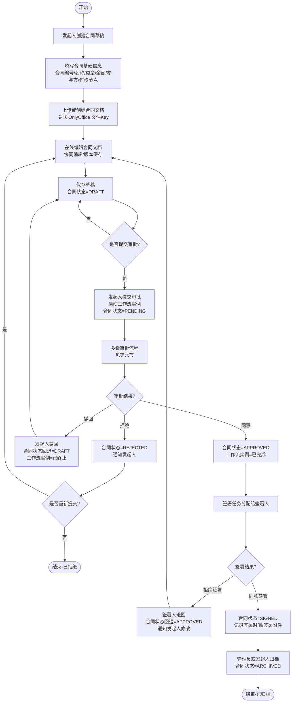

要点解读：

- 草稿态（DRAFT）允许反复编辑文档与基础信息，可多次保存；
- 提交审批后合同状态由工作流实例驱动，不再由控制器硬编码流转；
- 拒绝与撤回均回退至草稿态，但拒绝由审批人触发、撤回由发起人主动触发（仅当前节点任务未处理时可撤回）；
- 签署阶段为合同状态机与工作流实例解耦环节：审批工作流完成后，签署任务由合同模块单独驱动，避免签署周期过长占用工作流实例；
- 归档为终态，归档后合同只读，版本与留痕仍可查询。

---

## 四、合同状态机流程图

合同状态机定义合同实体的合法状态与转换规则。重构后合同状态由工作流实例状态与签署/归档动作共同驱动，状态枚举与转换条件如下。

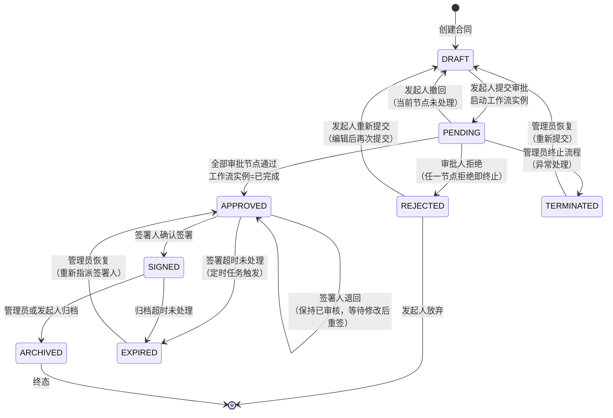

要点解读：

- 主干状态为 `DRAFT → PENDING → APPROVED → SIGNED → ARCHIVED`，对应合同从草稿到归档的完整生命周期；
- `REJECTED` 为审批拒绝分支，发起人可编辑后重新提交回到 `PENDING`，也可放弃终止；
- `TERMINATED` 为异常终止态，由管理员在异常处理或流程治理时触发，可恢复至 `DRAFT` 重新提交；
- `EXPIRED` 为超时态，由定时任务检测签署或归档环节超时触发，可由管理员恢复并重新指派；
- `ARCHIVED` 为唯一终态，归档后不可再流转，仅支持只读查询；
- 状态转换均需记录操作留痕，权限变更类操作额外写入权限审计表。

---

## 五、工作流实例状态机

工作流实例是审批流程的运行时载体，每份合同提交审批后创建一个工作流实例。工作流实例状态机独立于合同状态机，但通过 `ContractWorkflowService` 回调桥接二者。

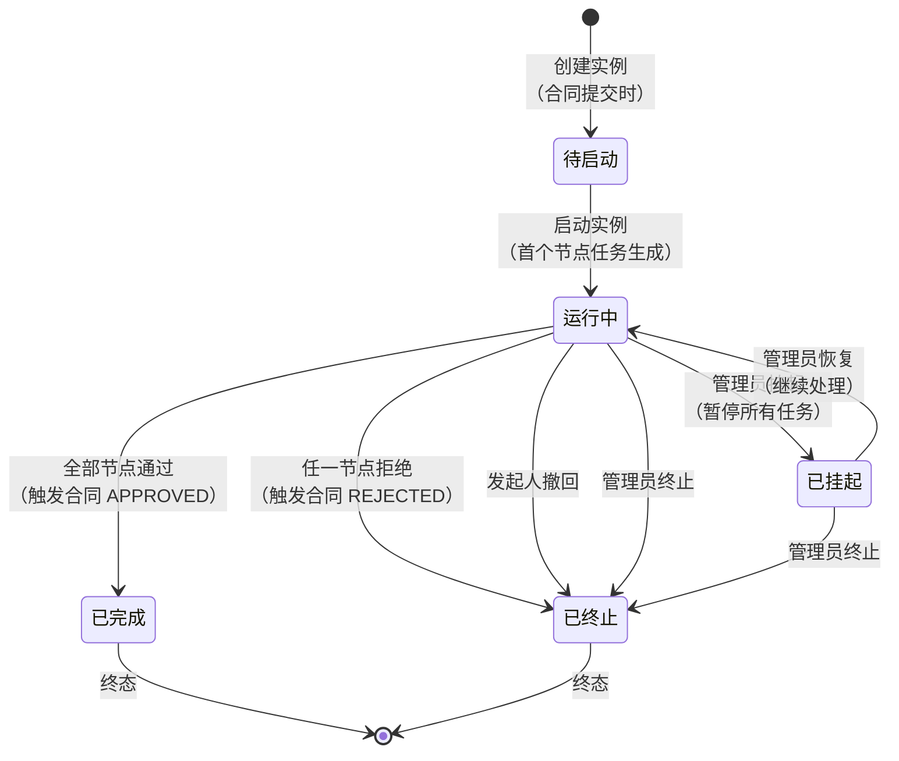

要点解读：

- `待启动` 为瞬时态，合同提交审批时创建实例并立即启动，进入 `运行中`；
- `运行中` 实例下挂多个待办任务，任务处理由 `WorkflowTaskService` 驱动节点推进；
- `已完成` 触发 `ContractWorkflowService::onTaskCompleted()` 回调，合同状态置为 `APPROVED`；
- `已终止` 触发回调，合同状态置为 `REJECTED`（审批拒绝）或回退 `DRAFT`（撤回/管理员终止）；
- `已挂起` 暂停所有待办任务的超时计时，恢复后继续，适用于节假日或外部协调场景；
- 实例状态与任务状态分离：实例 `运行中` 时各节点任务状态独立（待办/已办/已跳过）。

---

## 六、多级审批流程

多级审批由流程定义（`def_workflow_definition` + `def_workflow_node` + `def_workflow_edge`）配置，运行时由 `WorkflowEngine` 推进。本节展示含会签、或签、抄送、转签、加签分支的完整审批推进流程。

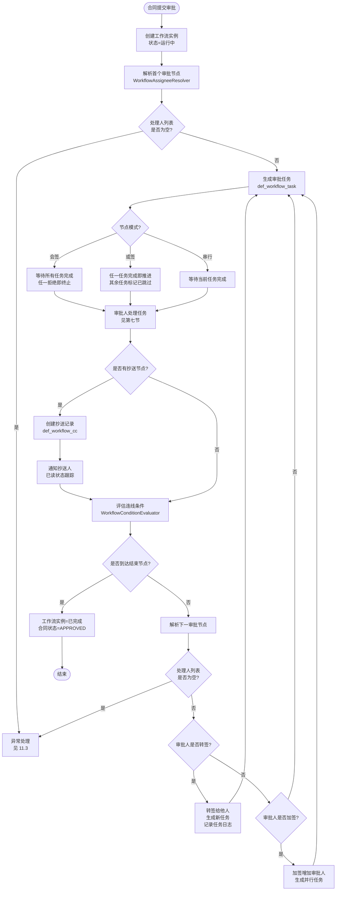

要点解读：

- 节点模式分串行/会签/或签三种，由 `def_workflow_node.会签或签` 字段配置；
- 会签要求所有任务完成才推进，任一拒绝即终止实例；或签任一完成即推进，其余任务自动标记 `已跳过`；
- 抄送节点（`def_workflow_cc`）不阻塞流程，仅通知并跟踪已读状态；
- 转签替换当前任务处理人，加签在当前节点增加并行处理人，二者均生成新任务并记录 `def_workflow_task_log`；
- 连线条件由 `WorkflowConditionEvaluator` 求值，支持基于合同业务字段（金额/类型/属地）的分支路由；
- 任一节点处理人解析为空时进入异常处理流程（见 11.3），实例标记为异常并通知发起人。

---

## 七、审批人处理任务流程

审批人登录系统后，从"我的待办"入口处理分配到本人的审批任务。本节展示审批人从查看待办到填写意见、做出决策的完整操作路径。

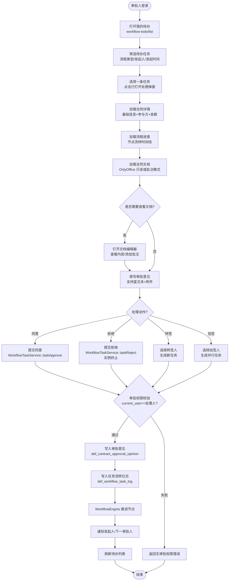

要点解读：

- 审批权限校验是关键安全控制：`taskApprove/taskReject/taskTransfer/taskCountersign` 均校验 `current_user == task.处理人`，否则返回 `businessError('无审批权限')`；
- 审批意见独立存储于 `def_contract_approval_opinion`，支持编辑/查看/追溯/导出，与任务状态解耦；
- 文档查看模式由权限决定：审批人默认只读或批注模式，不可直接修改正文（避免审批人篡改合同内容）；
- 转签与加签均生成新任务并记录日志，转签替换处理人、加签增加并行处理人；
- 任务处理完成后由 `WorkflowEngine` 自动推进节点，无需审批人手动触发下一步。

---

## 八、文档协作流程

合同文档通过 OnlyOffice 实现多人在线协同编辑。本节展示从打开文档到回调保存、创建版本、记录留痕的完整数据交互流程。

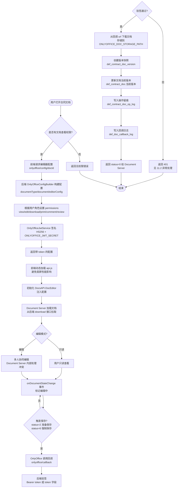

要点解读：

- 编辑器配置由后端构建并 JWT 签名，前端仅负责注入配置，密钥不暴露；
- 权限映射由 `OnlyOfficeConfigBuilder` 根据用户操作级权限动态生成，无编辑权限用户只能查看；
- OnlyOffice 回调状态码：0=未保存、1=编辑中、2=准备保存、3=保存出错、4=无变化关闭、6=强制保存、7=强制保存出错；
- 回调验签失败返回 401，Document Server 会按内置策略重试，重试仍失败进入异常处理流程（见 11.2）；
- 协同编辑冲突由 Document Server 内部处理，应用层仅负责版本快照与留痕，不处理冲突合并；
- 动态加载 `api.js` 避免首屏性能影响，仅在用户打开文档时加载。

---

## 九、版本管理流程

文档版本管理提供版本历史查看、版本对比、版本回溯、版本标记四项核心能力。本节展示用户在文档编辑器侧边栏操作版本的完整路径。

```mermaid
flowchart TD
    Start([用户打开版本面板]) --> LoadHistory[加载版本历史<br/>onlyoffice/history/docId]
    LoadHistory --> RenderList[渲染版本列表<br/>版本号/创建人/创建时间/版本说明/标记]
    RenderList --> SelectVersion[选择一个版本]
    SelectVersion --> DecisionAction{操作动作?}
    DecisionAction -- 查看 --> FetchData[获取版本数据<br/>onlyoffice/history-data/versionId]
    FetchData --> RenderVersion[在编辑器历史组件中渲染<br/>OnlyOffice 内置 history]
    RenderVersion --> End
    DecisionAction -- 对比 --> SelectTarget[选择目标版本<br/>另一版本号]
    SelectTarget --> CompareVersions[调用版本对比<br/>onlyoffice/history-data 对比两版本]
    CompareVersions --> RenderDiff[渲染差异视图<br/>OnlyOffice 内置对比组件]
    RenderDiff --> End
    DecisionAction -- 回溯 --> ConfirmRollback{确认回溯?<br/>当前版本将被覆盖}
    ConfirmRollback -- 否 --> End([结束])
    ConfirmRollback -- 是 --> CheckPermission{有回溯权限?<br/>管理员或发起人}
    CheckPermission -- 否 --> PermissionDeny[返回无权限错误]
    CheckPermission -- 是 --> BackupCurrent[备份当前版本<br/>创建新版本快照]
    BackupCurrent --> ReplaceDoc[用目标版本替换当前文档<br/>更新 def_contract_doc.当前版本]
    ReplaceDoc --> WriteOpLog[写入操作留痕<br/>操作类型=版本回溯]
    WriteOpLog --> Notify[通知协作者刷新]
    Notify --> End
    DecisionAction -- 标记 --> InputLabel[输入版本标记/说明<br/>如"终版"/"法务审核版"]
    InputLabel --> MarkVersion[调用版本标记接口<br/>contract-doc/version/mark]
    MarkVersion --> UpdateLabel[更新 def_contract_doc_version.版本说明<br/>是否标记=true]
    UpdateLabel --> WriteOpLog
    WriteOpLog --> End
    PermissionDeny --> End
```

要点解读：

- 版本历史由 `def_contract_doc_version` 表存储，每次回调保存（status=2/6）自动创建版本快照；
- 版本对比与查看复用 OnlyOffice 内置 history 组件，无需自研 diff 算法；
- 版本回溯需先备份当前版本，避免误操作丢失数据，回溯失败进入异常处理（见 11.4）；
- 版本标记用于人工标注关键版本（如终版、法务审核版），便于后续检索与追溯；
- 所有版本操作均写入 `def_contract_doc_op_log`，操作类型包括 `版本创建/版本回溯/版本标记`。

---

## 十、权限审计流程

权限审计捕获角色赋权、用户赋权、菜单赋权、工作流节点赋权四类变更，写入 `def_permission_audit` 与 `def_permission_audit_detail`，支持多维度查询与导出。

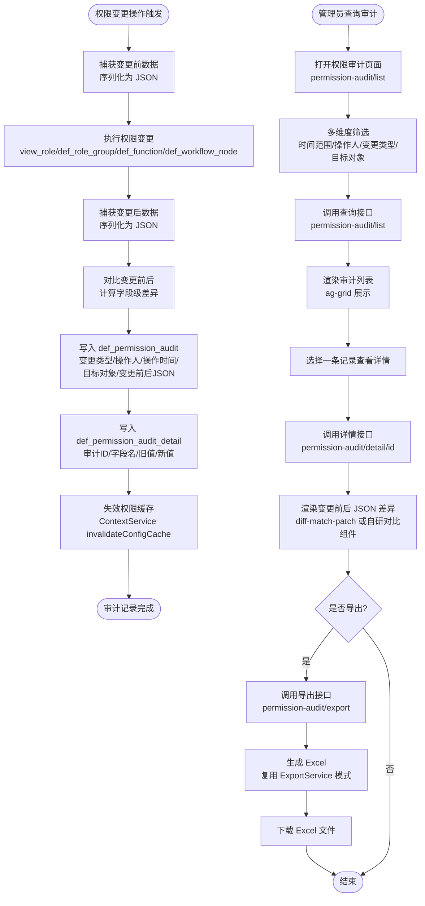

要点解读：

- 审计埋点在现有角色/用户/菜单/工作流节点 CRUD 接口中植入，调用 `PermissionAuditService::record()`；
- 变更前后数据均序列化为 JSON 存储，明细表记录字段级差异，便于精准追溯；
- 权限变更后立即失效 `ContextService` 缓存（TTL 1800s），确保权限实时生效；
- 查询支持按时间范围、操作人、变更类型、目标对象四维度筛选；
- 详情页采用 JSON diff 视图展示变更前后差异，类似 git diff 体验；
- 导出复用 Workbench `ExportService` 模式，输出 Excel 供合规审查归档。

---

## 十一、异常处理流程

### 11.1 审批超时处理

审批任务超时由定时任务或请求触发 `WorkflowEngine::checkTimeout()` 检测，按节点配置的超时规则自动处理。

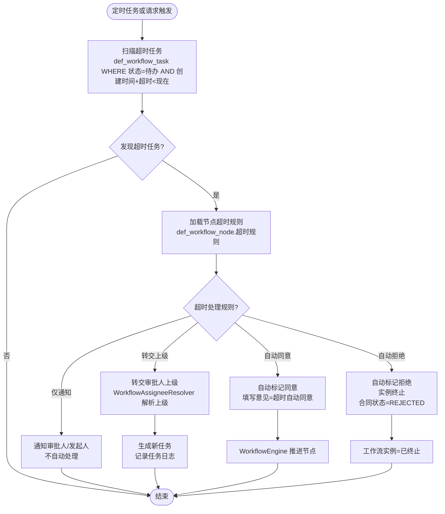

要点解读：

- 超时规则由节点配置决定，支持自动同意/自动拒绝/仅通知/转交上级四种策略；
- 自动处理需填写审批意见（标注"超时自动处理"）并记录任务日志，确保可追溯；
- 转交上级通过 `WorkflowAssigneeResolver` 解析审批人上级，需上级用户存在，否则降级为仅通知；
- 超时检测由定时任务（如每 10 分钟）或请求触发（请求时顺带检测当前实例），避免遗漏。

### 11.2 OnlyOffice 回调失败处理

OnlyOffice 回调验签失败或处理异常时，Document Server 会按内置策略重试，应用层需记录失败并支持人工补救。

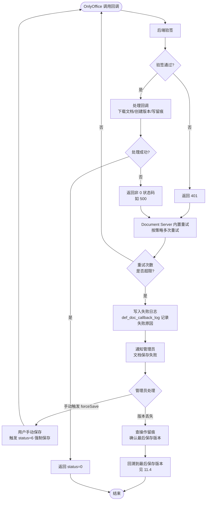

要点解读：

- OnlyOffice 回调失败包括验签失败（401）与处理异常（500），Document Server 均会重试；
- 所有回调（含失败）均写入 `def_doc_callback_log`，记录载荷与处理结果；
- 重试超限后通知管理员，管理员可引导用户手动触发 `forceSave`（status=6）重新保存；
- 若版本丢失，通过操作留痕定位最后成功保存的版本，执行版本回溯恢复。

### 11.3 审批人指派为空处理

`WorkflowAssigneeResolver` 解析节点处理人列表为空时，流程实例无法继续，需标记异常并通知发起人。

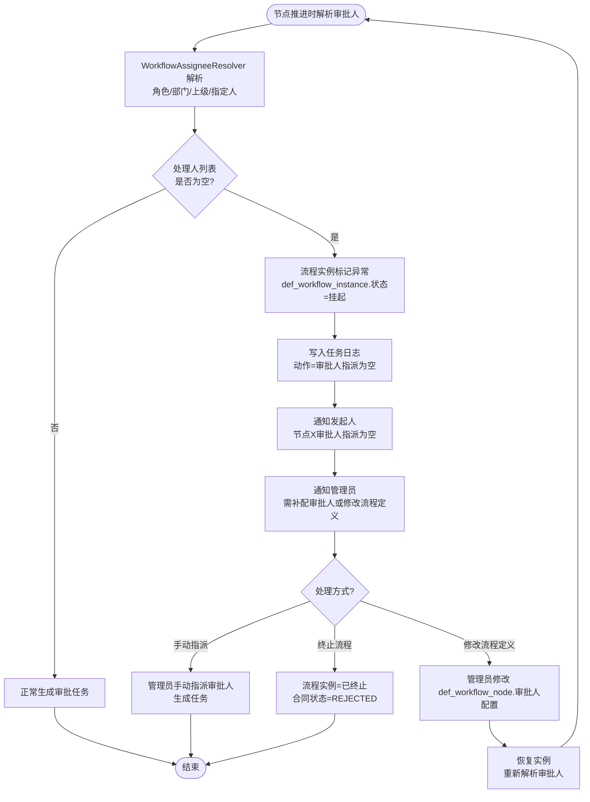

要点解读：

- 审批人指派为空通常因角色/部门下无用户、上级用户不存在、指定人离职等原因；
- 实例标记为 `挂起` 而非直接终止，便于管理员补配后恢复；
- 管理员可通过修改流程定义（影响后续实例）或手动指派（仅影响当前实例）两种方式处理；
- 若无法补配，发起人可放弃并终止流程，合同状态置为 `REJECTED`。

### 11.4 版本回溯失败处理

版本回溯涉及文档替换与版本快照备份，失败时需保证当前版本不丢失，并支持重试。

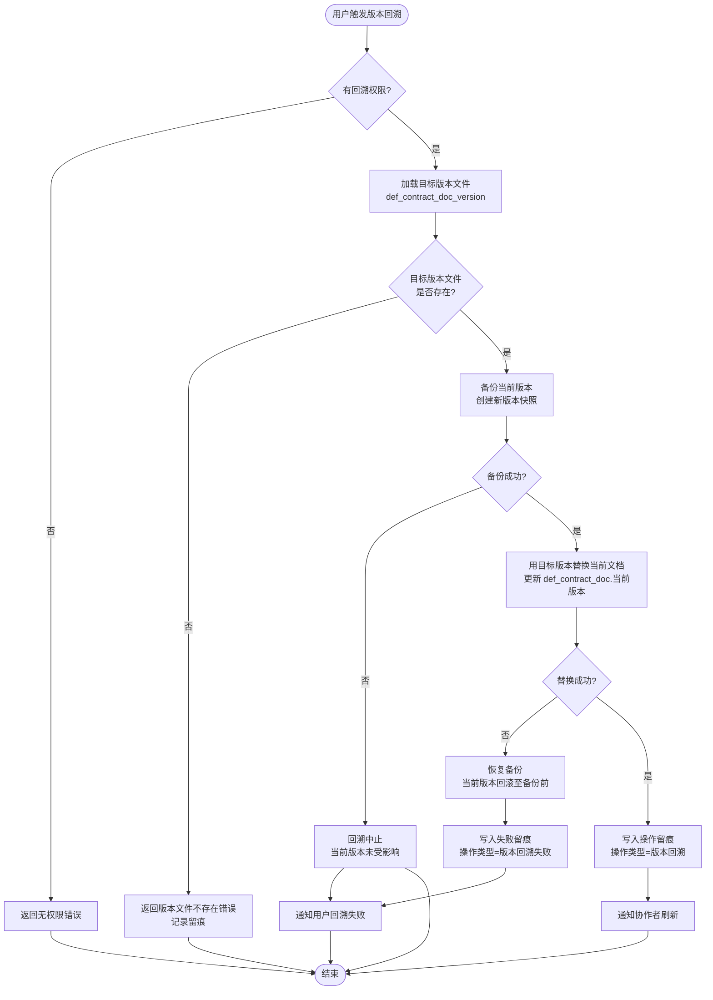

要点解读：

- 版本回溯遵循"先备份再替换"原则，确保失败时当前版本可恢复；
- 目标版本文件缺失（如存储清理误删）直接返回错误，不执行回溯；
- 替换失败时自动恢复备份，避免文档损坏；
- 所有回溯操作（含失败）均写入操作留痕，便于追溯与重试。

---

## 十二、各角色操作流程

### 12.1 发起人操作流程

发起人是合同的创建者与提交者，主要负责草稿维护、提交审批、撤回与重新提交。

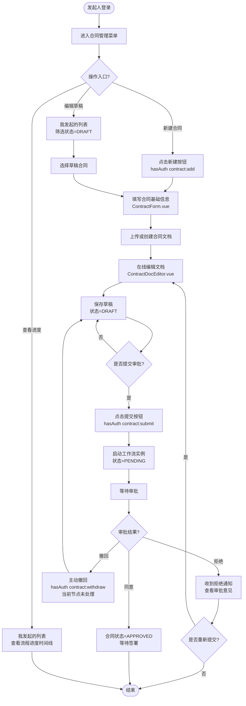

要点解读：

- 发起人权限通过 `hasAuth('contract:add/submit/withdraw')` 控制，按钮按操作级权限显隐；
- 草稿态可反复编辑文档与基础信息，提交后进入审批态，仅撤回可回退；
- 拒绝后可编辑重新提交，文档版本持续累积，审批意见保留可追溯；
- 撤回仅当当前节点任务未处理时可用，避免审批人已处理后被撤回。

### 12.2 审批人操作流程

审批人处理分配到本人的审批任务，操作路径详见第七节，本节补充审批人的整体工作流。

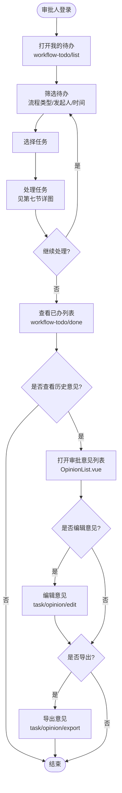

要点解读：

- 审批人主要工作集中在"我的待办"，支持待办/已办/抄送/我发起的 Tab 切换；
- 审批意见支持事后编辑与导出，便于归档与合规审查；
- 已办列表可追溯历史处理记录，支持按合同/时间筛选。

### 12.3 签署人操作流程

签署人处理已审核通过（APPROVED）的合同签署任务，可确认签署或退回修改。

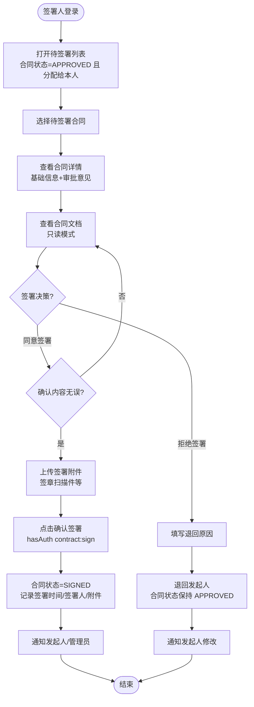

要点解读：

- 签署人仅对 APPROVED 状态合同操作，签署任务由合同模块单独驱动（不占用审批工作流实例）；
- 签署人默认只读查看文档，不可修改正文，仅可上传签署附件；
- 拒绝签署不改变合同状态（保持 APPROVED），退回发起人修改后重新进入签署环节；
- 签署完成后合同进入 SIGNED 状态，等待归档。

### 12.4 管理员操作流程

管理员负责流程定义配置、流程实例治理、权限管理、审计查询与异常处理，是系统的运维与治理角色。

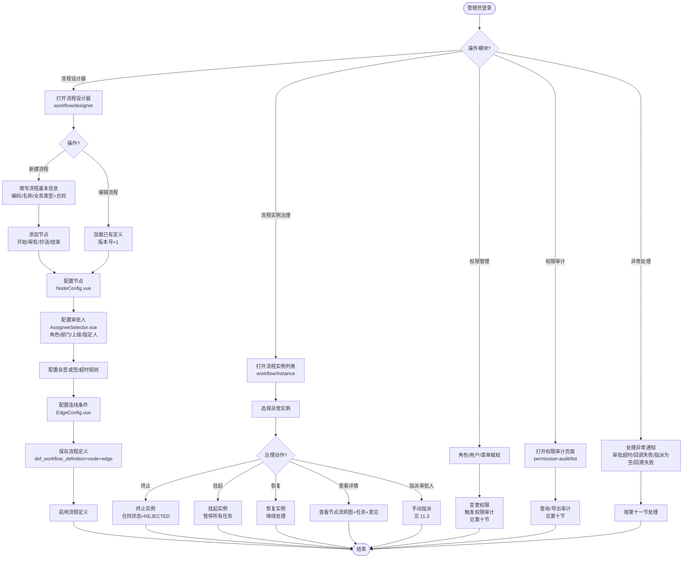

要点解读：

- 流程设计器为表单式配置器（非 BPMN 拖拽），通过垂直节点列表 + 右侧配置面板完成流程定义；
- 流程定义支持版本管理，编辑后版本号递增，旧版本实例继续按旧版本运行，新实例用新版本；
- 流程实例治理支持终止/挂起/恢复/手动指派，覆盖异常处理与流程治理场景；
- 权限变更自动触发审计记录，无需管理员手动操作；
- 异常处理统一收敛到管理员，由第十一节各子流程具体处理。

### 12.5 查看人操作流程

查看人为只读角色，仅可查看授权范围内的合同信息与文档，无任何写操作权限。

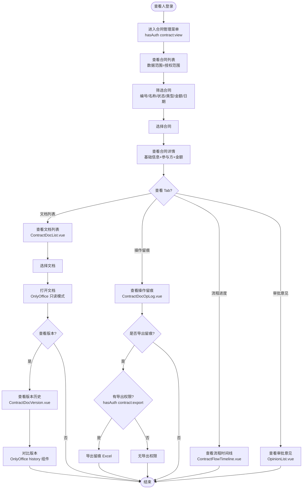

要点解读：

- 查看人仅持有 `contract:view` 权限，所有写操作按钮（编辑/审批/签署/归档）均隐藏；
- 文档以 OnlyOffice 只读模式打开，permissions 仅含 view，无 edit/download/print；
- 版本对比复用 OnlyOffice history 组件，查看人可对比但不可回溯；
- 操作留痕查看人可见，但导出需额外 `contract:export` 权限，未授权时导出按钮隐藏。

---

## 文档统计

- Mermaid 图总数：17 个
  - flowchart 流程图：15 个（第三、六、七、八、九、十、十一.1、十一.2、十一.3、十一.4、十二.1、十二.2、十二.3、十二.4、十二.5 节，其中第十二节含 5 个子图）
  - stateDiagram-v2 状态图：2 个（第四、五节）
- 章节概要：
  - 一、引言：目的、范围、图例说明
  - 二、角色定义：5 种角色职责权限表
  - 三、合同全生命周期流程：创建到归档主干流程含拒绝/重新提交/撤回分支
  - 四、合同状态机流程图：DRAFT/PENDING/APPROVED/SIGNED/ARCHIVED 主干 + REJECTED/TERMINATED/EXPIRED 异常分支
  - 五、工作流实例状态机：待启动/运行中/已完成/已终止/已挂起
  - 六、多级审批流程：串行/会签/或签/抄送/转签/加签分支
  - 七、审批人处理任务流程：待办到处理决策含权限校验
  - 八、文档协作流程：OnlyOffice 配置/编辑/回调/版本/留痕
  - 九、版本管理流程：查看/对比/回溯/标记
  - 十、权限审计流程：变更捕获/写入/查询/导出
  - 十一、异常处理流程：审批超时/回调失败/指派为空/版本回溯失败
  - 十二、各角色操作流程：发起人/审批人/签署人/管理员/查看人五小节
