# 合同管理系统架构设计

> 文档编号：MIS-CONTRACT-ARCH-001
> 版本：V1.0
> 编制日期：2026-07-23
> 编制依据：《合同管理模块系统性升级实施计划》《合同管理功能需求规格说明书》《OnlyOffice 集成技术方案》及 Phase 1 代码库探索结论
> 适用范围：`e:\code\php\mis`（backend: CodeIgniter 4.7.2 / PHP 8.5.4；frontend: Vue 3 + Vite + Soybean Admin + ag-grid + Pinia + pnpm 11 + Node.js 25.9.0）
> 状态：作为后续数据库设计、API 接口设计、编码实现与测试验收的架构依据

---

## 目录

- [1. 引言](#1-引言)
  - [1.1 目的](#11-目的)
  - [1.2 范围](#12-范围)
  - [1.3 设计原则](#13-设计原则)
  - [1.4 参考资料](#14-参考资料)
- [2. 总体架构](#2-总体架构)
  - [2.1 系统总体架构图](#21-系统总体架构图)
  - [2.2 技术栈选型](#22-技术栈选型)
- [3. 后端架构设计](#3-后端架构设计)
  - [3.1 分层架构](#31-分层架构)
  - [3.2 四大子域划分与依赖](#32-四大子域划分与依赖)
  - [3.3 Workflow 子域类图](#33-workflow-子域类图)
  - [3.4 Contract 子域类图](#34-contract-子域类图)
  - [3.5 OnlyOffice 子域类图](#35-onlyoffice-子域类图)
  - [3.6 Permission 子域类图](#36-permission-子域类图)
  - [3.7 与现有模块的集成点](#37-与现有模块的集成点)
- [4. 前端架构设计](#4-前端架构设计)
  - [4.1 分层架构](#41-分层架构)
  - [4.2 模块划分](#42-模块划分)
  - [4.3 组件复用关系](#43-组件复用关系)
  - [4.4 路由与权限守卫流程](#44-路由与权限守卫流程)
  - [4.5 状态管理设计](#45-状态管理设计)
- [5. 工作流引擎架构](#5-工作流引擎架构)
  - [5.1 引擎核心架构](#51-引擎核心架构)
  - [5.2 流转流程图](#52-流转流程图)
  - [5.3 与业务模块的解耦设计](#53-与业务模块的解耦设计)
  - [5.4 扩展点设计](#54-扩展点设计)
- [6. OnlyOffice 集成架构](#6-onlyoffice-集成架构)
  - [6.1 集成架构图](#61-集成架构图)
  - [6.2 JWT 双轨制](#62-jwt-双轨制)
  - [6.3 回调处理架构](#63-回调处理架构)
- [7. 权限架构设计](#7-权限架构设计)
  - [7.1 权限层级图](#71-权限层级图)
  - [7.2 RBAC 模型](#72-rbac-模型)
  - [7.3 按钮级权限映射](#73-按钮级权限映射)
  - [7.4 数据级权限注入流程](#74-数据级权限注入流程)
  - [7.5 权限变更审计架构](#75-权限变更审计架构)
- [8. 数据架构](#8-数据架构)
  - [8.1 数据分层](#81-数据分层)
  - [8.2 数据流向图](#82-数据流向图)
  - [8.3 缓存策略](#83-缓存策略)
  - [8.4 数据迁移架构](#84-数据迁移架构)
- [9. 接口架构](#9-接口架构)
  - [9.1 RESTful 设计规范](#91-restful-设计规范)
  - [9.2 统一响应封装](#92-统一响应封装)
  - [9.3 X-Server-Trace 头规范](#93-x-server-trace-头规范)
  - [9.4 JWT 鉴权流程](#94-jwt-鉴权流程)
  - [9.5 错误码规范](#95-错误码规范)
- [10. 安全架构](#10-安全架构)
  - [10.1 认证与授权](#101-认证与授权)
  - [10.2 SQL 注入防护](#102-sql-注入防护)
  - [10.3 XSS/CSRF 防护](#103-xsscsrf-防护)
  - [10.4 敏感信息加密](#104-敏感信息加密)
  - [10.5 审计日志](#105-审计日志)
  - [10.6 OnlyOffice 回调安全](#106-onlyoffice-回调安全)
- [11. 性能架构](#11-性能架构)
  - [11.1 后端性能](#111-后端性能)
  - [11.2 前端性能](#112-前端性能)
  - [11.3 数据库性能](#113-数据库性能)
  - [11.4 OnlyOffice 性能](#114-onlyoffice-性能)
- [12. 可扩展性设计](#12-可扩展性设计)
  - [12.1 工作流引擎扩展](#121-工作流引擎扩展)
  - [12.2 OnlyOffice 组件复用](#122-onlyoffice-组件复用)
  - [12.3 权限系统扩展](#123-权限系统扩展)
  - [12.4 数据库扩展](#124-数据库扩展)
- [13. 部署架构](#13-部署架构)
  - [13.1 部署拓扑图](#131-部署拓扑图)
  - [13.2 环境变量清单](#132-环境变量清单)
  - [13.3 迁移脚本执行流程](#133-迁移脚本执行流程)
- [14. 技术债务与规避](#14-技术债务与规避)
  - [14.1 现有合同模块债务](#141-现有合同模块债务)
  - [14.2 本次重构如何消除债务](#142-本次重构如何消除债务)
  - [14.3 pnpm 11 严格依赖隔离](#143-pnpm-11-严格依赖隔离)
  - [14.4 ag-grid 数值列对齐惯例](#144-ag-grid-数值列对齐惯例)
  - [14.5 行尾符规范](#145-行尾符规范)

---

## 1. 引言

### 1.1 目的

本文档对 MIS 系统合同管理模块的系统性升级进行架构层面的完整约定，明确模块划分、分层结构、子域依赖、关键流程、集成方式、安全与性能策略，作为后续数据库设计、API 接口设计、编码实现、测试验收与部署运维的统一架构依据。

本次升级在纠正现有合同模块工程问题（未遵循 Controller-Service 分层、未使用 CI4 Migration、`list()` 未实现筛选、`approve()` 未校验审批权限、字段命名不一致、`sprintf` SQL 拼接风险）的基础上，引入四大子域能力：

1. **Workflow 子域**：通用工作流引擎，支持串行/会签/或签/抄送/加签/转签；
2. **Contract 子域**：合同模块重构，接入工作流引擎与 OnlyOffice 文档协作；
3. **OnlyOffice 子域**：文档在线协作、版本控制、操作留痕；
4. **Permission 子域**：权限变更审计、按钮级与数据级权限补全。

### 1.2 范围

| 范围内 | 范围外 |
|---|---|
| 后端 Controller-Service 分层架构、子域划分、类设计 | OnlyOffice Document Server 本身的部署与运维 |
| 前端 View-Store-API 三层架构、模块划分、组件复用 | BPMN 可视化拖拽设计器（采用表单式配置器） |
| 工作流引擎核心架构与扩展点 | 工作流引擎接入其他业务模块（本次仅合同接入） |
| OnlyOffice JWT 双轨制、回调、版本、留痕 | 移动端适配（仅 PC 端） |
| RBAC + 按钮/数据级权限与审计 | Workbench/Employee 等现有模块改造 |
| CI4 Migration 版本化数据库变更 | 数字签名、电子签章（仅在线编辑与版本管理） |

### 1.3 设计原则

| 原则 | 含义 | 落地措施 |
|---|---|---|
| 高内聚低耦合 | 子域内部紧密聚合，子域之间通过明确接口通信 | 四大子域物理隔离（独立目录），通过 Service facade 调用 |
| 复用 | 通用能力下沉为基础设施，业务模块复用 | Workflow 引擎与 OnlyOffice 组件设计为可复用基础设施 |
| 可扩展 | 新业务模块接入工作流/文档协作无需修改引擎 | 通过回调接口 `onTaskCompleted()` 与通用编辑器组件扩展 |
| 安全 | 鉴权、防注入、防篡改、审计全覆盖 | JWT 双 Token + RBAC + 参数化查询 + 操作留痕 + 权限审计 |
| 性能 | 分段计时、缓存、索引、虚拟滚动 | hrtime 计时 + X-Server-Trace + MetadataCache + ag-grid 虚拟滚动 |
| 一致性 | 新代码遵循项目既有惯例 | 与 Workbench/Employee 模块分层一致、中文字段名一致、性能惯例一致 |

### 1.4 参考资料

- 《合同管理模块系统性升级实施计划.md》
- 《合同管理功能需求规格说明书.md》
- 《OnlyOffice 集成技术方案.md》
- CodeIgniter 4.7.2 官方文档：https://codeigniter.com/user_guide/index.html
- OnlyOffice 官方 API：https://api.onlyoffice.com/editors/
- Soybean Admin 文档：https://docs.soybeanjs.cn/
- ag-grid v33 文档：https://www.ag-grid.com/javascript-data-grid/

---

## 2. 总体架构

### 2.1 系统总体架构图

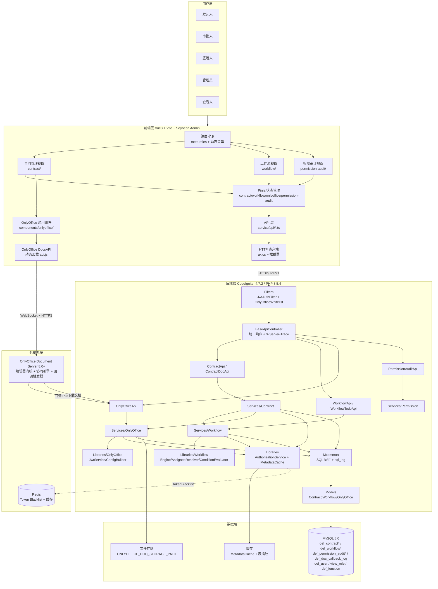
```mermaid
flowchart TB
    subgraph UserLayer[用户层]
        Initiator[发起人]
        Approver[审批人]
        Signer[签署人]
        Admin[管理员]
        Viewer[查看人]
    end

    subgraph FrontendLayer[前端层 Vue3 + Vite + Soybean Admin]
        Router[路由守卫<br/>meta.roles + 动态菜单]
        ContractView[合同管理视图<br/>contract/]
        WorkflowView[工作流视图<br/>workflow/]
        OnlyOfficeComp[OnlyOffice 通用组件<br/>components/onlyoffice/]
        AuditView[权限审计视图<br/>permission-audit/]
        PiniaStore[Pinia 状态管理<br/>contract/workflow/onlyoffice/permission-audit]
        ApiLayer[API 层<br/>service/api/*.ts]
        HTTPClient[HTTP 客户端<br/>axios + 拦截器]
        DocsAPI[OnlyOffice DocsAPI<br/>动态加载 api.js]
    end

    subgraph BackendLayer[后端层 CodeIgniter 4.7.2 / PHP 8.5.4]
        Filters[Filters<br/>JwtAuthFilter + OnlyOfficeWhitelist]
        BaseApi[BaseApiController<br/>统一响应 + X-Server-Trace]
        ContractCtrl[ContractApi / ContractDocApi]
        WorkflowCtrl[WorkflowApi / WorkflowTodoApi]
        OnlyOfficeCtrl[OnlyOfficeApi]
        PermCtrl[PermissionAuditApi]
        ContractSvc[Services/Contract]
        WorkflowSvc[Services/Workflow]
        OnlyOfficeSvc[Services/OnlyOffice]
        PermSvc[Services/Permission]
        WorkflowLib[Libraries/Workflow<br/>Engine/AssigneeResolver/ConditionEvaluator]
        OnlyOfficeLib[Libraries/OnlyOffice<br/>JwtService/ConfigBuilder]
        AuthLib[Libraries<br/>AuthorizationService + MetadataCache]
        Mcommon[Mcommon<br/>SQL 执行 + sql_log]
        Models[Models<br/>Contract/Workflow/OnlyOffice]
    end

    subgraph DataLayer[数据层]
        MySQL[(MySQL 8.0<br/>def_contract* / def_workflow*<br/>def_permission_audit* / def_doc_callback_log<br/>def_user / view_role / def_function)]
        FileStore[文件存储<br/>ONLYOFFICE_DOC_STORAGE_PATH]
        Cache[缓存<br/>MetadataCache + 表指纹]
    end

    subgraph ExternalLayer[外部系统]
        OnlyOfficeDS[OnlyOffice Document Server 8.0+<br/>编辑器内核 + 协同引擎 + 回调触发器]
        Redis[(Redis<br/>Token Blacklist + 缓存)]
    end

    UserLayer --> FrontendLayer
    Router --> ContractView
    Router --> WorkflowView
    Router --> AuditView
    ContractView --> PiniaStore
    WorkflowView --> PiniaStore
    AuditView --> PiniaStore
    ContractView --> OnlyOfficeComp
    PiniaStore --> ApiLayer
    ApiLayer --> HTTPClient
    HTTPClient -->|HTTPS REST| Filters
    OnlyOfficeComp --> DocsAPI
    DocsAPI -->|WebSocket + HTTPS| OnlyOfficeDS

    Filters --> BaseApi
    BaseApi --> ContractCtrl
    BaseApi --> WorkflowCtrl
    BaseApi --> OnlyOfficeCtrl
    BaseApi --> PermCtrl
    ContractCtrl --> ContractSvc
    WorkflowCtrl --> WorkflowSvc
    OnlyOfficeCtrl --> OnlyOfficeSvc
    PermCtrl --> PermSvc
    ContractSvc --> WorkflowSvc
    ContractSvc --> OnlyOfficeSvc
    ContractSvc --> AuthLib
    WorkflowSvc --> WorkflowLib
    WorkflowSvc --> AuthLib
    OnlyOfficeSvc --> OnlyOfficeLib
    OnlyOfficeSvc --> AuthLib
    ContractSvc --> Mcommon
    WorkflowSvc --> Mcommon
    OnlyOfficeSvc --> Mcommon
    Mcommon --> Models
    Models --> MySQL
    OnlyOfficeSvc --> FileStore
    AuthLib --> Cache
    OnlyOfficeDS -->|回调 POST| OnlyOfficeCtrl
    OnlyOfficeDS -->|下载文档| OnlyOfficeCtrl
    AuthLib -.TokenBlacklist.-> Redis
```

### 2.2 技术栈选型

| 类别 | 技术 | 版本 | 选型依据 |
|---|---|---|---|
| 后端语言 | PHP | 8.5.4 | 项目既有版本，支持枚举、readonly、纤维等现代特性 |
| 后端框架 | CodeIgniter | 4.7.2 | 项目既有框架，轻量、MVC 清晰、Migration 支持完善 |
| 后端 JWT | firebase/php-jwt | ^6.x | HS256 签名/验签，同时用于用户鉴权与 OnlyOffice |
| 数据库 | MySQL | 8.0+ | 项目既有，支持 JSON 字段、CTE、窗口函数 |
| 缓存 | Redis | 6.x+ | Token 黑名单、MetadataCache 后端 |
| 前端框架 | Vue | 3.x | Composition API、`<script setup>`、性能优 |
| 前端构建 | Vite | 6.x | ES 原生模块、HMR 快、Rollup 打包 |
| 前端脚手架 | Soybean Admin | 最新 | 项目既有，提供路由守卫、动态菜单、布局 |
| 前端状态 | Pinia | 2.x | Vue 3 官方推荐，TS 友好 |
| 前端表格 | ag-grid | v33+ | 企业级虚拟滚动、数值列过滤器、列拖拽 |
| 前端包管理 | pnpm | 11 | 严格依赖隔离、workspace、磁盘节省 |
| 前端运行时 | Node.js | 25.9.0 | 构建环境 |
| 前端组件自动导入 | unplugin-vue-components | 最新 | 按需注册、uno-preset |
| 文档协作 | OnlyOffice Document Server | 8.0+ | 协同编辑、版本历史、JWT 安全 |
| Web 服务器 | Apache | 2.4+ | Windows 部署、mod_rewrite、反向代理、WebSocket 代理 |
| PHP 运行模式 | mod_php / FastCGI | 8.5.4 | 与 Apache 配合，Windows 服务运行 |

---

## 3. 后端架构设计

### 3.1 分层架构


```mermaid
flowchart TB
    subgraph ControllerLayer[Controller 层]
        direction LR
        ContractApi[ContractApi<br/>ContractDocApi]
        WorkflowApi[WorkflowApi<br/>WorkflowTodoApi]
        OnlyOfficeApi[OnlyOfficeApi]
        PermissionAuditApi[PermissionAuditApi]
    end

    subgraph ServiceLayer[Service 层 按子域拆分 单文件 < 30KB]
        direction LR
        ContractSvc[ContractService<br/>ContractQueryService<br/>ContractWorkflowService<br/>ContractDocService<br/>ContractMigrationService]
        WorkflowSvc[WorkflowDefinitionService<br/>WorkflowInstanceService<br/>WorkflowTaskService<br/>WorkflowOpinionService<br/>WorkflowCcService]
        OnlyOfficeSvc[OnlyOfficeCallbackService<br/>OnlyOfficeVersionService<br/>OnlyOfficeDownloadService]
        PermSvc[PermissionAuditService<br/>PermissionQueryService]
    end

    subgraph LibraryLayer[Library 层 无状态算法/工具]
        direction LR
        WorkflowLib[WorkflowEngine<br/>WorkflowAssigneeResolver<br/>WorkflowConditionEvaluator]
        OnlyOfficeLib[OnlyOfficeJwtService<br/>OnlyOfficeConfigBuilder<br/>OnlyOfficeHealthCheck]
        AuthLib[AuthorizationService<br/>MetadataCache]
        CommonLib[Mcommon<br/>SessionUserContext]
    end

    subgraph ModelLayer[Model 层 数据访问]
        direction LR
        ContractModel[ContractModel<br/>ContractDocModel<br/>ContractDocVersionModel<br/>ContractDocOpLogModel]
        WorkflowModel[WorkflowDefinitionModel<br/>WorkflowInstanceModel<br/>WorkflowTaskModel]
        OnlyOfficeModel[DocCallbackLogModel]
        AuthModel[AuthModel<br/>角色/菜单/按钮]
    end

    subgraph DBLayer[数据库 MySQL]
        DB[(def_contract*<br/>def_workflow*<br/>def_permission_audit*<br/>def_doc_callback_log<br/>def_user / view_role / def_function)]
    end

    ControllerLayer -->|参数校验 + 响应封装| ServiceLayer
    ServiceLayer -->|业务编排| LibraryLayer
    ServiceLayer -->|数据访问| ModelLayer
    LibraryLayer -->|权限/缓存| ModelLayer
    ModelLayer -->|SQL| DBLayer

    BaseApiController[BaseApiController<br/>注入 Mcommon/SessionUserContext/traceId<br/>统一响应 + buildPerformanceTable] -.基类.-> ControllerLayer
```

**分层职责**：

| 层 | 职责 | 约束 |
|---|---|---|
| Controller | 参数校验、调用 Service、响应封装、X-Server-Trace 输出 | 方法数 ≤ 10，不写业务逻辑，不直接操作 DB |
| Service | 业务编排、事务管理、调用 Library 与 Model | 单文件 < 30KB，按子域拆分 |
| Library | 无状态算法、配置构建、JWT、权限求值 | 不持有状态，可被多 Service 复用 |
| Model | 数据访问、表映射、SQL 执行 | 通过 Mcommon 执行参数化 SQL |
| DB | 持久化 | 中文字段名，CI4 Migration 管理 |

### 3.2 四大子域划分与依赖

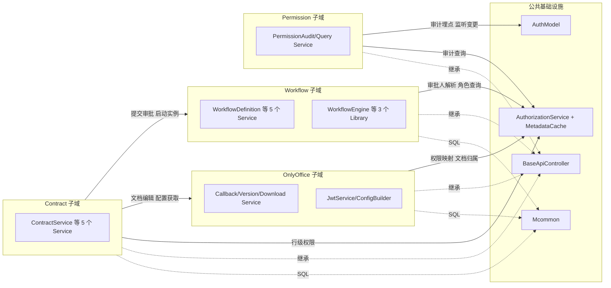
```mermaid
flowchart LR
    subgraph Contract[Contract 子域]
        ContractSvc[ContractService 等 5 个 Service]
    end
    subgraph Workflow[Workflow 子域]
        WorkflowSvc[WorkflowDefinition 等 5 个 Service]
        WorkflowLib[WorkflowEngine 等 3 个 Library]
    end
    subgraph OnlyOffice[OnlyOffice 子域]
        OnlyOfficeSvc[Callback/Version/Download Service]
        OnlyOfficeLib[JwtService/ConfigBuilder]
    end
    subgraph Permission[Permission 子域]
        PermSvc[PermissionAudit/Query Service]
    end
    subgraph Common[公共基础设施]
        BaseApi[BaseApiController]
        Mcommon[Mcommon]
        AuthLib[AuthorizationService + MetadataCache]
        AuthModel[AuthModel]
    end

    Contract -->|提交审批 启动实例| Workflow
    Contract -->|文档编辑 配置获取| OnlyOffice
    Contract -->|行级权限| AuthLib
    Workflow -->|审批人解析 角色查询| AuthLib
    OnlyOffice -->|权限映射 文档归属| AuthLib
    Permission -->|审计埋点 监听变更| AuthModel
    Permission -->|审计查询| AuthLib

    Contract -.继承.-> BaseApi
    Workflow -.继承.-> BaseApi
    OnlyOffice -.继承.-> BaseApi
    Permission -.继承.-> BaseApi
    Contract -.SQL.-> Mcommon
    Workflow -.SQL.-> Mcommon
    OnlyOffice -.SQL.-> Mcommon
```

**依赖规则**：

- Contract 子域依赖 Workflow 子域（提交审批、审批回调）与 OnlyOffice 子域（文档配置、版本查询）；
- Workflow 与 OnlyOffice 子域**互不依赖**，彼此独立；
- Permission 子域**不依赖**任何业务子域，仅监听公共权限模型的变更；
- 四个子域均依赖公共基础设施（BaseApiController、Mcommon、AuthorizationService、MetadataCache、AuthModel）；
- 严禁反向依赖：Workflow/OnlyOffice/Permission 不得调用 Contract Service。

### 3.3 Workflow 子域类图

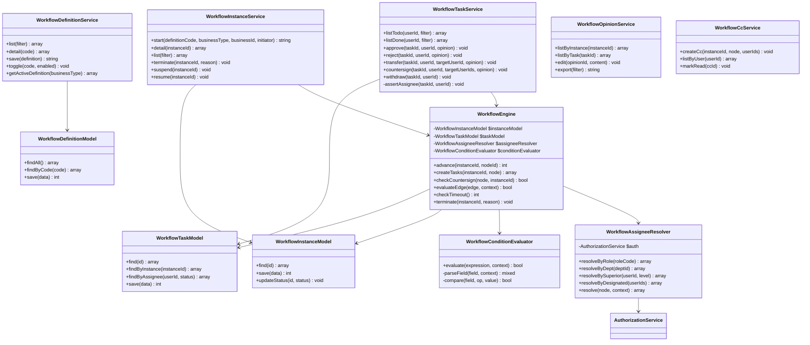
```mermaid
classDiagram
    class WorkflowEngine {
        -WorkflowInstanceModel $instanceModel
        -WorkflowTaskModel $taskModel
        -WorkflowAssigneeResolver $assigneeResolver
        -WorkflowConditionEvaluator $conditionEvaluator
        +advance(instanceId, nodeId) int
        +createTasks(instanceId, node) array
        +checkCountersign(node, instanceId) bool
        +evaluateEdge(edge, context) bool
        +checkTimeout() int
        +terminate(instanceId, reason) void
    }

    class WorkflowAssigneeResolver {
        -AuthorizationService $auth
        +resolveByRole(roleCode) array
        +resolveByDept(deptId) array
        +resolveBySuperior(userId, level) array
        +resolveByDesignated(userIds) array
        +resolve(node, context) array
    }

    class WorkflowConditionEvaluator {
        +evaluate(expression, context) bool
        -parseField(field, context) mixed
        -compare(field, op, value) bool
    }

    class WorkflowDefinitionService {
        +list(filter) array
        +detail(code) array
        +save(definition) string
        +toggle(code, enabled) void
        +getActiveDefinition(businessType) array
    }

    class WorkflowInstanceService {
        +start(definitionCode, businessType, businessId, initiator) string
        +detail(instanceId) array
        +list(filter) array
        +terminate(instanceId, reason) void
        +suspend(instanceId) void
        +resume(instanceId) void
    }

    class WorkflowTaskService {
        +listTodo(userId, filter) array
        +listDone(userId, filter) array
        +approve(taskId, userId, opinion) void
        +reject(taskId, userId, opinion) void
        +transfer(taskId, userId, targetUserId, opinion) void
        +countersign(taskId, userId, targetUserIds, opinion) void
        +withdraw(taskId, userId) void
        -assertAssignee(taskId, userId) void
    }

    class WorkflowOpinionService {
        +listByInstance(instanceId) array
        +listByTask(taskId) array
        +edit(opinionId, content) void
        +export(filter) string
    }

    class WorkflowCcService {
        +createCc(instanceId, node, userIds) void
        +listByUser(userId) array
        +markRead(ccId) void
    }

    class WorkflowDefinitionModel {
        +findAll() array
        +findByCode(code) array
        +save(data) int
    }

    class WorkflowInstanceModel {
        +find(id) array
        +save(data) int
        +updateStatus(id, status) void
    }

    class WorkflowTaskModel {
        +find(id) array
        +findByInstance(instanceId) array
        +findByAssignee(userId, status) array
        +save(data) int
    }

    WorkflowEngine --> WorkflowAssigneeResolver
    WorkflowEngine --> WorkflowConditionEvaluator
    WorkflowEngine --> WorkflowInstanceModel
    WorkflowEngine --> WorkflowTaskModel
    WorkflowInstanceService --> WorkflowEngine
    WorkflowTaskService --> WorkflowEngine
    WorkflowDefinitionService --> WorkflowDefinitionModel
    WorkflowInstanceService --> WorkflowInstanceModel
    WorkflowTaskService --> WorkflowTaskModel
    WorkflowAssigneeResolver --> AuthorizationService
```

### 3.4 Contract 子域类图

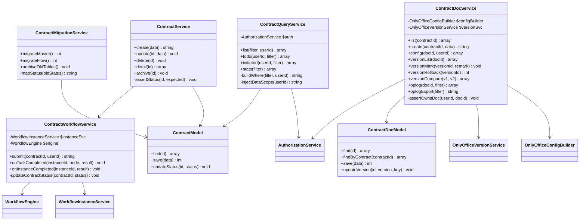
```mermaid
classDiagram
    class ContractService {
        +create(data) string
        +update(id, data) void
        +delete(id) void
        +detail(id) array
        +archive(id) void
        -assertStatus(id, expected) void
    }

    class ContractQueryService {
        -AuthorizationService $auth
        +list(filter, userId) array
        +todo(userId, filter) array
        +initiated(userId, filter) array
        +stats(filter) array
        -buildWhere(filter, userId) string
        -injectDataScope(userId) string
    }

    class ContractWorkflowService {
        -WorkflowInstanceService $instanceSvc
        -WorkflowEngine $engine
        +submit(contractId, userId) string
        +onTaskCompleted(instanceId, node, result) void
        +onInstanceCompleted(instanceId, result) void
        -updateContractStatus(contractId, status) void
    }

    class ContractDocService {
        -OnlyOfficeConfigBuilder $configBuilder
        -OnlyOfficeVersionService $versionSvc
        +list(contractId) array
        +create(contractId, data) string
        +config(docId, userId) array
        +versionList(docId) array
        +versionMark(versionId, remark) void
        +versionRollback(versionId) int
        +versionCompare(v1, v2) array
        +oplog(docId, filter) array
        +oplogExport(filter) string
        -assertOwnsDoc(userId, docId) void
    }

    class ContractMigrationService {
        +migrateMaster() int
        +migrateFlow() int
        +archiveOldTables() void
        -mapStatus(oldStatus) string
    }

    class ContractModel {
        +find(id) array
        +save(data) int
        +updateStatus(id, status) void
    }

    class ContractDocModel {
        +find(id) array
        +findByContract(contractId) array
        +save(data) int
        +updateVersion(id, version, key) void
    }

    ContractService --> ContractModel
    ContractService --> ContractWorkflowService
    ContractQueryService --> AuthorizationService
    ContractQueryService --> ContractModel
    ContractWorkflowService --> WorkflowInstanceService
    ContractWorkflowService --> WorkflowEngine
    ContractDocService --> OnlyOfficeConfigBuilder
    ContractDocService --> OnlyOfficeVersionService
    ContractDocService --> ContractDocModel
    ContractDocService --> AuthorizationService
    ContractMigrationService --> ContractModel
```

### 3.5 OnlyOffice 子域类图

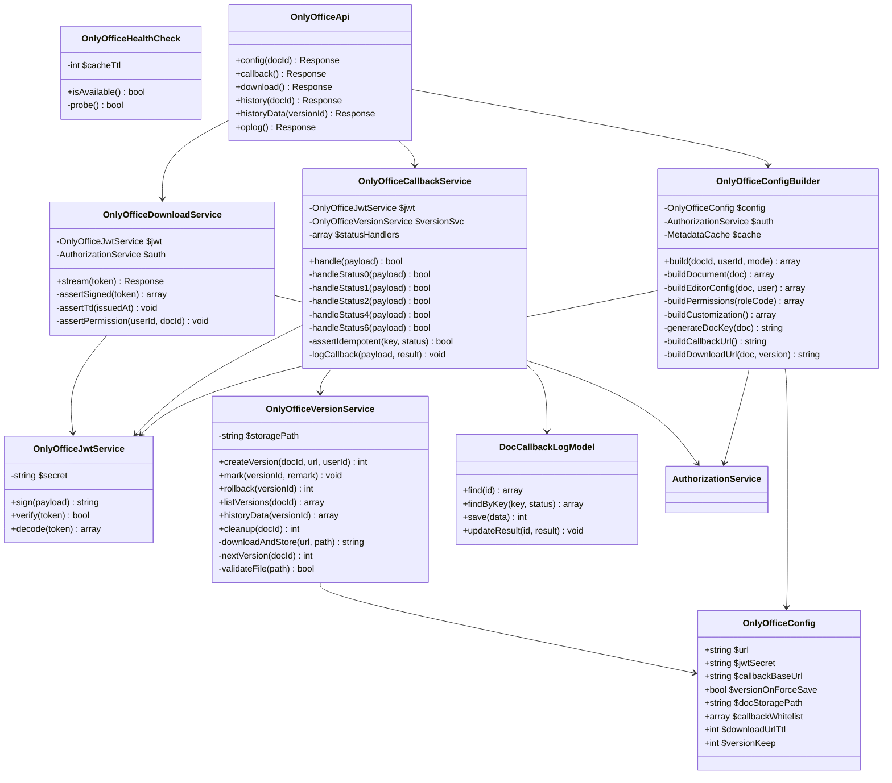
```mermaid
classDiagram
    class OnlyOfficeJwtService {
        -string $secret
        +sign(payload) string
        +verify(token) bool
        +decode(token) array
    }

    class OnlyOfficeConfigBuilder {
        -OnlyOfficeConfig $config
        -AuthorizationService $auth
        -MetadataCache $cache
        +build(docId, userId, mode) array
        -buildDocument(doc) array
        -buildEditorConfig(doc, user) array
        -buildPermissions(roleCode) array
        -buildCustomization() array
        -generateDocKey(doc) string
        -buildCallbackUrl() string
        -buildDownloadUrl(doc, version) string
    }

    class OnlyOfficeHealthCheck {
        -int $cacheTtl
        +isAvailable() bool
        -probe() bool
    }

    class OnlyOfficeCallbackService {
        -OnlyOfficeJwtService $jwt
        -OnlyOfficeVersionService $versionSvc
        -array $statusHandlers
        +handle(payload) bool
        -handleStatus0(payload) bool
        -handleStatus1(payload) bool
        -handleStatus2(payload) bool
        -handleStatus4(payload) bool
        -handleStatus6(payload) bool
        -assertIdempotent(key, status) bool
        -logCallback(payload, result) void
    }

    class OnlyOfficeVersionService {
        -string $storagePath
        +createVersion(docId, url, userId) int
        +mark(versionId, remark) void
        +rollback(versionId) int
        +listVersions(docId) array
        +historyData(versionId) array
        +cleanup(docId) int
        -downloadAndStore(url, path) string
        -nextVersion(docId) int
        -validateFile(path) bool
    }

    class OnlyOfficeDownloadService {
        -OnlyOfficeJwtService $jwt
        -AuthorizationService $auth
        +stream(token) Response
        -assertSigned(token) array
        -assertTtl(issuedAt) void
        -assertPermission(userId, docId) void
    }

    class OnlyOfficeApi {
        +config(docId) Response
        +callback() Response
        +download() Response
        +history(docId) Response
        +historyData(versionId) Response
        +oplog() Response
    }

    class DocCallbackLogModel {
        +find(id) array
        +findByKey(key, status) array
        +save(data) int
        +updateResult(id, result) void
    }

    class OnlyOfficeConfig {
        +string $url
        +string $jwtSecret
        +string $callbackBaseUrl
        +bool $versionOnForceSave
        +string $docStoragePath
        +array $callbackWhitelist
        +int $downloadUrlTtl
        +int $versionKeep
    }

    OnlyOfficeApi --> OnlyOfficeConfigBuilder
    OnlyOfficeApi --> OnlyOfficeCallbackService
    OnlyOfficeApi --> OnlyOfficeDownloadService
    OnlyOfficeConfigBuilder --> OnlyOfficeJwtService
    OnlyOfficeConfigBuilder --> OnlyOfficeConfig
    OnlyOfficeConfigBuilder --> AuthorizationService
    OnlyOfficeCallbackService --> OnlyOfficeJwtService
    OnlyOfficeCallbackService --> OnlyOfficeVersionService
    OnlyOfficeCallbackService --> DocCallbackLogModel
    OnlyOfficeVersionService --> OnlyOfficeConfig
    OnlyOfficeDownloadService --> OnlyOfficeJwtService
    OnlyOfficeDownloadService --> AuthorizationService
```

### 3.6 Permission 子域类图

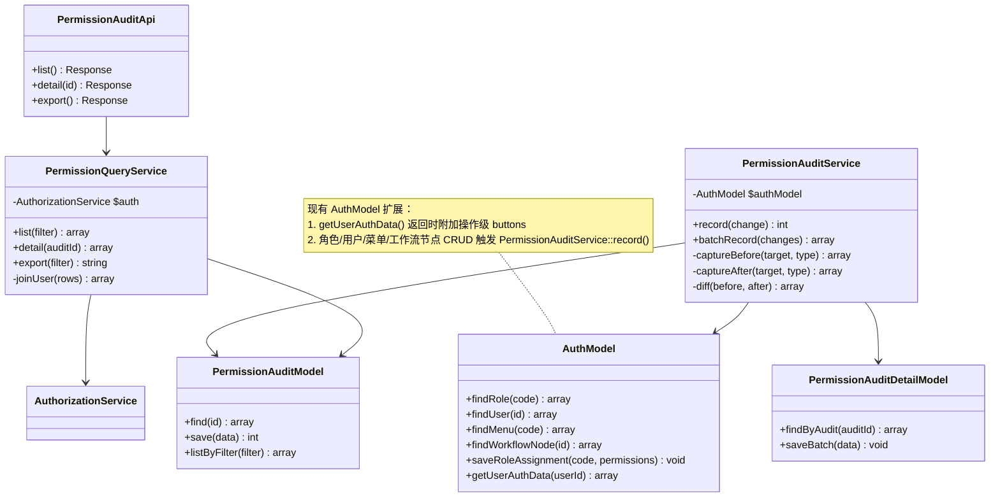
```mermaid
classDiagram
    class PermissionAuditService {
        -AuthModel $authModel
        +record(change) int
        +batchRecord(changes) array
        -captureBefore(target, type) array
        -captureAfter(target, type) array
        -diff(before, after) array
    }

    class PermissionQueryService {
        -AuthorizationService $auth
        +list(filter) array
        +detail(auditId) array
        +export(filter) string
        -joinUser(rows) array
    }

    class PermissionAuditApi {
        +list() Response
        +detail(id) Response
        +export() Response
    }

    class AuthModel {
        +findRole(code) array
        +findUser(id) array
        +findMenu(code) array
        +findWorkflowNode(id) array
        +saveRoleAssignment(code, permissions) void
        +getUserAuthData(userId) array
    }

    class PermissionAuditModel {
        +find(id) array
        +save(data) int
        +listByFilter(filter) array
    }

    class PermissionAuditDetailModel {
        +findByAudit(auditId) array
        +saveBatch(data) void
    }

    PermissionAuditApi --> PermissionQueryService
    PermissionAuditService --> AuthModel
    PermissionAuditService --> PermissionAuditModel
    PermissionAuditService --> PermissionAuditDetailModel
    PermissionQueryService --> AuthorizationService
    PermissionQueryService --> PermissionAuditModel

    note for AuthModel "现有 AuthModel 扩展：<br/>1. getUserAuthData() 返回时附加操作级 buttons<br/>2. 角色/用户/菜单/工作流节点 CRUD 触发 PermissionAuditService::record()"
```

### 3.7 与现有模块的集成点

| 集成点 | 现有模块 | 本次集成方式 |
|---|---|---|
| `BaseApiController` | 公共基类 | 四个子域的 Controller 均继承，复用 `success/error/paramError/notFound/serverError/businessError` 响应封装与 `buildPerformanceTable` |
| `Mcommon` | SQL 执行 + `sql_log` | 所有 SQL 通过 `Mcommon::select()/execute()` 执行，自动写入 `sys_sql_log` |
| `SessionUserContext` | 会话上下文 | Controller 通过基类注入，Service 通过参数传递当前用户 |
| `AuthorizationService` | 行级数据权限 | `ContractQueryService::list()` 注入属地/部门/工号过滤；`OnlyOfficeConfigBuilder` 查询用户角色；`WorkflowAssigneeResolver` 解析角色用户列表 |
| `MetadataCache` | 跨请求缓存 + 表指纹 | 流程定义、合同主表、文档配置通过 MetadataCache 缓存，写操作后 `invalidateConfigCache()` |
| `AuthModel` | 角色/菜单/按钮 | `getUserAuthData()` 返回附加操作级 buttons；CRUD 接口埋点调用 `PermissionAuditService::record()` |
| `JwtAuthFilter` | JWT 用户鉴权 | `Config/Filters.php` 第 108-126 行 `jwt` 过滤范围追加 `contract/*`、`workflow/*`、`workflow-todo/*`、`onlyoffice/config/*`、`onlyoffice/history/*`、`contract-doc/*`、`permission-audit/*` |
| `TokenBlacklistService` | Token 黑名单 | 退出登录、密码修改时复用现有机制 |
| `ExportService`（Workbench） | Excel 导出 | 审批意见导出、留痕导出、权限审计导出复用相同模式 |

---

## 4. 前端架构设计

### 4.1 分层架构


```mermaid
flowchart TB
    subgraph ViewLayer[View 层]
        ContractIdx[contract/index.vue]
        ContractForm[contract/components/ContractForm.vue]
        ContractApprove[contract/components/ContractApproval.vue]
        ContractFlow[contract/components/ContractFlowTimeline.vue]
        ContractDocList[contract/components/ContractDocList.vue]
        ContractDocEditor[contract/components/ContractDocEditor.vue]
        WorkflowDesigner[workflow/designer/index.vue]
        WorkflowTodo[workflow/todo/index.vue]
        WorkflowInstance[workflow/instance/detail.vue]
        AuditIdx[permission-audit/index.vue]
        AuditDetail[permission-audit/detail.vue]
    end

    subgraph ComponentLayer[通用组件层]
        OnlyOfficeEditor[components/onlyoffice/OnlyOfficeEditor.vue]
        OnlyOfficeVer[components/onlyoffice/OnlyOfficeVersionPanel.vue]
        OnlyOfficeOp[components/onlyoffice/OnlyOfficeOpLogPanel.vue]
        AgGrid[ag-grid 表格组件]
        NSkeleton[Soybean 布局组件]
    end

    subgraph StoreLayer[Store 层 Pinia]
        ContractStore[store/modules/contract]
        WorkflowStore[store/modules/workflow]
        OnlyOfficeStore[store/modules/onlyoffice]
        AuditStore[store/modules/permission-audit]
        AuthStore[store/modules/auth<br/>useAuth + hasAuth]
    end

    subgraph ApiLayer[API 层]
        ContractApi[service/api/contract.ts]
        WorkflowApi[service/api/workflow.ts]
        OnlyOfficeApi[service/api/onlyoffice.ts]
        AuditApi[service/api/permission-audit.ts]
    end

    subgraph HttpLayer[HTTP 层]
        Axios[axios 实例]
        RequestInterceptor[请求拦截器<br/>注入 Authorization]
        ResponseInterceptor[响应拦截器<br/>统一错误处理 + 401 跳登录]
    end

    ContractIdx --> ContractStore
    ContractForm --> ContractStore
    ContractApprove --> ContractStore
    ContractFlow --> WorkflowStore
    ContractDocList --> ContractStore
    ContractDocEditor --> OnlyOfficeEditor
    ContractDocEditor --> ContractStore
    WorkflowDesigner --> WorkflowStore
    WorkflowTodo --> WorkflowStore
    WorkflowInstance --> WorkflowStore
    AuditIdx --> AuditStore
    AuditDetail --> AuditStore

    OnlyOfficeEditor --> OnlyOfficeVer
    OnlyOfficeEditor --> OnlyOfficeOp
    ContractDocList --> AgGrid
    ContractIdx --> AgGrid
    WorkflowTodo --> AgGrid
    AuditIdx --> AgGrid

    ContractStore --> ContractApi
    WorkflowStore --> WorkflowApi
    OnlyOfficeStore --> OnlyOfficeApi
    AuditStore --> AuditApi
    AuthStore -.hasAuth.-> ViewLayer

    ContractApi --> Axios
    WorkflowApi --> Axios
    OnlyOfficeApi --> Axios
    AuditApi --> Axios
    Axios --> RequestInterceptor
    Axios --> ResponseInterceptor
    RequestInterceptor -->|HTTPS| Backend[后端 API]
```

### 4.2 模块划分

| 模块 | 路径 | 主要视图 | Store | API |
|---|---|---|---|---|
| 合同管理 | `src/views/contract/` | `index.vue` + 9 个 components | `store/modules/contract` | `service/api/contract.ts` |
| 工作流 | `src/views/workflow/` | `designer/`、`todo/`、`instance/` | `store/modules/workflow` | `service/api/workflow.ts` |
| OnlyOffice 通用组件 | `src/components/onlyoffice/` | 3 个组件 | `store/modules/onlyoffice` | `service/api/onlyoffice.ts` |
| 权限审计 | `src/views/permission-audit/` | `index.vue`、`detail.vue` | `store/modules/permission-audit` | `service/api/permission-audit.ts` |

### 4.3 组件复用关系

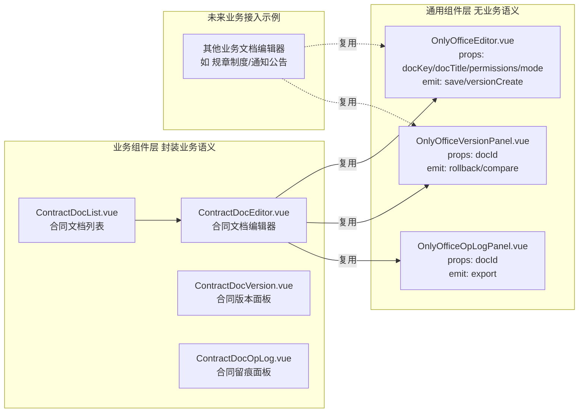
```mermaid
flowchart LR
    subgraph Generic[通用组件层 无业务语义]
        OnlyOfficeEditor[OnlyOfficeEditor.vue<br/>props: docKey/docTitle/permissions/mode<br/>emit: save/versionCreate]
        OnlyOfficeVersionPanel[OnlyOfficeVersionPanel.vue<br/>props: docId<br/>emit: rollback/compare]
        OnlyOfficeOpLogPanel[OnlyOfficeOpLogPanel.vue<br/>props: docId<br/>emit: export]
    end

    subgraph Business[业务组件层 封装业务语义]
        ContractDocEditor[ContractDocEditor.vue<br/>合同文档编辑器]
        ContractDocList[ContractDocList.vue<br/>合同文档列表]
        ContractDocVersion[ContractDocVersion.vue<br/>合同版本面板]
        ContractDocOpLog[ContractDocOpLog.vue<br/>合同留痕面板]
    end

    subgraph Future[未来业务接入示例]
        OtherDocEditor[其他业务文档编辑器<br/>如 规章制度/通知公告]
    end

    ContractDocEditor -->|复用| OnlyOfficeEditor
    ContractDocEditor -->|复用| OnlyOfficeVersionPanel
    ContractDocEditor -->|复用| OnlyOfficeOpLogPanel
    ContractDocList --> ContractDocEditor
    OtherDocEditor -.复用.-> OnlyOfficeEditor
    OtherDocEditor -.复用.-> OnlyOfficeVersionPanel
```

**复用原则**：

- `OnlyOfficeEditor.vue` 仅关心 DocsAPI 初始化、事件监听、配置注入，不关心任何业务语义；
- 业务组件（如 `ContractDocEditor.vue`）负责获取合同文档配置、组装 props、处理业务回调（如保存后刷新合同状态）；
- 业务组件通过 props 向通用组件传值，通过 emit 接收事件，**不**直接操作 DocsAPI。

### 4.4 路由与权限守卫流程

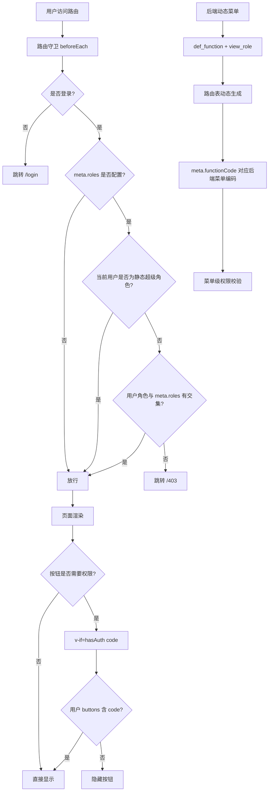
```mermaid
flowchart TD
    A[用户访问路由] --> B[路由守卫 beforeEach]
    B --> C{是否登录?}
    C -- 否 --> D[跳转 /login]
    C -- 是 --> E{meta.roles 是否配置?}
    E -- 否 --> F[放行]
    E -- 是 --> G{当前用户是否为静态超级角色?}
    G -- 是 --> F
    G -- 否 --> H{用户角色与 meta.roles 有交集?}
    H -- 是 --> F
    H -- 否 --> I[跳转 /403]

    F --> J[页面渲染]
    J --> K{按钮是否需要权限?}
    K -- 否 --> L[直接显示]
    K -- 是 --> M[v-if=hasAuth code]
    M --> N{用户 buttons 含 code?}
    N -- 是 --> L
    N -- 否 --> O[隐藏按钮]

    P[后端动态菜单] --> Q[def_function + view_role]
    Q --> R[路由表动态生成]
    R --> S[meta.functionCode 对应后端菜单编码]
    S --> T[菜单级权限校验]
```

**关键点**：

1. **三级权限校验**：路由级（`meta.roles`）→ 菜单级（后端动态菜单）→ 按钮级（`hasAuth(code)`）；
2. **静态超级角色**：在路由守卫中硬编码，绕过 `meta.roles` 校验，保证管理员始终可访问；
3. **按钮权限 code 来源**：后端 `AuthModel::getUserAuthData()` 返回 `buttons` 数组，前端 `useAuth().hasAuth(code)` 查询；
4. **本次扩展的按钮 code**：`contract:add`/`contract:edit`/`contract:delete`/`contract:approve`/`contract:sign`/`contract:archive`/`contract:export`/`contract:import`。

### 4.5 状态管理设计

| Store | state | 关键 actions |
|---|---|---|
| `contract` | `contractList`、`currentContract`、`pagination`、`searchParams`、`docList`、`currentDoc`、`docVersions`、`docOpLogs`、`todoList`、`initiatedList` | `fetchList`、`fetchDetail`、`create`、`update`、`remove`、`submit`、`approve`、`reject`、`archive`、`fetchDocList`、`fetchDocConfig`、`fetchVersions`、`markVersion`、`rollbackVersion`、`fetchOpLogs`、`exportOpLogs`、`fetchTodo`、`fetchInitiated` |
| `workflow` | `definitionList`、`currentDefinition`、`todoList`、`doneList`、`ccList`、`initiatedList`、`instanceList`、`currentInstance` | `fetchDefinitionList`、`fetchDefinitionDetail`、`saveDefinition`、`toggleDefinition`、`startInstance`、`terminateInstance`、`fetchTodo`、`fetchDone`、`fetchCc`、`fetchInitiated`、`approveTask`、`rejectTask`、`transferTask`、`countersignTask`、`withdrawTask`、`fetchOpinion`、`editOpinion`、`exportOpinion`、`markCcRead` |
| `onlyoffice` | `editorConfig`、`versionList`、`currentVersion`、`opLogList`、`opLogPagination` | `fetchEditorConfig`、`fetchVersionList`、`markVersion`、`rollbackVersion`、`compareVersions`、`fetchOpLog`、`exportOpLog` |
| `permission-audit` | `auditList`、`currentAudit`、`pagination`、`searchParams` | `fetchAuditList`、`fetchAuditDetail`、`exportAudit` |

**Store 设计原则**：

- 每个 Store 仅管理本模块状态，跨模块通信通过组件 props 或路由参数；
- `contract` Store 不缓存工作流数据，工作流相关查询走 `workflow` Store；
- 列表数据采用分页 + `searchParams` 模式，便于筛选条件保持；
- 所有 action 返回 Promise，组件内 `await` 后处理 UI 状态。

---

## 5. 工作流引擎架构

### 5.1 引擎核心架构

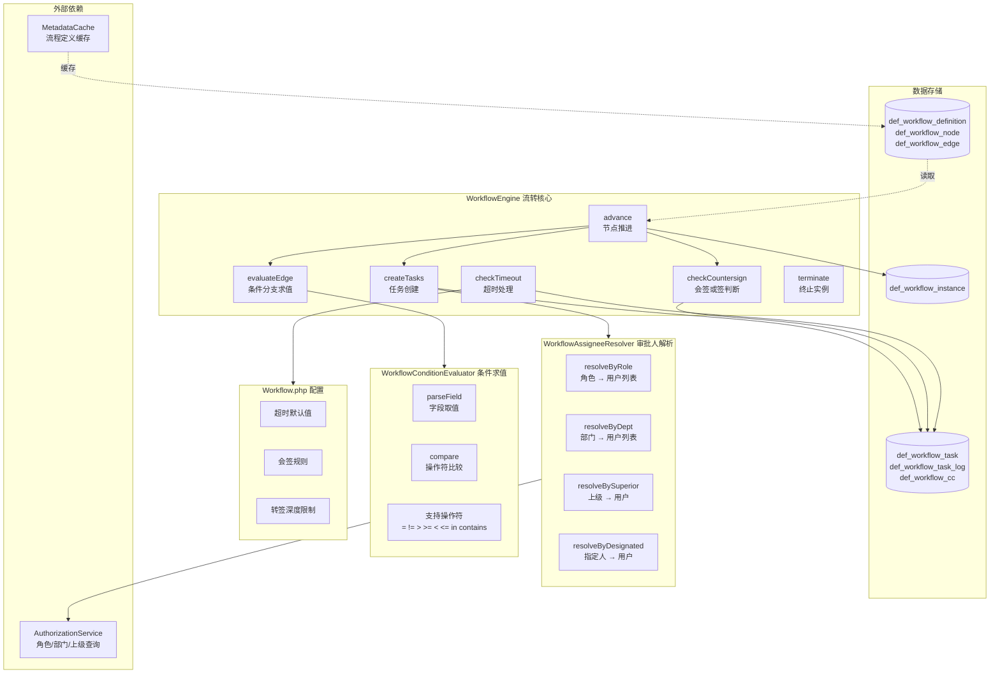
```mermaid
flowchart TB
    subgraph Engine[WorkflowEngine 流转核心]
        Advance[advance<br/>节点推进]
        CreateTasks[createTasks<br/>任务创建]
        CheckCountersign[checkCountersign<br/>会签或签判断]
        EvaluateEdge[evaluateEdge<br/>条件分支求值]
        CheckTimeout[checkTimeout<br/>超时处理]
        Terminate[terminate<br/>终止实例]
    end

    subgraph Resolver[WorkflowAssigneeResolver 审批人解析]
        ByRole[resolveByRole<br/>角色 → 用户列表]
        ByDept[resolveByDept<br/>部门 → 用户列表]
        BySuperior[resolveBySuperior<br/>上级 → 用户]
        ByDesignated[resolveByDesignated<br/>指定人 → 用户]
    end

    subgraph Evaluator[WorkflowConditionEvaluator 条件求值]
        ParseField[parseField<br/>字段取值]
        Compare[compare<br/>操作符比较]
        SupportedOps[支持操作符<br/>= != > >= < <= in contains]
    end

    subgraph Config[Workflow.php 配置]
        TimeoutDefault[超时默认值]
        CountersignRule[会签规则]
        TransferDepth[转签深度限制]
    end

    subgraph Storage[数据存储]
        DefTable[(def_workflow_definition<br/>def_workflow_node<br/>def_workflow_edge)]
        InstTable[(def_workflow_instance)]
        TaskTable[(def_workflow_task<br/>def_workflow_task_log<br/>def_workflow_cc)]
    end

    subgraph External[外部依赖]
        AuthLib[AuthorizationService<br/>角色/部门/上级查询]
        Cache[MetadataCache<br/>流程定义缓存]
    end

    Advance --> CreateTasks
    Advance --> CheckCountersign
    Advance --> EvaluateEdge
    CreateTasks --> Resolver
    CreateTasks --> TaskTable
    CheckCountersign --> TaskTable
    EvaluateEdge --> Evaluator
    Resolver --> AuthLib
    Advance --> InstTable
    CheckTimeout --> Config
    CheckTimeout --> TaskTable

    DefTable -.读取.-> Advance
    Cache -.缓存.-> DefTable
```

**三大核心组件职责**：

| 组件 | 职责 | 算法复杂度 |
|---|---|---|
| `WorkflowEngine` | 节点推进、任务创建、会签或签判断、条件分支求值、超时处理 | 单次推进 O(N)，N 为当前节点任务数 |
| `WorkflowAssigneeResolver` | 4 种审批人类型解析（角色/部门/上级/指定人），支持组合配置 | O(M)，M 为解析结果用户数 |
| `WorkflowConditionEvaluator` | 简单表达式 `field op value` 求值，基于合同业务字段 | O(1) 单次求值 |

### 5.2 流转流程图

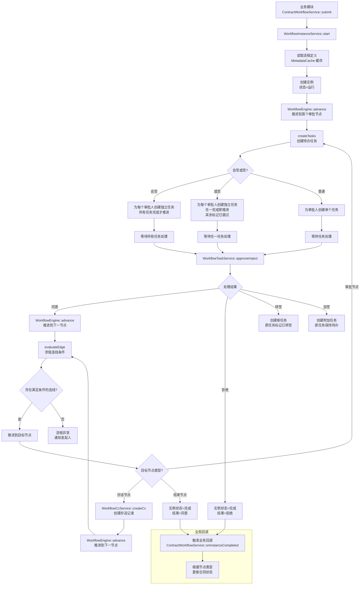
```mermaid
flowchart TD
    A[业务模块<br/>ContractWorkflowService::submit] --> B[WorkflowInstanceService::start]
    B --> C[读取流程定义<br/>MetadataCache 缓存]
    C --> D[创建实例<br/>状态=运行]
    D --> E[WorkflowEngine::advance<br/>推进到首个审批节点]
    E --> F[createTasks<br/>创建待办任务]
    F --> G{会签或签?}
    G -- 会签 --> H[为每个审批人创建独立任务<br/>所有任务完成才推进]
    G -- 或签 --> I[为每个审批人创建独立任务<br/>任一完成即推进<br/>其余标记已跳过]
    G -- 普通 --> J[为审批人创建单个任务]

    H --> K[等待所有任务处理]
    I --> L[等待任一任务处理]
    J --> M[等待任务处理]

    K --> N[WorkflowTaskService::approve/reject]
    L --> N
    M --> N

    N --> O{处理结果}
    O -- 同意 --> P[WorkflowEngine::advance<br/>推进到下一节点]
    O -- 拒绝 --> Q[实例状态=完成<br/>结果=拒绝]
    O -- 转签 --> R[创建新任务<br/>原任务标记已转签]
    O -- 加签 --> S[创建附加任务<br/>原任务保持待办]

    P --> T[evaluateEdge<br/>求值连线条件]
    T --> U{存在满足条件的连线?}
    U -- 是 --> V[推进到目标节点]
    U -- 否 --> W[流程异常<br/>通知发起人]

    V --> X{目标节点类型?}
    X -- 审批节点 --> F
    X -- 抄送节点 --> Y[WorkflowCcService::createCc<br/>创建抄送记录]
    X -- 结束节点 --> Z[实例状态=完成<br/>结果=同意]

    Y --> AA[WorkflowEngine::advance<br/>推进到下一节点]
    AA --> T

    Z --> AB[触发业务回调<br/>ContractWorkflowService::onInstanceCompleted]
    Q --> AB

    subgraph Callback[业务回调]
        AB --> AC[根据节点类型<br/>更新合同状态]
    end
```

### 5.3 与业务模块的解耦设计

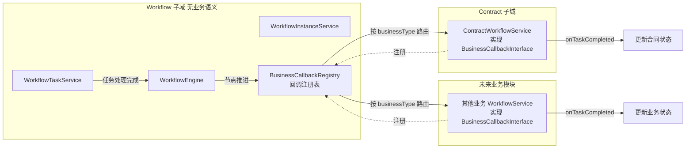
```mermaid
flowchart LR
    subgraph Workflow[Workflow 子域 无业务语义]
        Engine[WorkflowEngine]
        InstSvc[WorkflowInstanceService]
        TaskSvc[WorkflowTaskService]
        CallbackRegistry[BusinessCallbackRegistry<br/>回调注册表]
    end

    subgraph Contract[Contract 子域]
        ContractWf[ContractWorkflowService<br/>实现 BusinessCallbackInterface]
    end

    subgraph Future[未来业务模块]
        OtherWf[其他业务 WorkflowService<br/>实现 BusinessCallbackInterface]
    end

    ContractWf -.注册.-> CallbackRegistry
    OtherWf -.注册.-> CallbackRegistry

    TaskSvc -->|任务处理完成| Engine
    Engine -->|节点推进| CallbackRegistry
    CallbackRegistry -->|按 businessType 路由| ContractWf
    CallbackRegistry -->|按 businessType 路由| OtherWf

    ContractWf -->|onTaskCompleted| ContractStatus[更新合同状态]
    OtherWf -->|onTaskCompleted| OtherStatus[更新业务状态]
```

**解耦设计要点**：

1. **回调接口契约**：业务模块实现 `BusinessCallbackInterface`，包含 `onTaskCompleted(instanceId, node, result)`、`onInstanceCompleted(instanceId, result)` 两个方法；
2. **回调注册表**：`BusinessCallbackRegistry` 按 `businessType` 路由回调，业务模块在应用启动时注册；
3. **Workflow 子域零业务知识**：引擎不感知"合同"概念，仅处理通用节点/任务/连线；
4. **业务模块主动调用**：`ContractWorkflowService::submit()` 主动调用 `WorkflowInstanceService::start()`，传入 `businessType=contract` 与 `businessId=合同ID`。

### 5.4 扩展点设计

新业务模块接入工作流引擎的步骤：

| 步骤 | 动作 | 实现位置 |
|---|---|---|
| 1 | 在 `def_workflow_definition` 中创建该业务类型的流程定义 | 通过流程设计器 UI |
| 2 | 实现业务模块的 `XxxWorkflowService`，实现 `BusinessCallbackInterface` | `app/Services/Xxx/` |
| 3 | 在 `BusinessCallbackRegistry` 注册 `businessType=xxx` → `XxxWorkflowService` | `app/Config/Workflow.php` |
| 4 | 业务模块的提交动作调用 `WorkflowInstanceService::start('xxx', businessId, userId)` | 业务 Controller |
| 5 | 引擎推进时自动通过注册表回调业务模块的 `onTaskCompleted` | WorkflowEngine |
| 6 | 业务模块在回调中更新自身状态（如合同状态、报销单状态） | XxxWorkflowService |

**扩展示例**：未来报销模块接入仅需：

```php
// app/Services/Reimbursement/ReimbursementWorkflowService.php
class ReimbursementWorkflowService implements BusinessCallbackInterface
{
    public function onTaskCompleted(int $instanceId, array $node, string $result): void
    {
        // 更新报销单状态
    }
    public function onInstanceCompleted(int $instanceId, string $result): void
    {
        // 报销单审批结束
    }
}

// app/Config/Workflow.php
public array $businessCallbacks = [
    'contract' => \App\Services\Contract\ContractWorkflowService::class,
    'reimbursement' => \App\Services\Reimbursement\ReimbursementWorkflowService::class,
];
```

---

## 6. OnlyOffice 集成架构

### 6.1 集成架构图

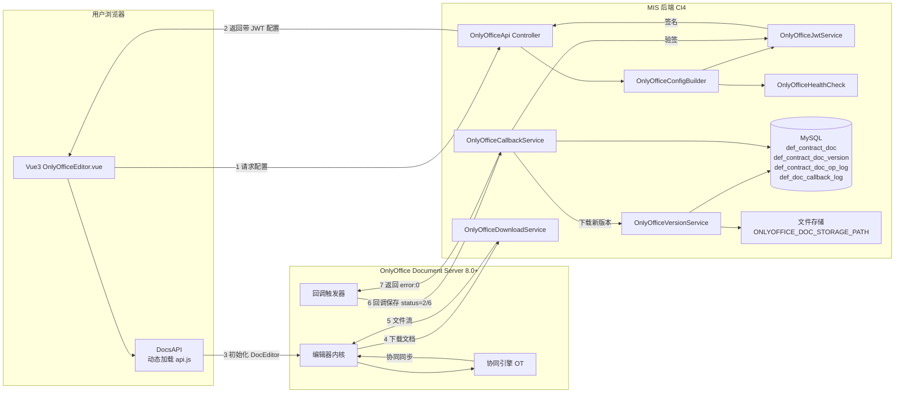
```mermaid
flowchart LR
    subgraph Browser[用户浏览器]
        Vue[Vue3 OnlyOfficeEditor.vue]
        DocsAPI[DocsAPI<br/>动态加载 api.js]
    end

    subgraph DocServer[OnlyOffice Document Server 8.0+]
        EditorCore[编辑器内核]
        CoEdit[协同引擎 OT]
        CallbackHandler[回调触发器]
    end

    subgraph Backend[MIS 后端 CI4]
        OnlyOfficeApi[OnlyOfficeApi Controller]
        ConfigBuilder[OnlyOfficeConfigBuilder]
        JwtService[OnlyOfficeJwtService]
        CallbackService[OnlyOfficeCallbackService]
        VersionService[OnlyOfficeVersionService]
        DownloadService[OnlyOfficeDownloadService]
        HealthCheck[OnlyOfficeHealthCheck]
        DB[(MySQL<br/>def_contract_doc<br/>def_contract_doc_version<br/>def_contract_doc_op_log<br/>def_doc_callback_log)]
        FileStore[文件存储<br/>ONLYOFFICE_DOC_STORAGE_PATH]
    end

    Vue -->|1 请求配置| OnlyOfficeApi
    OnlyOfficeApi --> ConfigBuilder
    ConfigBuilder --> JwtService
    ConfigBuilder --> HealthCheck
    JwtService -->|签名| OnlyOfficeApi
    OnlyOfficeApi -->|2 返回带 JWT 配置| Vue
    Vue --> DocsAPI
    DocsAPI -->|3 初始化 DocEditor| EditorCore
    EditorCore -->|4 下载文档| DownloadService
    DownloadService -->|5 文件流| EditorCore
    EditorCore --> CoEdit
    CoEdit -->|协同同步| EditorCore
    CallbackHandler -->|6 回调保存 status=2/6| CallbackService
    CallbackService -->|验签| JwtService
    CallbackService -->|下载新版本| VersionService
    VersionService --> FileStore
    VersionService --> DB
    CallbackService --> DB
    CallbackService -->|7 返回 error:0| CallbackHandler
```

### 6.2 JWT 双轨制

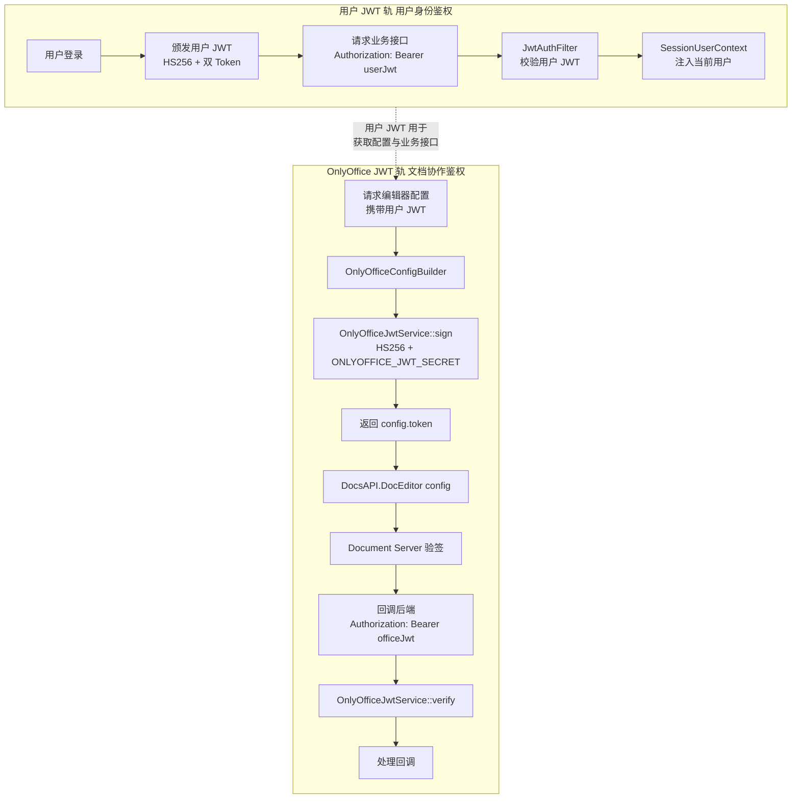
```mermaid
flowchart TB
    subgraph UserTrack[用户 JWT 轨 用户身份鉴权]
        UserLogin[用户登录] --> UserJwt[颁发用户 JWT<br/>HS256 + 双 Token]
        UserJwt --> UserReq[请求业务接口<br/>Authorization: Bearer userJwt]
        UserReq --> JwtAuthFilter[JwtAuthFilter<br/>校验用户 JWT]
        JwtAuthFilter --> SessionCtx[SessionUserContext<br/>注入当前用户]
    end

    subgraph OnlyOfficeTrack[OnlyOffice JWT 轨 文档协作鉴权]
        ConfigReq[请求编辑器配置<br/>携带用户 JWT] --> ConfigBuilder[OnlyOfficeConfigBuilder]
        ConfigBuilder --> OfficeSign[OnlyOfficeJwtService::sign<br/>HS256 + ONLYOFFICE_JWT_SECRET]
        OfficeSign --> ConfigReturn[返回 config.token]
        ConfigReturn --> DocEditor[DocsAPI.DocEditor config]
        DocEditor --> DSVerify[Document Server 验签]
        DSVerify --> DSCallback[回调后端<br/>Authorization: Bearer officeJwt]
        DSCallback --> BackendVerify[OnlyOfficeJwtService::verify]
        BackendVerify --> HandleCallback[处理回调]
    end

    UserTrack -.用户 JWT 用于<br/>获取配置与业务接口.-> ConfigReq
```

**双轨制要点**：

| 维度 | 用户 JWT | OnlyOffice JWT |
|---|---|---|
| 用途 | 用户身份鉴权、业务接口访问 | 文档配置签名、回调验签 |
| 密钥 | 系统用户密钥（`JWT_SECRET`） | `ONLYOFFICE_JWT_SECRET`（与 Document Server 一致） |
| 签发方 | 后端登录接口 | 后端 `OnlyOfficeJwtService::sign()` |
| 验签方 | 后端 `JwtAuthFilter` | 后端 `OnlyOfficeJwtService::verify()` + Document Server |
| 携带方式 | `Authorization: Bearer` 头 | `config.token` 字段 + 回调 `Authorization` 头 |
| 黑名单 | `TokenBlacklistService` | 无（短期有效，密钥轮换） |
| 过期 | accessToken 短期 + refreshToken 长期 | 编辑会话期间有效 |

**隔离原则**：两套 JWT 物理隔离，密钥不同、签发方不同、验签方不同，互不干扰。

### 6.3 回调处理架构

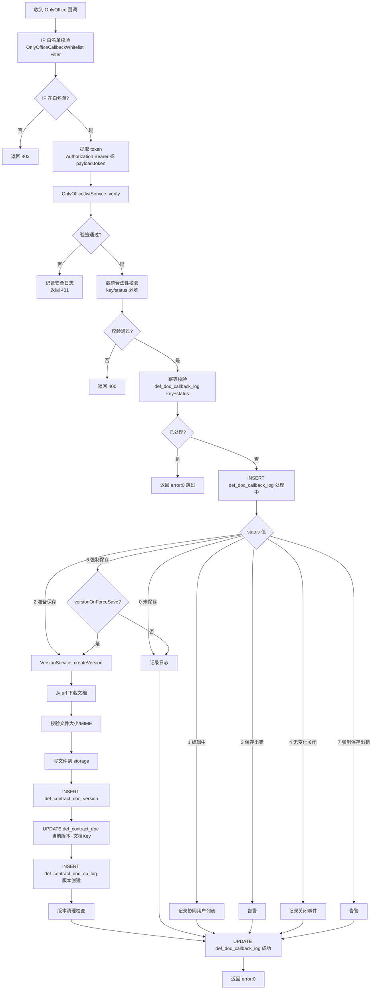
```mermaid
flowchart TD
    A[收到 OnlyOffice 回调] --> B[IP 白名单校验<br/>OnlyOfficeCallbackWhitelist Filter]
    B --> C{IP 在白名单?}
    C -- 否 --> D[返回 403]
    C -- 是 --> E[提取 token<br/>Authorization Bearer 或 payload.token]
    E --> F[OnlyOfficeJwtService::verify]
    F --> G{验签通过?}
    G -- 否 --> H[记录安全日志<br/>返回 401]
    G -- 是 --> I[载荷合法性校验<br/>key/status 必填]
    I --> J{校验通过?}
    J -- 否 --> K[返回 400]
    J -- 是 --> L[幂等校验<br/>def_doc_callback_log key+status]
    L --> M{已处理?}
    M -- 是 --> N[返回 error:0 跳过]
    M -- 否 --> O[INSERT def_doc_callback_log 处理中]
    O --> P{status 值}
    P -- 0 未保存 --> Q1[记录日志]
    P -- 1 编辑中 --> Q2[记录协同用户列表]
    P -- 2 准备保存 --> Q3[VersionService::createVersion]
    P -- 3 保存出错 --> Q4[告警]
    P -- 4 无变化关闭 --> Q5[记录关闭事件]
    P -- 6 强制保存 --> Q6{versionOnForceSave?}
    P -- 7 强制保存出错 --> Q7[告警]
    Q6 -- 是 --> Q3
    Q6 -- 否 --> Q1

    Q3 --> R[从 url 下载文档]
    R --> S[校验文件大小/MIME]
    S --> T[写文件到 storage]
    T --> U[INSERT def_contract_doc_version]
    U --> V[UPDATE def_contract_doc 当前版本+文档Key]
    V --> W[INSERT def_contract_doc_op_log 版本创建]
    W --> X[版本清理检查]
    X --> Y[UPDATE def_doc_callback_log 成功]
    Y --> Z[返回 error:0]

    Q1 --> Y
    Q2 --> Y
    Q4 --> Y
    Q5 --> Y
    Q7 --> Y
```

**关键设计**：

1. **幂等性**：`def_doc_callback_log` 的 `(文档Key, status, forcesavetype)` 联合唯一索引 + 处理前预检，保证重复回调不重复创建版本；
2. **版本号并发安全**：`SELECT MAX(版本号) FOR UPDATE` + 1，避免并发回调导致版本号冲突；
3. **文件名防覆盖**：`{docId}/{version}_{timestamp}_{shortUuid}.{ext}` 命名规则；
4. **慢回调追踪**：`def_doc_callback_log.处理耗时毫秒` 字段记录总耗时，配合 `X-Server-Trace` 排查。

详细回调状态处理、JWT 验签流程、版本管理机制、异常处理等见《OnlyOffice 集成技术方案.md》。

---

## 7. 权限架构设计

### 7.1 权限层级图

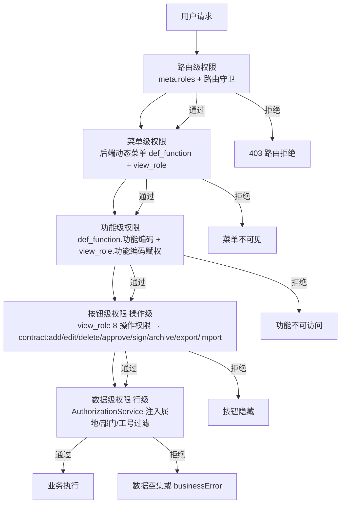
```mermaid
flowchart TB
    L1[路由级权限<br/>meta.roles + 路由守卫]
    L2[菜单级权限<br/>后端动态菜单 def_function + view_role]
    L3[功能级权限<br/>def_function.功能编码 + view_role.功能编码赋权]
    L4[按钮级权限 操作级<br/>view_role 8 操作权限 → contract:add/edit/delete/approve/sign/archive/export/import]
    L5[数据级权限 行级<br/>AuthorizationService 注入属地/部门/工号过滤]

    L1 --> L2
    L2 --> L3
    L3 --> L4
    L4 --> L5

    Request[用户请求] --> L1
    L1 -- 通过 --> L2
    L2 -- 通过 --> L3
    L3 -- 通过 --> L4
    L4 -- 通过 --> L5
    L5 -- 通过 --> Business[业务执行]
    L1 -- 拒绝 --> Deny1[403 路由拒绝]
    L2 -- 拒绝 --> Deny2[菜单不可见]
    L3 -- 拒绝 --> Deny3[功能不可访问]
    L4 -- 拒绝 --> Deny4[按钮隐藏]
    L5 -- 拒绝 --> Deny5[数据空集或 businessError]
```

### 7.2 RBAC 模型

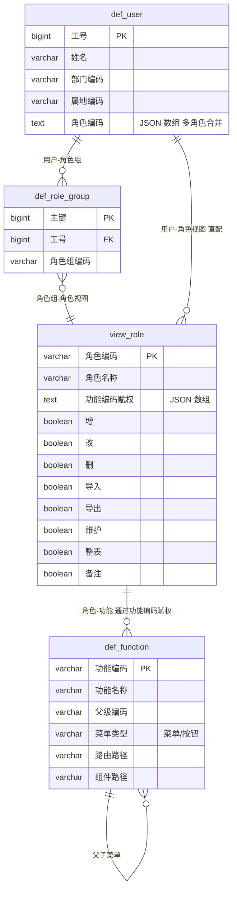
```mermaid
erDiagram
    def_user ||--o{ def_role_group : "用户-角色组"
    def_role_group }o--|| view_role : "角色组-角色视图"
    def_user ||--o{ view_role : "用户-角色视图 直配"
    view_role ||--o{ def_function : "角色-功能 通过功能编码赋权"
    def_function ||--o{ def_function : "父子菜单"
    view_role {
        varchar 角色编码 PK
        varchar 角色名称
        text 功能编码赋权 "JSON 数组"
        boolean 增
        boolean 改
        boolean 删
        boolean 导入
        boolean 导出
        boolean 维护
        boolean 整表
        boolean 备注
    }
    def_user {
        bigint 工号 PK
        varchar 姓名
        varchar 部门编码
        varchar 属地编码
        text 角色编码 "JSON 数组 多角色合并"
    }
    def_function {
        varchar 功能编码 PK
        varchar 功能名称
        varchar 父级编码
        varchar 菜单类型 "菜单/按钮"
        varchar 路由路径
        varchar 组件路径
    }
    def_role_group {
        bigint 主键 PK
        bigint 工号 FK
        varchar 角色组编码
    }
```

**RBAC 关键规则**：

1. **多角色合并**：用户的有效权限 = `def_user.角色编码` + `def_role_group` 关联的角色组权限的并集；
2. **功能编码赋权**：`view_role.功能编码赋权` 是 JSON 数组，列出该角色可访问的功能编码；
3. **8 操作权限**：`view_role` 内置 8 个布尔字段（增/改/删/导入/导出/维护/整表/备注），对应功能编码下的操作粒度；
4. **行级数据权限**：`AuthorizationService` 根据用户属地/部门/工号注入 WHERE 条件。

### 7.3 按钮级权限映射

| view_role 操作权限 | 合同模块按钮 code | 前端使用示例 |
|---|---|---|
| 增 | `contract:add` | `v-if="hasAuth('contract:add')"` 新增按钮 |
| 改 | `contract:edit` | `v-if="hasAuth('contract:edit')"` 编辑按钮 |
| 删 | `contract:delete` | `v-if="hasAuth('contract:delete')"` 删除按钮 |
| 维护 | `contract:approve` | `v-if="hasAuth('contract:approve')"` 审批按钮 |
| 备注 | `contract:sign` | `v-if="hasAuth('contract:sign')"` 签署按钮 |
| 整表 | `contract:archive` | `v-if="hasAuth('contract:archive')"` 归档按钮 |
| 导出 | `contract:export` | `v-if="hasAuth('contract:export')"` 导出按钮 |
| 导入 | `contract:import` | `v-if="hasAuth('contract:import')"` 导入按钮 |

**映射实现**：

```php
// AuthModel::getUserAuthData() 扩展
public function getUserAuthData(int $userId): array
{
    $roles = $this->getUserRoles($userId);
    $functions = $this->getAuthorizedFunctions($roles);
    $buttons = $this->buildOperationButtons($roles, $functions);
    return [
        'roles' => $roles,
        'functions' => $functions,
        'buttons' => $buttons, // ['contract:add', 'contract:edit', ...]
    ];
}

protected function buildOperationButtons(array $roles, array $functions): array
{
    $buttons = [];
    $opMap = ['增' => 'add', '改' => 'edit', '删' => 'delete',
              '导入' => 'import', '导出' => 'export', '维护' => 'approve',
              '整表' => 'archive', '备注' => 'sign'];
    foreach ($functions as $func) {
        foreach ($roles as $role) {
            if (! in_array($func['功能编码'], $role['功能编码赋权'], true)) continue;
            foreach ($opMap as $field => $op) {
                if (! empty($role[$field])) {
                    $buttons[] = "{$func['功能编码']}:{$op}";
                }
            }
        }
    }
    return array_values(array_unique($buttons));
}
```

### 7.4 数据级权限注入流程

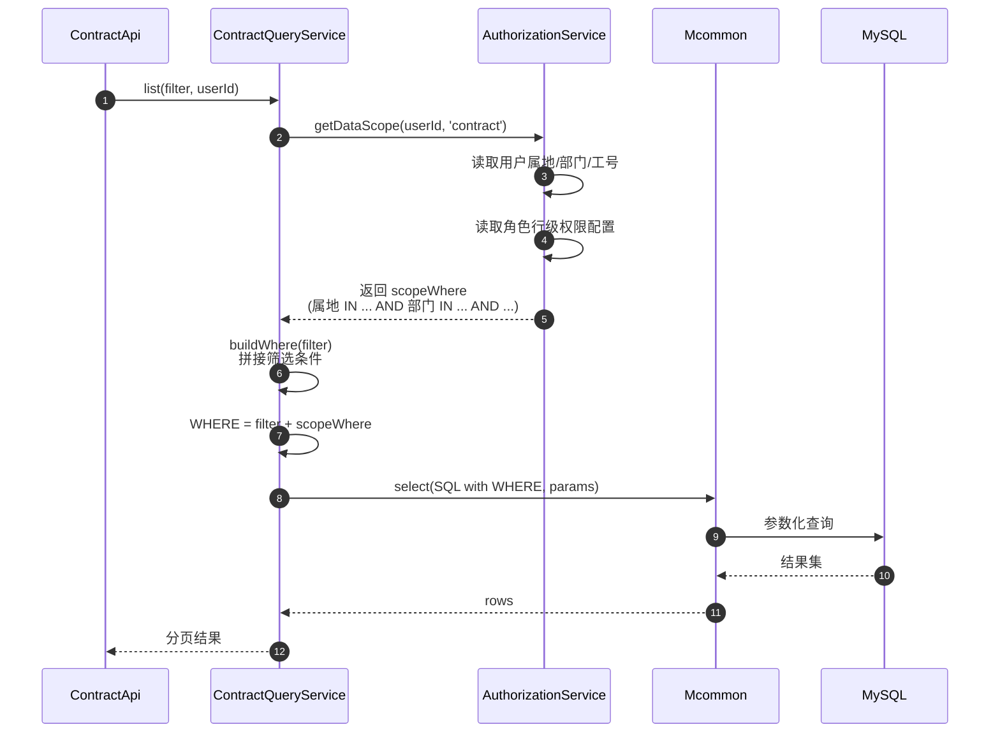
```mermaid
sequenceDiagram
    autonumber
    participant C as ContractApi
    participant Q as ContractQueryService
    participant A as AuthorizationService
    participant M as Mcommon
    participant DB as MySQL

    C->>Q: list(filter, userId)
    Q->>A: getDataScope(userId, 'contract')
    A->>A: 读取用户属地/部门/工号
    A->>A: 读取角色行级权限配置
    A-->>Q: 返回 scopeWhere<br/>(属地 IN ... AND 部门 IN ... AND ...)
    Q->>Q: buildWhere(filter)<br/>拼接筛选条件
    Q->>Q: WHERE = filter + scopeWhere
    Q->>M: select(SQL with WHERE, params)
    M->>DB: 参数化查询
    DB-->>M: 结果集
    M-->>Q: rows
    Q-->>C: 分页结果
```

**注入规则**：

- `AuthorizationService::getDataScope(userId, businessType)` 返回行级过滤条件（如 `属地编码 IN ('北京','上海')`）；
- `ContractQueryService::list()` 将筛选条件与行级过滤条件合并到 WHERE 子句；
- 行级权限对用户透明，前端不感知，后端强制注入；
- 超级角色或全表权限角色返回空 WHERE（不限制）。

### 7.5 权限变更审计架构

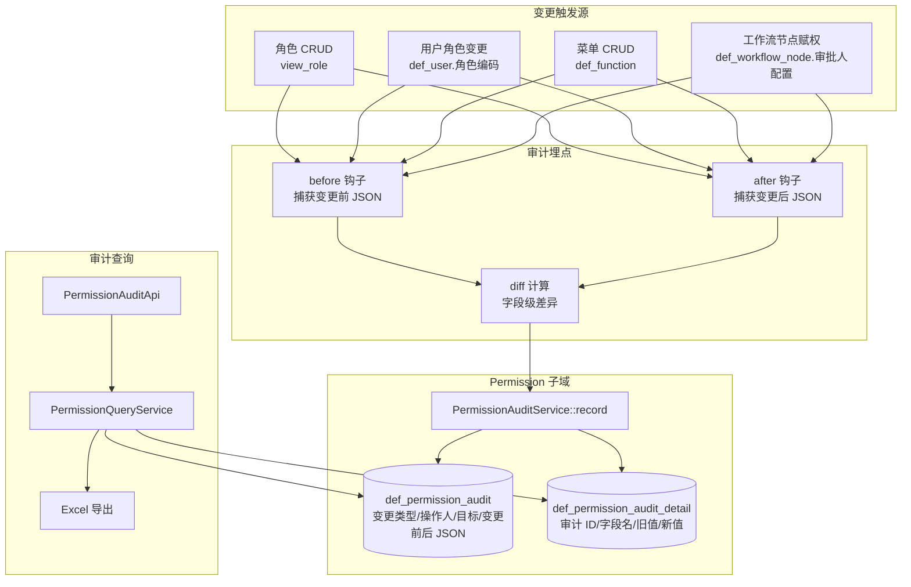
```mermaid
flowchart TB
    subgraph Trigger[变更触发源]
        RoleCRUD[角色 CRUD<br/>view_role]
        UserCRUD[用户角色变更<br/>def_user.角色编码]
        MenuCRUD[菜单 CRUD<br/>def_function]
        WfNodeCRUD[工作流节点赋权<br/>def_workflow_node.审批人配置]
    end

    subgraph Hook[审计埋点]
        BeforeHook[before 钩子<br/>捕获变更前 JSON]
        AfterHook[after 钩子<br/>捕获变更后 JSON]
        DiffCalc[diff 计算<br/>字段级差异]
    end

    subgraph Audit[Permission 子域]
        AuditSvc[PermissionAuditService::record]
        AuditTable[(def_permission_audit<br/>变更类型/操作人/目标/变更前后 JSON)]
        AuditDetail[(def_permission_audit_detail<br/>审计 ID/字段名/旧值/新值)]
    end

    subgraph Query[审计查询]
        QuerySvc[PermissionQueryService]
        AuditApi[PermissionAuditApi]
        Export[Excel 导出]
    end

    RoleCRUD --> BeforeHook
    UserCRUD --> BeforeHook
    MenuCRUD --> BeforeHook
    WfNodeCRUD --> BeforeHook
    RoleCRUD --> AfterHook
    UserCRUD --> AfterHook
    MenuCRUD --> AfterHook
    WfNodeCRUD --> AfterHook
    BeforeHook --> DiffCalc
    AfterHook --> DiffCalc
    DiffCalc --> AuditSvc
    AuditSvc --> AuditTable
    AuditSvc --> AuditDetail
    AuditApi --> QuerySvc
    QuerySvc --> AuditTable
    QuerySvc --> AuditDetail
    QuerySvc --> Export
```

**审计埋点方式**：

- 在现有角色/用户/菜单/工作流节点 CRUD 接口中，调用 `PermissionAuditService::record()` 之前先捕获 `before` 快照，CRUD 完成后捕获 `after` 快照；
- `diff()` 计算字段级差异，写入 `def_permission_audit_detail`；
- 变更前后 JSON 整体写入 `def_permission_audit.变更前JSON` 与 `变更后JSON`；
- 变更类型枚举：`角色赋权`、`用户赋权`、`菜单赋权`、`工作流节点赋权`。

---

## 8. 数据架构

### 8.1 数据分层

| 数据层 | 表 | 用途 | 生命周期 |
|---|---|---|---|
| 业务数据 | `def_contract`、`def_contract_doc`、`def_contract_doc_version`、`def_contract_approval_opinion` | 合同主数据与文档 | 长期 |
| 流程数据 | `def_workflow_definition`、`def_workflow_node`、`def_workflow_edge`、`def_workflow_instance`、`def_workflow_task`、`def_workflow_task_log`、`def_workflow_cc` | 工作流定义与运行时 | 定义长期，实例/任务归档 |
| 文档数据 | `def_contract_doc_op_log`、`def_doc_callback_log` | 文档操作留痕与回调日志 | 长期（可定期归档） |
| 审计数据 | `def_permission_audit`、`def_permission_audit_detail`、`sys_sql_log` | 权限审计与通用 SQL 日志 | 长期（合规要求） |
| 主数据 | `def_user`、`def_function`、`view_role`、`def_role_group`、`def_contract_type` | 用户/角色/菜单/字典 | 长期 |

### 8.2 数据流向图

```mermaid
flowchart LR
    subgraph Input[输入源]
        User[用户操作]
        Callback[OnlyOffice 回调]
        Migration[迁移脚本]
    end

    subgraph Write[写入路径]
        ContractSvc[ContractService]
        WorkflowSvc[WorkflowInstanceService/TaskService]
        CallbackSvc[OnlyOfficeCallbackService]
        AuditSvc[PermissionAuditService]
    end

    subgraph Storage[存储]
        ContractDB[(def_contract<br/>def_contract_doc)]
        WorkflowDB[(def_workflow_*)]
        DocDB[(def_contract_doc_version<br/>def_contract_doc_op_log<br/>def_doc_callback_log)]
        AuditDB[(def_permission_audit<br/>def_permission_audit_detail<br/>sys_sql_log)]
        FileStore[文件存储]
    end

    subgraph Read[读取路径]
        QuerySvc[ContractQueryService]
        ConfigBuilder[OnlyOfficeConfigBuilder]
        AuthLib[AuthorizationService]
    end

    subgraph Cache[缓存层]
        MetadataCache[MetadataCache<br/>表指纹校验]
    end

    User --> ContractSvc
    User --> WorkflowSvc
    Callback --> CallbackSvc
    Migration --> ContractSvc
    User --> AuditSvc

    ContractSvc --> ContractDB
    ContractSvc --> WorkflowDB
    WorkflowSvc --> WorkflowDB
    CallbackSvc --> DocDB
    CallbackSvc --> FileStore
    CallbackSvc --> ContractDB
    AuditSvc --> AuditDB

    QuerySvc --> ContractDB
    QuerySvc --> WorkflowDB
    ConfigBuilder --> ContractDB
    ConfigBuilder --> DocDB
    AuthLib --> MetadataCache
    MetadataCache -.缓存.-> ContractDB
    MetadataCache -.缓存.-> WorkflowDB
```

### 8.3 缓存策略

| 缓存对象 | 缓存键 | TTL | 表指纹 | 失效时机 |
|---|---|---|---|---|
| 流程定义 | `workflow:definition:{code}` | 1800s | `def_workflow_definition.UPDATE_TIME` | 流程定义保存/启用/停用后 `invalidateConfigCache()` |
| 合同主表 | `contract:master:{id}` | 1800s | `def_contract.UPDATE_TIME` | 合同 CRUD 后失效 |
| 文档配置 | `onlyoffice:doc:{docId}` | 1800s | `def_contract_doc.UPDATE_TIME` | 版本创建/回溯/标记后失效 |
| 用户权限 | `auth:user:{userId}` | 1800s | `view_role.UPDATE_TIME` + `def_function.UPDATE_TIME` | 角色/用户/菜单赋权变更后失效 |
| DS 健康状态 | `onlyoffice:health` | 30s | 无 | 自动过期 |
| 版本列表 | `onlyoffice:versions:{docId}` | 60s | `def_contract_doc_version.UPDATE_TIME` | 版本创建/清理后失效 |

**表指纹校验机制**：

1. 缓存写入时，同时存储 `information_schema.TABLES.UPDATE_TIME`（表最后修改时间）；
2. 缓存读取时，先查询当前表的 `UPDATE_TIME`，与缓存中的指纹比对；
3. 指纹不匹配则视为缓存失效，回源查询并刷新缓存；
4. 此机制保证即使忘记主动失效，表结构变更后缓存自动失效。

**实现约束**：

- 所有缓存读写通过 `MetadataCache` 统一组件，禁止直接调用 CI4 Cache；
- 写操作（INSERT/UPDATE/DELETE）后必须调用 `invalidateConfigCache($key)`；
- 缓存值必须可序列化（避免存储 PDOStatement 等资源）。

### 8.4 数据迁移架构

```mermaid
flowchart LR
    subgraph Source[旧表 保留归档]
        OldMaster[(def_contract_master)]
        OldFlow[(def_contract_flow)]
        OldSign[(def_contract_sign)]
        OldType[(def_contract_type 复用)]
    end

    subgraph Mapping[ContractMigrationService 映射]
        MapMaster[字段映射<br/>状态映射]
        MapFlow[流程类型映射<br/>审核意见映射]
        MapSign[签署记录映射]
    end

    subgraph Target[新表]
        NewContract[(def_contract)]
        NewDoc[(def_contract_doc)]
        NewWfInst[(def_workflow_instance<br/>标记 历史迁移)]
        NewWfTask[(def_workflow_task<br/>标记 历史迁移)]
        NewWfLog[(def_workflow_task_log)]
        NewOpinion[(def_contract_approval_opinion)]
    end

    subgraph Archive[旧表归档]
        ArchivedMaster[(def_contract_master_archive)]
        ArchivedFlow[(def_contract_flow_archive)]
    end

    OldMaster --> MapMaster
    OldFlow --> MapFlow
    OldSign --> MapSign

    MapMaster --> NewContract
    MapMaster --> NewWfInst
    MapFlow --> NewWfTask
    MapFlow --> NewWfLog
    MapFlow --> NewOpinion
    MapSign --> NewContract

    OldMaster -.重命名归档.-> ArchivedMaster
    OldFlow -.重命名归档.-> ArchivedFlow
    OldType -.保留复用.-> Target
```

**迁移策略**：

1. **Dry-run 模式**：`ContractMigrationService::migrateMaster(dryRun=true)` 仅输出映射结果不写库；
2. **旧表保留**：迁移后旧表重命名为 `_archive` 后缀，不删除，支持回滚；
3. **历史标记**：迁移产生的工作流实例/任务标记为"历史迁移"，不参与待办统计；
4. **状态映射表**：旧 11 种状态枚举映射到新状态机（部分中间态合并）；
5. **字段映射**：消除 `当前流程节点`/`流程节点` 不一致，统一为新字段名。

---

## 9. 接口架构

### 9.1 RESTful 设计规范

| 规范项 | 约定 | 示例 |
|---|---|---|
| URL 风格 | 短横线小写，资源名复数 | `/contract/list`、`/workflow/instance/detail/123` |
| HTTP 方法 | GET 查询、POST 创建/操作、PUT 更新（本项目以 POST 为主）、DELETE 删除（本项目以 POST 为主） | `POST /contract/submit`、`GET /contract/list` |
| 路径参数 | `(:segment)` 占位，CI4 路由 | `GET /contract/detail/(:segment)` |
| 查询参数 | 筛选/分页/排序 | `?page=1&pageSize=20&keyword=xxx` |
| 请求体 | JSON | `{"合同名称": "xxx", "合同金额": 10000}` |
| 响应体 | JSON，统一封装 | `{"code": 0, "message": "success", "data": {...}}` |
| 字段命名 | 与数据库中文字段一致 | `合同编号`、`当前流程节点` |
| 分页 | `page` + `pageSize`，响应含 `total` | `{"data": [...], "total": 100}` |

### 9.2 统一响应封装

`BaseApiController` 提供统一响应方法：

| 方法 | HTTP 状态 | 响应 code | 用途 |
|---|---|---|---|
| `success($data, $message)` | 200 | 0 | 请求成功 |
| `error($message, $code)` | 200 | 自定义 | 通用错误 |
| `paramError($message)` | 200 | 40001 | 参数校验失败 |
| `notFound($message)` | 200 | 40401 | 资源不存在 |
| `serverError($message)` | 200 | 50001 | 服务器异常 |
| `businessError($message)` | 200 | 42201 | 业务规则校验失败 |

**响应体结构**：

```json
{
  "code": 0,
  "message": "success",
  "data": {
    "合同ID": "C2026-0001",
    "合同名称": "采购合同",
    "当前状态": "PENDING"
  },
  "traceId": "abc-123-def",
  "timestamp": "2026-07-23T10:00:00+08:00"
}
```

**约定**：

- HTTP 状态码统一返回 200，业务错误通过响应体 `code` 区分（便于前端统一处理）；
- `traceId` 由 `BaseApiController` 注入，贯穿日志链路；
- `timestamp` 为服务器时间，ISO 8601 格式；
- 例外：OnlyOffice 回调接口响应 `{"error": 0}` 或 `{"error": 1}`（遵循 OnlyOffice 协议）。

### 9.3 X-Server-Trace 头规范

```mermaid
flowchart LR
    A[Controller 入口<br/>t0 = hrtime true] --> B[参数校验<br/>t1]
    B --> C[Service 调用<br/>t2]
    C --> D[SQL 查询<br/>t3]
    D --> E[业务处理<br/>t4]
    E --> F[响应封装<br/>t5]
    F --> G[setServerTrace<br/>计算分段耗时]
    G --> H[X-Server-Trace 头输出]

    subgraph Trace[分段耗时]
        T1[parse 参数校验 t1-t0]
        T2[service Service 调用 t2-t1]
        T3[query SQL 查询 t3-t2]
        T4[business 业务处理 t4-t3]
        T5[encode 响应封装 t5-t4]
        T6[total 总耗时 t5-t0]
    end

    subgraph Slow[慢查询 仅 > 50ms]
        S1[SQL 文本 base64 编码]
        S2[SQL 耗时 ms]
        S3[SQL 行数]
    end

    Trace --> H
    Slow --> H
```

**X-Server-Trace 头格式**：

```
X-Server-Trace: parse=2.1,service=15.3,query=85.2,business=3.1,encode=0.5,total=106.2;slow=1;slow0_sql=<base64>;slow0_time=85.2;slow0_rows=125
```

**规范要点**：

1. **计时精度**：`hrtime(true)` 纳秒精度，`/1e6` 转毫秒，保留 1 位小数；
2. **分段命名**：`parse`/`service`/`query`/`business`/`encode`/`total`；
3. **慢查询阈值**：仅记录 > 50ms 的 SQL，避免响应头溢出；
4. **SQL 编码**：base64 编码，避免特殊字符破坏响应头；
5. **慢查询索引**：`slow=N` 表示 N 条慢查询，`slow0_sql`、`slow1_sql`... 依次列出；
6. **集中实现**：`buildPerformanceTable` 集中在 `BaseApiController`，子类调用 `setServerTrace($segments, $slowQueries)`。

### 9.4 JWT 鉴权流程

```mermaid
sequenceDiagram
    autonumber
    participant U as 用户
    participant F as JwtAuthFilter
    participant S as SessionUserContext
    participant B as Blacklist
    participant C as Controller

    U->>F: 请求 + Authorization: Bearer accessToken
    F->>F: 提取 token
    F->>F: JWT::decode 验签 HS256
    alt 验签失败
        F-->>U: 401 Invalid Token
    else 验签通过
        F->>B: 查询 TokenBlacklist
        alt 在黑名单
            F-->>U: 401 Token Revoked
        else 不在黑名单
            F->>S: 注入 SessionUserContext<br/>userId/roles/部门/属地
            S-->>F: 注入完成
            F->>C: 放行请求
            C-->>F: 响应
            F-->>U: 响应 + X-Server-Trace
        end
    end
```

**双 Token 机制**：

- **accessToken**：短期有效（如 2 小时），每次请求携带；
- **refreshToken**：长期有效（如 7 天），仅用于刷新 accessToken；
- **Token 黑名单**：退出登录、密码修改时 accessToken 加入黑名单，强制失效；
- **签名算法**：HS256，密钥从 `.env` 读取。

### 9.5 错误码规范

| 错误码范围 | 类别 | 示例 |
|---|---|---|
| 0 | 成功 | `0` success |
| 40001-40099 | 参数错误 | `40001` 参数校验失败、`40002` 参数缺失 |
| 40101-40199 | 鉴权错误 | `40101` Token 无效、`40102` Token 过期、`40103` Token 已撤销、`40104` 无权限 |
| 40401-40499 | 资源不存在 | `40401` 合同不存在、`40402` 文档不存在、`40403` 任务不存在 |
| 42201-42299 | 业务规则错误 | `42201` 状态不允许此操作、`42202` 非审批人、`42203` 会签未完成、`42204` 已归档不可编辑 |
| 50001-50099 | 服务器错误 | `50001` 数据库异常、`50002` 文件存储异常、`50003` OnlyOffice 服务不可用 |
| 50301-50399 | 外部依赖错误 | `50301` OnlyOffice 回调失败、`50302` OnlyOffice 下载失败 |

---

## 10. 安全架构

### 10.1 认证与授权

| 维度 | 机制 | 实现 |
|---|---|---|
| 身份认证 | JWT 双 Token（HS256） | `JwtAuthFilter` + `SessionUserContext` + `TokenBlacklistService` |
| 会话管理 | accessToken 短期 + refreshToken 长期 | 登录接口颁发，刷新接口续期 |
| 路由级授权 | `meta.roles` + 路由守卫 | 前端 `beforeEach` 守卫 |
| 菜单级授权 | 后端动态菜单 | `def_function` + `view_role.功能编码赋权` |
| 按钮级授权 | 8 操作权限映射 | `view_role` 布尔字段 → `contract:add` 等 code |
| 数据级授权 | 行级数据权限 | `AuthorizationService::getDataScope()` 注入 WHERE |
| OnlyOffice 授权 | JWT 双轨制 | 用户 JWT（业务接口）+ OnlyOffice JWT（文档协作） |

### 10.2 SQL 注入防护

| 防护措施 | 实现方式 |
|---|---|
| 参数化查询 | 所有 SQL 通过 `Mcommon::select()/execute()` 执行，参数使用 `?` 占位 + bind |
| 禁止 sprintf 拼接 | 代码审查强制检查，禁止 `$sql = sprintf("... WHERE id = %d", $id)` 模式 |
| 输入校验 | Controller 层对入参类型/范围校验，Service 层二次校验 |
| 字段白名单 | INSERT/UPDATE 仅允许白名单字段，禁止用户输入直接映射字段名 |
| 转义函数 | 动态字段名使用 `Mcommon::quoteIdentifier()` 转义 |
| ORM 优先 | 简单查询使用 CI4 Model 的查询构造器，复杂查询用参数化原生 SQL |

**反面案例（禁止）**：

```php
// 禁止：sprintf 拼接 SQL
$sql = sprintf("SELECT * FROM def_contract WHERE 合同编号 = '%s'", $code);

// 正确：参数化查询
$sql = "SELECT * FROM def_contract WHERE 合同编号 = ?";
$rows = $this->mcommon->select($sql, [$code]);
```

### 10.3 XSS/CSRF 防护

| 防护 | 措施 |
|---|---|
| XSS | Vue 默认转义插值；`v-html` 仅用于受信任内容（如富文本编辑器输出，需后端过滤）；后端对富文本输入使用 HTML 净化库（如 `ezyang/htmlpurifier`） |
| CSRF | CI4 `csrf` Filter 全局启用；OnlyOffice 回调接口 `onlyoffice/callback` 排除 CSRF（走 JWT 验签） |
| Cookie | `HttpOnly` + `Secure` + `SameSite=Strict` |
| CORS | 仅允许前端域名，预检请求 `OPTIONS` 放行 |
| Referer 校验 | 敏感操作（删除/审批）校验 Referer |

### 10.4 敏感信息加密

| 信息 | 存储方式 | 加密算法 |
|---|---|---|
| 用户密码 | `def_user.密码` 字段 | bcrypt（cost=12），禁止 MD5/SHA1 |
| accessToken 签名密钥 | `.env` `JWT_SECRET` | 不存数据库，运维下发 |
| refreshToken | `def_user.refresh_token` 或 Redis | bcrypt 哈希存储，原文不入库 |
| OnlyOffice JWT 密钥 | `.env` `ONLYOFFICE_JWT_SECRET` | 32+ 字节，`openssl rand -base64 48` 生成 |
| 文档下载签名 token | URL 参数 | HS256 签名 + TTL 校验 |
| 数据库密码 | `.env` `database.default.password` | 运维下发，不入版本库 |
| Redis 密码 | `.env` `cache.password` | 运维下发 |

**密钥管理**：

- 所有密钥通过 `.env` 注入，`.env` 不入版本库（`.gitignore` 排除）；
- 生产环境密钥由运维通过环境变量或密钥管理服务下发；
- OnlyOffice JWT 密钥与 Document Server 的 `local.json` 严格一致；
- 密钥轮换建议每 6 个月一次，轮换需停机同步两端。

### 10.5 审计日志

| 日志表 | 用途 | 写入方 | 写入时机 |
|---|---|---|---|
| `sys_sql_log` | 通用 SQL 日志（项目惯例） | `Mcommon::sql_log()` 自动 | 每次 SQL 执行 |
| `def_contract_doc_op_log` | 文档操作留痕（结构化） | `OnlyOfficeCallbackService` + `OnlyOfficeApi` + `ContractDocService` | 打开/编辑/保存/下载/版本创建/回溯/标记/关闭 |
| `def_doc_callback_log` | OnlyOffice 回调原始日志 | `OnlyOfficeCallbackService` | 每次回调 |
| `def_permission_audit` + `def_permission_audit_detail` | 权限变更审计 | `PermissionAuditService` | 角色/用户/菜单/工作流节点赋权变更 |
| `def_workflow_task_log` | 工作流任务流转日志 | `WorkflowTaskService` | 任务提交/同意/拒绝/转签/加签/撤回 |
| `writable/logs/` | CI4 框架日志 | `log_message()` | error/warning/info |

**日志查询场景**：

- 安全事件排查：`sys_sql_log` + `def_doc_callback_log`（验签失败）；
- 权限合规审计：`def_permission_audit`（谁在何时改了谁的什么权限）；
- 文档操作追溯：`def_contract_doc_op_log`（谁在何时打开/编辑/保存/下载了文档）；
- 工作流追溯：`def_workflow_task_log`（谁在何时处理了哪个任务，意见是什么）。

### 10.6 OnlyOffice 回调安全

```mermaid
flowchart TD
    A[OnlyOffice 回调请求] --> B[Layer 1: IP 白名单<br/>OnlyOfficeCallbackWhitelist Filter]
    B --> C{IP 在白名单?}
    C -- 否 --> D[403 Forbidden]
    C -- 是 --> E[Layer 2: JWT 验签<br/>OnlyOfficeJwtService::verify]
    E --> F{验签通过?}
    F -- 否 --> G[记录安全日志<br/>401 Unauthorized]
    F -- 是 --> H[Layer 3: 载荷合法性<br/>key/status 必填]
    H --> I{校验通过?}
    I -- 否 --> J[400 Bad Request]
    I -- 是 --> K[Layer 4: 幂等校验<br/>def_doc_callback_log]
    K --> L{已处理?}
    L -- 是 --> M[跳过 返回 error:0]
    L -- 否 --> N[Layer 5: 业务处理<br/>下载/版本/留痕]
    N --> O[返回 error:0]

    P[CSRF 排除<br/>onlyoffice/callback 不走 CSRF] -.-> B
    Q[用户 JWT 排除<br/>onlyoffice/callback 与 download 不走 JwtAuthFilter] -.-> B
```

**五层防护**：

1. **IP 白名单**：`ONLYOFFICE_CALLBACK_WHITELIST` 配置 Document Server 出口 IP/CIDR；
2. **JWT 验签**：OnlyOffice JWT 密钥验签，防伪造回调；
3. **载荷合法性**：`key`、`status` 必填，`status` 取值 0/1/2/3/4/6/7；
4. **幂等校验**：`(文档Key, status, forcesavetype)` 联合唯一索引，防重复处理；
5. **业务校验**：文档归属、版本号单调递增、文件大小/MIME 校验。

**豁免说明**：

- `onlyoffice/callback` 排除 CSRF（OnlyOffice 无法携带 CSRF Token）；
- `onlyoffice/callback` 与 `onlyoffice/download` 排除用户 JWT（由 OnlyOffice JWT 验签替代）；
- 其他 OnlyOffice 接口（`config`、`history`、`history-data`、`oplog`）仍走用户 JWT。

---

## 11. 性能架构

### 11.1 后端性能

| 优化项 | 实现 | 收益 |
|---|---|---|
| hrtime 计时 | `hrtime(true)` 纳秒精度，`/1e6` 转毫秒 | 精准定位慢分段 |
| X-Server-Trace | 分段耗时 + 慢查询（>50ms）base64 编码 | 线上排查无需查日志 |
| MetadataCache | 流程定义/合同主表/文档配置/用户权限缓存 1800s | 减少 DB 查询 90%+ |
| 表指纹校验 | `information_schema.TABLES.UPDATE_TIME` 比对 | 缓存自动失效，避免脏读 |
| 索引设计 | 高频查询字段建索引（见数据库设计文档） | 查询从全表扫描变索引扫描 |
| 慢查询阈值 | 仅 >50ms SQL 进入 X-Server-Trace | 响应头不溢出 |
| buildPerformanceTable | 集中在 BaseApiController | 子类零成本接入 |

### 11.2 前端性能

| 优化项 | 实现 | 收益 |
|---|---|---|
| 路由懒加载 | `() => import('views/contract/index.vue')` | 首屏只加载当前路由代码 |
| ag-grid 虚拟滚动 | 企业版虚拟滚动，仅渲染可视区域行 | 万行数据流畅渲染 |
| 数值列对齐 | `cellStyle: { textAlign: 'right' }` + `agNumberColumnFilter` + 数值比较器 | 列对齐美观，筛选正确 |
| 动态加载 api.js | `OnlyOfficeEditor.vue` `onMounted` 时 `loadScript` | api.js ~300KB 不影响首屏 |
| unplugin-vue-components | 组件按需自动注册 | 减少手动 import，打包更小 |
| Pinia 模块化 | 每个 Store 独立 chunk | 按需加载状态 |
| 防抖节流 | 搜索输入 300ms 防抖 | 减少无效请求 |

### 11.3 数据库性能

| 优化项 | 实现 |
|---|---|
| 索引设计 | 主键、外键、高频筛选字段（合同编号、状态、类型、发起人、创建时间）建索引 |
| 分页查询 | `LIMIT offset, pageSize`，深分页用游标分页 |
| 缓存 | MetadataCache 缓存高频读取数据，TTL 1800s |
| 表指纹 | 缓存写入时存储 `UPDATE_TIME`，读取时校验 |
| 慢查询日志 | MySQL `slow_query_log` + `long_query_time=1s` |
| 读写分离 | 本次不引入（数据量小），未来可扩展 |
| 连接池 | Apache MPM 线程/进程 + MySQL `max_connections` 调优 |

### 11.4 OnlyOffice 性能

| 优化项 | 实现 |
|---|---|
| 协同编辑 | Document Server 内部 OT 算法，应用层不参与冲突解决 |
| 异步回调 | 默认同步处理（避免版本号错乱），文档 >5MB 时启用异步队列 |
| 版本存储 | 全量存储，按 `docId` 分目录，避免单目录文件数过多 |
| 版本清理 | `ONLYOFFICE_VERSION_KEEP` 自动清理早期未标记版本 |
| 健康检查缓存 | `onlyoffice:health` 缓存 30s，避免每次请求探测 DS |
| 文档配置缓存 | `onlyoffice:doc:{docId}` 缓存 1800s，减少 DB 查询 |
| document.key 管理 | 版本变更后强制更新 key，避免 DS 返回缓存旧内容 |

---

## 12. 可扩展性设计

### 12.1 工作流引擎扩展

新业务模块接入工作流引擎的步骤（详见 [5.4 扩展点设计](#54-扩展点设计)）：

1. 在 `def_workflow_definition` 创建该业务类型的流程定义；
2. 实现业务模块的 `XxxWorkflowService`，实现 `BusinessCallbackInterface`；
3. 在 `app/Config/Workflow.php` 的 `$businessCallbacks` 注册 `businessType` → Service 类名；
4. 业务模块的提交动作调用 `WorkflowInstanceService::start(businessType, businessId, userId)`；
5. 引擎推进时自动通过 `BusinessCallbackRegistry` 回调业务模块；
6. 业务模块在回调中更新自身状态。

### 12.2 OnlyOffice 组件复用

新业务文档接入 OnlyOffice 协作的步骤：

| 步骤 | 动作 | 实现位置 |
|---|---|---|
| 1 | 在业务表新增文档关联字段或新建文档表 | CI4 Migration |
| 2 | 在 `def_contract_doc` 表抽象为通用 `def_doc` 表（未来扩展），或新建业务专属文档表 | Migration |
| 3 | 业务 Service 调用 `OnlyOfficeConfigBuilder::build(docId, userId, mode)` 获取配置 | 业务 Service |
| 4 | 业务 Vue 组件复用 `OnlyOfficeEditor.vue`，传入 props | 业务组件 |
| 5 | 业务 Service 调用 `OnlyOfficeVersionService` 查询/管理版本 | 业务 Service |
| 6 | 操作留痕自动通过 `OnlyOfficeCallbackService` 写入 `def_contract_doc_op_log`（或新建业务专属留痕表） | 回调自动 |

**未来演进**：若多业务模块需要文档协作，可将 `def_contract_doc` 抽象为通用 `def_doc` 表（增加 `businessType` 字段），`OnlyOfficeEditor.vue` 保持不变。

### 12.3 权限系统扩展

新功能权限接入步骤：

| 步骤 | 动作 |
|---|---|
| 1 | 在 `def_function` 表新增功能编码（如 `finance:report`） |
| 2 | 在 `view_role` 中为相应角色赋权（`功能编码赋权` JSON 数组追加） |
| 3 | 前端路由 `meta.roles` 配置可访问角色 |
| 4 | 前端按钮 `v-if="hasAuth('finance:report:export')"` 控制显隐 |
| 5 | 后端 Controller 调用 `AuthorizationService::hasPermission('finance:report')` 校验 |
| 6 | 数据级权限通过 `AuthorizationService::getDataScope(userId, 'finance')` 注入 |
| 7 | 权限变更自动通过 `PermissionAuditService` 审计 |

### 12.4 数据库扩展

CI4 Migration 版本化管理：

| 规范项 | 约定 |
|---|---|
| Migration 目录 | `app/Database/Migrations/` |
| 文件命名 | `YYYY-MM-DD-NNNNNN_Description.php`（如 `2026-07-23-100001_CreateWorkflowDefinition.php`） |
| 编号段 | 100001-199999 Workflow、200001-299999 Contract、300001-399999 Permission、400001-499999 OnlyOffice、900001-999999 数据迁移、910001+ 菜单初始化 |
| 执行命令 | `php spark migrate`（升）、`php spark migrate:rollback`（降） |
| 回滚支持 | 每个 Migration 必须实现 `down()` 方法 |
| 字段命名 | 中文字段名，与项目惯例一致 |
| 索引命名 | `idx_表名_字段名` 或 `uk_表名_字段名`（唯一索引） |
| 外键约束 | 显式定义外键，`ON DELETE RESTRICT ON UPDATE CASCADE` |

**版本化优势**：

- 团队协作时 Migration 顺序明确，避免冲突；
- 回滚机制支持快速回退；
- 生产环境部署时 `php spark migrate` 一键升级；
- 与 Git 提交对应，便于追踪变更历史。

---

## 13. 部署架构

### 13.1 部署拓扑图

```mermaid
flowchart TB
    subgraph UserNet[用户网络]
        Browser[用户浏览器<br/>PC Chrome/Edge]
    end

    subgraph DMZ[DMZ 区]
        Apache[Apache 2.4+<br/>Windows Server 部署<br/>mod_rewrite + 反向代理<br/>WebSocket 代理]
    end

    subgraph AppNet[应用网络]
        PHPApp[PHP 8.5.4<br/>CI4 4.7.2 应用<br/>mod_php / FastCGI]
        FrontendDist[前端 dist 静态资源<br/>Vite 构建]
    end

    subgraph DataNet[数据网络]
        MySQL[(MySQL 8.0<br/>业务数据)]
        Redis[(Redis 6.x+<br/>Token 黑名单 + 缓存)]
        FileStorage[文件存储<br/>ONLYOFFICE_DOC_STORAGE_PATH<br/>本地磁盘/NAS]
    end

    subgraph OnlyOfficeNet[OnlyOffice 网络域]
        DocServer[OnlyOffice Document Server 8.0+<br/>Docker/独立部署<br/>监听 80/443]
    end

    Browser -->|HTTPS 443| Apache
    Apache -->|静态资源| FrontendDist
    Apache -->|mod_php / FastCGI| PHPApp
    Apache -->|反向代理 /onlyoffice/api.js| DocServer

    Browser -->|HTTPS 443 加载 api.js| DocServer
    Browser -->|WebSocket 协同| DocServer

    DocServer -->|HTTPS 回调 /onlyoffice/callback| Apache
    DocServer -->|HTTPS 下载 /onlyoffice/download| Apache
    Apache -->|mod_php / FastCGI| PHPApp

    PHPApp -->|TCP 3306| MySQL
    PHPApp -->|TCP 6379| Redis
    PHPApp -->|读写文件| FileStorage

    subgraph Filters[Filters 链]
        JwtAuth[JwtAuthFilter<br/>用户 JWT 鉴权]
        CSRF[csrf Filter<br/>CSRF 防护]
        OfficeWhitelist[OnlyOfficeCallbackWhitelist<br/>IP 白名单]
        OfficeVerify[OnlyOfficeDownloadVerify<br/>下载签名校验]
    end

    PHPApp -.Filter 链.-> Filters
```

**网络互通要求**：

| 方向 | 协议 | 端口 | 用途 | 必需性 |
|---|---|---|---|---|
| 用户浏览器 → Apache | HTTPS | 443 | 前端页面 + REST API | 必需 |
| 用户浏览器 → Document Server | HTTPS | 443 | 加载 api.js + WebSocket 协同 | 必需 |
| Apache → PHP | mod_php / FastCGI | - | PHP 请求处理 | 必需 |
| PHP → MySQL | TCP | 3306 | 数据库访问 | 必需 |
| PHP → Redis | TCP | 6379 | 缓存 + Token 黑名单 | 必需 |
| PHP → 文件存储 | 本地磁盘 | - | 文档版本存储 | 必需 |
| Document Server → Apache | HTTP/HTTPS | 80/443 | 回调 + 下载文档 | 必需 |
| Apache → Document Server | HTTP/HTTPS | 80/443 | 反向代理 api.js（可选） | 可选 |

### 13.2 环境变量清单

| 变量 | 必填 | 示例 | 说明 |
|---|---|---|---|
| `app.baseURL` | 是 | `http://mis-backend.example.com/` | CI4 基础 URL |
| `JWT_SECRET` | 是 | `openssl rand -base64 48` | 用户 JWT 签名密钥 |
| `JWT_ACCESS_TTL` | 否 | `7200` | accessToken 有效期（秒） |
| `JWT_REFRESH_TTL` | 否 | `604800` | refreshToken 有效期（秒） |
| `database.default.hostname` | 是 | `127.0.0.1` | MySQL 主机 |
| `database.default.database` | 是 | `mis` | 数据库名 |
| `database.default.username` | 是 | `mis_app` | 数据库用户 |
| `database.default.password` | 是 | `***` | 数据库密码 |
| `cache.handler` | 是 | `redis` | 缓存处理器 |
| `cache.redis.host` | 是 | `127.0.0.1` | Redis 主机 |
| `cache.redis.password` | 否 | `***` | Redis 密码 |
| `ONLYOFFICE_URL` | 是 | `http://onlyoffice.example.com` | Document Server 地址 |
| `ONLYOFFICE_JWT_SECRET` | 是 | `openssl rand -base64 48` | OnlyOffice JWT 密钥 |
| `ONLYOFFICE_CALLBACK_BASE_URL` | 是 | `http://mis-backend.example.com` | 后端回调基址 |
| `ONLYOFFICE_VERSION_ON_FORCE_SAVE` | 否 | `true` | forceSave 是否创建版本 |
| `ONLYOFFICE_DOC_STORAGE_PATH` | 否 | `WRITEPATH/uploads/onlyoffice/` | 文档存储路径 |
| `ONLYOFFICE_CALLBACK_WHITELIST` | 否 | `10.0.0.0/8,172.16.0.0/12` | 回调 IP 白名单 |
| `ONLYOFFICE_DOWNLOAD_URL_TTL` | 否 | `300` | 下载链接 TTL（秒） |
| `ONLYOFFICE_VERSION_KEEP` | 否 | `50` | 版本保留数量 |
| `VITE_ONLYOFFICE_URL`（前端） | 是 | `http://onlyoffice.example.com` | 前端 api.js 加载地址 |
| `VITE_API_BASE_URL`（前端） | 是 | `/api` | 前端 API 基址 |

### 13.3 迁移脚本执行流程

```mermaid
flowchart TD
    A[部署前准备] --> B[备份现有数据库<br/>mysqldump 全量备份]
    B --> C[拉取最新代码<br/>git pull]
    C --> D[安装后端依赖<br/>composer install --no-dev]
    D --> E[复制 .env<br/>cp env .env + 填写配置]
    E --> F[执行 CI4 Migration<br/>php spark migrate]
    F --> G{Migration 成功?}
    G -- 否 --> H[回滚<br/>php spark migrate:rollback]
    H --> I[排查错误]
    I --> F
    G -- 是 --> J[执行数据迁移脚本<br/>php spark migrate:latest --all]
    J --> K[ContractMigrationService 执行<br/>dry-run 先行]
    K --> L{dry-run 结果正常?}
    L -- 否 --> M[修正映射规则]
    M --> K
    L -- 是 --> N[正式执行迁移<br/>migrateMaster + migrateFlow]
    N --> O[旧表归档<br/>重命名为 _archive]
    O --> P[初始化菜单权限<br/>php spark migrate:latest 910001]
    P --> Q[验证<br/>查询新表数据 + 管理员可见新菜单]
    Q --> R{验证通过?}
    R -- 否 --> S[回滚迁移<br/>恢复旧表名 + migrate:rollback]
    R -- 是 --> T[部署前端<br/>pnpm install + pnpm build]
    T --> U[Apache 重载<br/>httpd -k restart]
    U --> V[部署完成]

    W[OnlyOffice 部署验证] -.独立.-> X[curl ONLYOFFICE_URL/healthcheck]
    X --> Y{返回 true?}
    Y -- 是 --> Z[OnlyOffice 就绪]
    Y -- 否 --> AA[OnlyOffice 降级模式<br/>前端只读提示]
```

**迁移注意事项**：

1. **全量备份**：迁移前必须 `mysqldump` 全量备份，便于回滚；
2. **Dry-run 先行**：`ContractMigrationService::migrateMaster(dryRun=true)` 先输出映射结果，人工核对；
3. **低峰执行**：数据迁移在业务低峰期执行，避免锁表影响在线服务；
4. **旧表归档**：迁移后旧表重命名为 `_archive`，不删除，保留 30 天后清理；
5. **验证清单**：新表数据量与旧表一致、关键字段映射正确、管理员可见新菜单、现有合同可在新表查询。

---

## 14. 技术债务与规避

### 14.1 现有合同模块债务

| 债务 | 现状 | 影响 |
|---|---|---|
| 未分层 | `ContractApi.php` 单控制器硬编码业务逻辑，与 Workbench/Employee 模块惯例不一致 | 难以维护、无法测试、逻辑耦合 |
| SQL 注入风险 | 部分位置 `sprintf` 拼接 SQL | 安全漏洞 |
| 字段命名不一致 | 表结构 `当前流程节点` vs 控制器 `流程节点`；控制器使用 `合同模板ID`/`付款节点` 但表结构未定义 | 字段映射混乱 |
| 未用 Migration | `app/Database/Migrations/` 仅有 `.gitkeep`，手工 SQL 管理 | 变更不可追溯、团队协作冲突 |
| 列表筛选缺失 | `list()` 接口未实现条件筛选，前端搜索 UI 参数被忽略 | 用户体验差 |
| 审批权限缺失 | `approve()` 未校验审批权限，任何登录用户都能审批 | 安全漏洞 |
| 状态机硬编码 | 控制器硬编码 `DRAFT → PENDING → APPROVED → SIGNED → ARCHIVED` | 无法配置多级审批 |
| 已建未用表 | `def_contract_reminder`/`def_contract_party`/`def_contract_attachment`/`def_contract_template` 无对应 CRUD | 资源浪费 |
| 中间态未流转 | 11 种状态枚举中 `APPROVING`/`SIGNING`/`EXECUTING`/`TERMINATED`/`EXPIRED` 未在控制器流转 | 状态机不完整 |

### 14.2 本次重构如何消除债务

| 债务 | 消除措施 | 验收标准 |
|---|---|---|
| 未分层 | 重构为 Controller-Service 分层，`ContractApi` 方法数 ≤ 10，Service 按子域拆分 | 与 Workbench/Employee 模块惯例一致 |
| SQL 注入 | 全部改用 `Mcommon` 参数化查询，禁止 `sprintf` 拼接 | 代码审查零 `sprintf` SQL |
| 字段命名 | 新表 `def_contract` 字段命名规范化，消除 `当前流程节点`/`流程节点` 不一致 | 字段映射表完整 |
| 未用 Migration | 全部新表通过 CI4 Migration 创建，编号段管理 | `php spark migrate` 成功 |
| 列表筛选 | `ContractQueryService::list()` 接收筛选参数，构建 WHERE | 前端搜索 UI 参数被正确接收 |
| 审批权限 | `WorkflowTaskService::approve()` 校验 `current_user == task.处理人` | 非处理人无法审批 |
| 状态机硬编码 | 合同状态由工作流实例状态驱动，不再硬编码 | 状态机可配置 |
| 已建未用表 | 评估复用或归档，新表设计整合相关字段 | 无未用表 |
| 中间态未流转 | 工作流节点配置中间态，状态机完整 | 11 种状态均可流转 |

### 14.3 pnpm 11 严格依赖隔离

**问题**：pnpm 11 默认严格依赖隔离，未在 `dependencies` 声明的包在运行时不可访问，导致构建失败。

**规避措施**：

| 措施 | 实现 |
|---|---|
| `.npmrc` 配置 | `verify-deps-before-run=false` 关闭运行前依赖校验 |
| workspace 配置 | `pnpm-workspace.yaml` 配置 `allowBuilds` 允许构建脚本 |
| 显式声明 | 所有运行时依赖显式声明在 `dependencies`，构建时依赖在 `devDependencies` |
| 锁文件提交 | `pnpm-lock.yaml` 提交版本库，保证团队依赖一致 |
| 不要 hoist | 不配置 `hoist-pattern`，保持严格隔离 |

**`.npmrc` 示例**：

```ini
verify-deps-before-run=false
shamefully-hoist=false
strict-peer-dependencies=false
auto-install-peers=true
```

### 14.4 ag-grid 数值列对齐惯例

**问题**：ag-grid 数值列默认左对齐，与财务/合同金额的右对齐惯例不符；数值筛选器使用文本筛选器导致 `"100" < "20"`（字符串比较）。

**惯例（强制）**：

```typescript
// 合同金额列配置
{
  headerName: '合同金额',
  field: '合同金额',
  type: 'numericColumn',  // 启用数值列类型
  cellStyle: { textAlign: 'right' },  // 右对齐
  filter: 'agNumberColumnFilter',  // 数值筛选器
  comparator: (a: number, b: number) => a - b,  // 数值比较器
  valueFormatter: (params) => 
    params.value?.toLocaleString('zh-CN', { minimumFractionDigits: 2, maximumFractionDigits: 2 }),
  width: 150,
}
```

**规范要点**：

- 数值列必须 `type: 'numericColumn'`；
- `cellStyle: { textAlign: 'right' }` 强制右对齐；
- `filter: 'agNumberColumnFilter'` 使用数值筛选器（支持 `=, >, <, range`）；
- `comparator: (a, b) => a - b` 数值比较器（排序正确）；
- `valueFormatter` 千分位格式化；
- 日期列使用 `agDateColumnFilter` + 日期比较器。

### 14.5 行尾符规范

**问题**：Windows 与 Linux 行尾符不一致导致 Git 提交混乱、shell 脚本无法执行。

**规范（强制）**：

| 文件类型 | 行尾符 | 配置 |
|---|---|---|
| 文本文件（.php/.ts/.vue/.md/.json/.yml/.css/.html） | LF | `.gitattributes` `* text=auto eol=lf` |
| Windows 脚本（.ps1/.bat/.cmd） | CRLF | `.gitattributes` `*.ps1 text eol=crlf`、`*.bat text eol=crlf`、`*.cmd text eol=crlf` |
| 二进制文件（.png/.jpg/.pdf/.docx） | 不转换 | `.gitattributes` `*.png binary`、`*.docx binary` |

**`.gitattributes` 示例**：

```gitattributes
# 默认文本文件 LF
* text=auto eol=lf

# Windows 脚本 CRLF
*.ps1 text eol=crlf
*.bat text eol=crlf
*.cmd text eol=crlf

# 二进制文件
*.png binary
*.jpg binary
*.jpeg binary
*.gif binary
*.ico binary
*.pdf binary
*.docx binary
*.xlsx binary
*.pptx binary
*.zip binary
*.tar.gz binary

# 锁文件
pnpm-lock.yaml text eol=lf
composer.lock text eol=lf
```

**Git 配置**：

```bash
git config core.autocrlf false
git config core.eol lf
git config core.filemode false
```

**执行规范**：

- 新建文件遵循 `.gitattributes` 配置；
- 提交前 `git add --renormalize .` 规整现有文件行尾符；
- IDE 配置默认 LF（VSCode `files.eol: \n`）；
- 禁止在 PR 中混入行尾符变更（除非整体规整）。

---

## 附录 A：架构决策记录

| ADR 编号 | 决策 | 理由 |
|---|---|---|
| ADR-001 | 采用 Controller-Service 分层 | 与 Workbench/Employee 模块惯例对齐，降低学习成本 |
| ADR-002 | 工作流引擎独立子域 | 通用复用，未来其他业务模块可接入 |
| ADR-003 | 采用表单式配置器而非 BPMN 拖拽 | 控制复杂度，满足企业审批场景 |
| ADR-004 | OnlyOffice JWT 双轨制 | 用户 JWT 与文档 JWT 物理隔离，互不干扰 |
| ADR-005 | 文档版本全量存储而非增量 | 实现简单、回溯快、合同文档通常 <10MB |
| ADR-006 | 版本回溯创建新版本而非覆盖 | 保证可追溯性，不删除历史 |
| ADR-007 | CI4 Migration 替代手工 SQL | 版本化追踪、团队协作、回滚支持 |
| ADR-008 | 中文字段名沿用 | 与 `def_user`/`def_function` 等表风格一致 |
| ADR-009 | 旧表保留归档而非删除 | 数据安全，可回滚 |
| ADR-010 | MetadataCache + 表指纹校验 | 跨请求缓存 + 自动失效，避免脏读 |

---

## 附录 B：术语表

| 术语 | 说明 |
|---|---|
| MIS | Management Information System，管理信息系统，本项目代号 |
| CI4 | CodeIgniter 4，后端框架，当前版本 4.7.2 |
| JWT | JSON Web Token，用于用户鉴权与 OnlyOffice 协作鉴权 |
| HS256 | HMAC-SHA256，JWT 签名算法 |
| RBAC | Role-Based Access Control，基于角色的访问控制 |
| BPMN | Business Process Model and Notation，业务流程建模标记法（本次不采用） |
| OT | Operational Transformation，操作变换算法，OnlyOffice 协同编辑核心 |
| Document Server | OnlyOffice 文档服务端 |
| DocsAPI | OnlyOffice 前端 JavaScript API |
| document.key | 文档版本唯一标识，变更后强制重新加载 |
| forceSave | 强制保存，不关闭文档的情况下触发版本快照 |
| MetadataCache | 项目自研缓存组件，存储数据 + 表指纹校验 |
| X-Server-Trace | 自定义响应头，记录分段耗时与慢查询 |
| BusinessCallbackInterface | 业务回调接口，工作流引擎与业务模块解耦的契约 |
| Pinia | Vue 3 官方状态管理库 |
| ag-grid | 企业级数据表格库，支持虚拟滚动 |
| pnpm | 高性能包管理器，严格依赖隔离 |
| Soybean Admin | Vue 3 后台管理脚手架 |

---

> 本文档为合同管理系统架构设计依据，编码实现需严格遵循。如遇实际场景与本架构冲突，需经架构评审后更新本文档并同步通知相关方。
